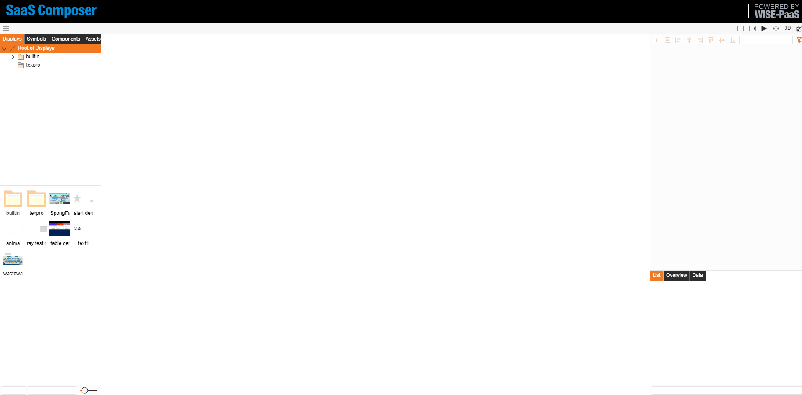

# Animation path  

An animation path accomplish the movement of one element along the trajectory of another element

## I.	Animation path demonstration

## II.	How to set the animation path

Set animation path method:
1.	Sketch two elements on the display; one element (object) moves along the trajectory of another element (“shape” path)
2.	On the display attribute list, select the “**Animation Paths**” in the “**Connection Action**” attribute 
3.	Select the object that wish to move along the path, click on the small blue dot that appears, click the left mouse button and drag to attach to the path, so that the path is understood to complete the connection
4.	Click on the object to complete the logical processing of the animation path in the data binding of the animation pathIn this case the object moves along the trajectory and returns function as follows:  

			function(input,output){
			      if (i>=1){          
					p = -0.1;      
				} else if (i<=0) {          
					p = +0.1;      
				}      
				i=i+p      
				return i;   
			}		