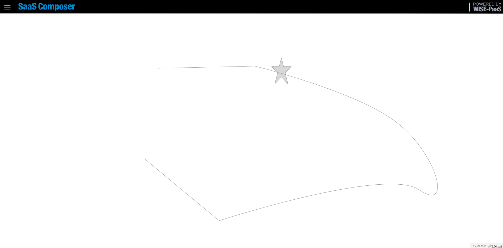
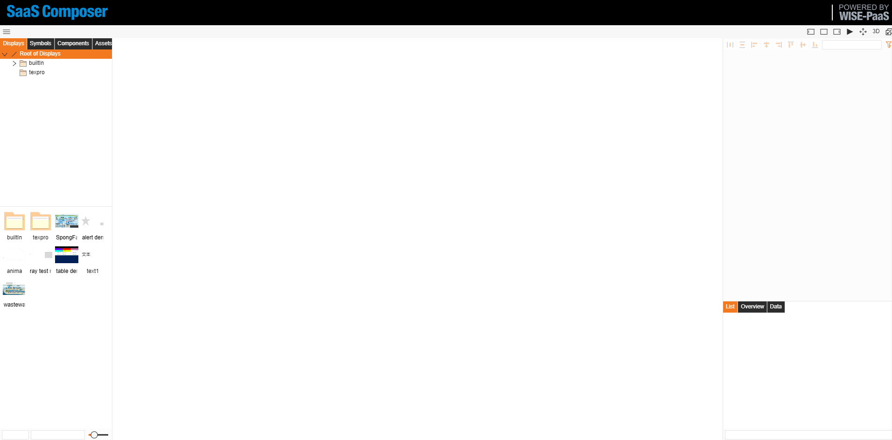

# 動畫路徑  

動畫路徑實現一個元素沿著另一個元素的軌跡運動

## 1-動畫路徑演示

## 2-動畫路徑設置方式

動畫路徑設置方式：
1. 在圖紙中繪製兩元素，一個元素（物體）沿著另一個元素（路徑）的軌跡運動
2. 在圖紙的連接方式出選擇動畫路徑
3. 選中物體，點擊出現的藍色小凸起，滑鼠左鍵點擊拖懂到路徑上完成連接動作
4. 點擊物體，在動畫路徑的資料綁定中完成對動畫路徑的邏輯處理本例中物體沿著軌跡運動然後返回function 
如下：  

function(input,output){

      if (i>=1){
          p = -0.1;
      } else if (i<=0) {
          p = +0.1;
      }
      i=i+p;
      return i;

   }
