# Display Event Detail  

### *Note! The Tag attribute names below will be used in the following examples. The details for these exemplary Tags include:
> -Circle --> circle
-Square --> square
-Triangle --> triangle
-TextScroll (increasing the font size when a mouse scroll operation occurs here) --> textscroll
-Star --> star
-Light bulb --> lightb
-Light Status --> LS
-ON button --> onon
-OFF button --> offoff
-Close button --> Close

- ! Syntax for controlling the attributes of an object by using the Tag of the object: `dataModel.getDataByTag(‘TagNameOfObject’).attributeClass(‘attributeName’, attributeValue)`;
- ! ex: `dataModel.getDataByTag('offoff').s('2d.visible', true)`
- ! When using Event Handler, please make sure the “**Interactive**” option is checked, such that program instructions for event handling can take effect.

## 1. Click Event:

Trigger timing: triggered upon a mouse click (a single click) on the object
Action timing: act upon the click release of the mouse having clicked on the object

Example: Upon a click on the light bulb, open the Light Status Box (including the buttons)

1. Select the light bulb and open the event handler

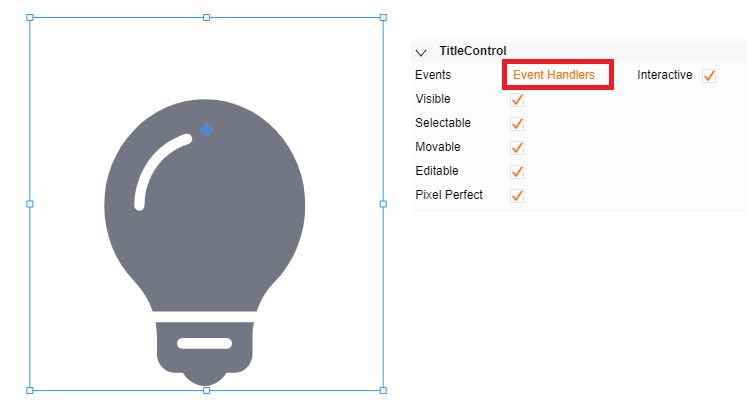

2. Select the Click tab and perform coding

Program code:

`dataModel.getDataByTag('offoff').s('2d.visible',true)`;
`dataModel.getDataByTag('onon').s('2d.visible',true)`;
`dataModel.getDataByTag('LS').s('2d.visible',true)`;
`dataModel.getDataByTag('Close').s('2d.visible',true)`;

The program code in the screenshot enables the following operation: a mouse click on the light bulb will display four objects including the ON button, the OFF button, the Light Status Box, and the Close button

3. Result

## 2. Double-Click Event:

Trigger timing: triggered upon a mouse being double-clicked on the object 
Action timing: act upon the click release of the mouse having double-clicked on the object 

Example: After a double-click on a light bulb, hide the Light Status Box (including the buttons)

1. Select the light bulb and open the event handler

2. Select the Double-Click tab and perform coding

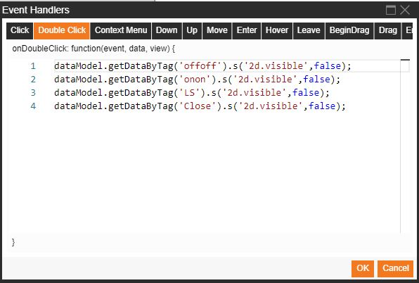

Program code:

`dataModel.getDataByTag('offoff').s('2d.visible',false)`
`dataModel.getDataByTag('onon').s('2d.visible',false)`
`dataModel.getDataByTag('LS').s('2d.visible',false)`
`dataModel.getDataByTag('Close').s('2d.visible',false)`

The program code in the screenshot enables the following operation: a mouse double-click on the light bulb will hide four objects, including the ON button, the OFF button, the Light Status Box, and the Close button.

3. Result

## 3. Context Menu Event: 

Trigger timing: triggered upon a mouse right-click on the object
Action timing: act upon the mouse right click

Example: After a mouse right-click on the light bulb, display the Light Status Box (including the buttons)

1. Select the light bulb and open the event handler

2. Select the Context Menu tab and perform coding

Program code:

`dataModel.getDataByTag('offoff').s('2d.visible',true)`
`dataModel.getDataByTag('onon').s('2d.visible',true)`
`dataModel.getDataByTag('LS').s('2d.visible',true)`
`dataModel.getDataByTag('Close').s('2d.visible',true)`

The program code in the screenshot enables the following operation: a mouse right-click on the light bulb will display four objects, including the ON button, the OFF button, the Light Status Box, and the Close button

3. Result

## 4. Down Event:

Trigger timing: triggered upon a mouse click-and-hold on the object
Action timing: act when holding the object with the mouse

Example: After the mouse is clicked and held on the circle, turn the color of the circle to yellow

1. Select the circle and open the event handler

2. Select the Down tab and perform coding

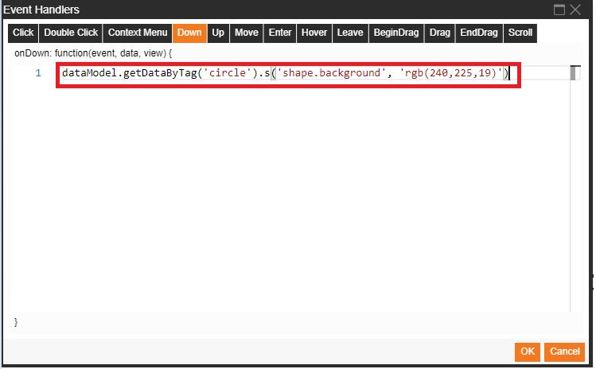

Program code:

`dataModel.getDataByTag('circle').s('shape.background', 'rgb(240,225,19)')`

The program code in the screenshot enables the following operation: a mouse click-and-hold on the circle will turn the color of the circle to yellow

3. Result

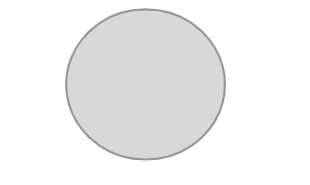

## 5. Up Event:

Trigger timing: triggered upon the mouse releasing the held object
Action timing: act upon release of the mouse holding the object

Example: After the mouse releases a circle, turn the color of the circle to blue

1. Select a circle and open the event handler

2. Select the Up tab and perform coding

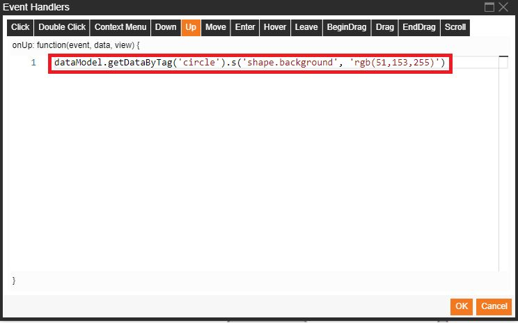

Program code:

`dataModel.getDataByTag('circle').s('shape.background', 'rgb(51,153,255)')`

The program code in the screenshot enables the following operation: a mouse click-release over the circle will turn the color of the circle to blue

3. Result

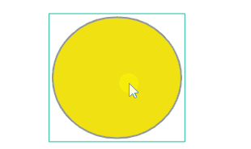

## 6. Move Event:

Trigger timing: triggered upon a mouse movement on the object
Action timing: act while the mouse is moving on the object

Example: While the mouse is moving within a rectangle, change the position of the circle

1. Select the rectangle and open the event handler

2. Select the Move tab and perform coding

Program code:

`var circlexval = dataModel.getDataByTag('circle').getPosition().x`
`var circleyval = dataModel.getDataByTag('circle').getPosition().y`
`dataModel.getDataByTag('circle').setPosition(circlexval+1, circleyval)`

The program code in the screenshot enables the following operations: acquire the X-axis and Y-axis position of the circle; a mouse movement within the box will change the position of the circle

3. Result

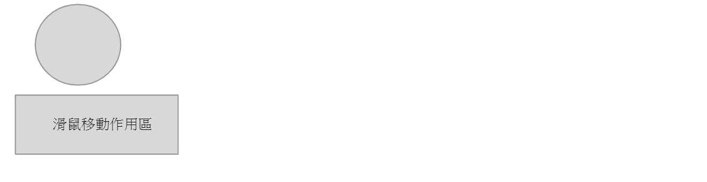

## 7. Enter Event:

Trigger timing: triggered upon a mouse entering the object
Action timing: act upon the mouse having entered the object

Example: After the mouse moves into (enters) a triangle, turn the color of the triangle to red

1. Select the triangle and open the event handler

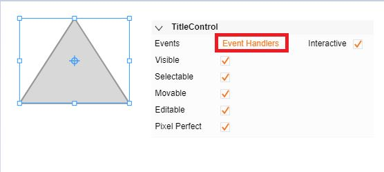

2. Select the Enter tab and perform coding

Program code:

`dataModel.getDataByTag('triangle').s('shape.background', 'rgb(212,0,0)')`

The program code in the screenshot enables the following operation: a mouse movement into (entering) the triangle will turn the color of the triangle to red

3. Result

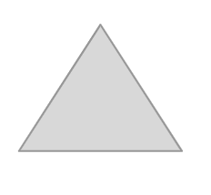

## 8. Hover Event:

Trigger timing: triggered upon a mouse entering and hovering over the object
Action timing: act upon the mouse hovering over the object

Example: After the mouse has moved into (entered) and is hovering over a triangle, turn the color of the triangle to white

1. Select the triangle and open the event handler

2. Select the Hover tab and perform coding

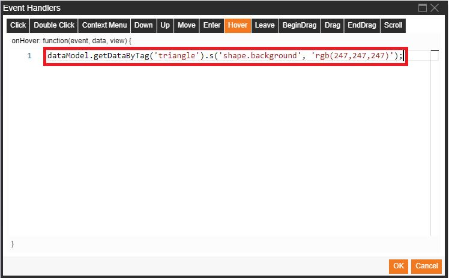

Program code:

`dataModel.getDataByTag('triangle').s('shape.background', 'rgb(247,247,247)')`

The program code in the screenshot enables the following operation: a mouse hover over the triangle after a movement into (entered) it will turn the color of the triangle to white

3. Result

## 9. Leave Event:

Trigger timing: triggered upon a mouse moving out of the object
Action timing: act upon the mouse having left the object

Example: After the mouse leaves (moves out of) a triangle, turn the color of the triangle into pink

1. Select the triangle and open the event handler

2. Select the Leave tab and perform coding

Program code:

`dataModel.getDataByTag('triangle').s('shape.background', 'rgb(241,125,164)')`

The program code in the screenshot enables the following operation: a mouse movement leaving (moving out of) the triangle will turn the background color of the triangle to pink

3. Result

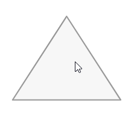

## 10. BeginDrag Event:

Trigger timing: triggered upon a mouse holding and dragging the object
Action timing: act at the instance when the dragging of the object starts

Example: After the mouse starts dragging a star-shaped object, immediately change the rotation angle of the star

1. Select the star-shaped object and open the event handler

2. Select the BeginDrag tab and perform coding

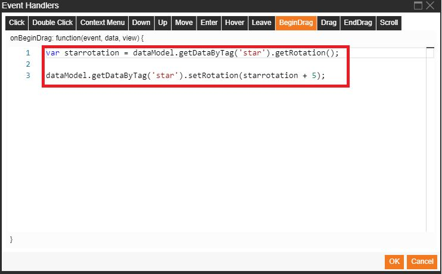

Program code:

`var starrotation = dataModel.getDataByTag('star').getRotation()`
`dataModel.getDataByTag('star').setRotation(starrotation+5)`

The program code in the screenshot enables the following operations: acquire the current rotation angle value of the star, and the mouse starting a dragging operation on the star will change the rotation angle of the star by five degrees in a clockwise direction immediately after the dragging operation starts

3. Result

## 11. Drag Event:

Trigger timing: triggered upon a mouse holding and dragging the object
Action timing: act while the object is being dragged

Example: While dragging the star-shaped object, change the size of the star with a width increment of 1 and a height increment of 1

1. Select the star-shaped object and open the event handler

2. Select the Drag tab and perform coding

Program code:

`var starheightval = dataModel.getDataByTag('star').getHeight()`
`var starwidthval = dataModel.getDataByTag('star').getWidth()`
`dataModel.getDataByTag('star').setHeight(starheightval+1)`
`dataModel.getDataByTag('star').setWidth(starwidthval+1)`

The program code in the screenshot enables the following operation: acquire the height and width values of the star and the mouse dragging the star will continuously change the width and the height of the star, each at an increment of 1, throughout the whole dragging operation

3. Result

## 12. EndDrag Event:

Trigger timing: triggered upon a mouse releasing the dragging of the object
Action timing: act upon the mouse releasing dragging of the object

Example: After dragging of a star-shaped object ends and the mouse is released, change the rotation angle of the star

1. Select the star-shaped object and open the event handler

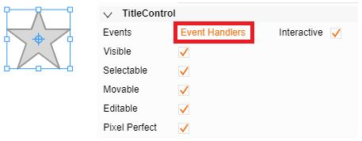

2. Select the EndDrag tab and perform coding

Program code:

`var starrotation = dataModel.getDataByTag('star').getRotation()`
`dataModel.getDataByTag('star').setRotation(starrotation - 10)`

The program code in the screenshot enables the following operations: acquire the current rotation angle value of the star, and the mouse ending and releasing a dragging operation on the star will change the rotation angle of the star by 10 degrees in a counterclockwise direction

3. Result
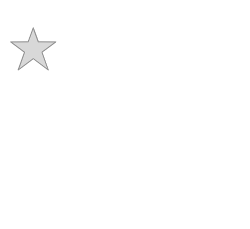

## 13. Scroll Event:

Trigger timing: triggered upon a mouse wheel action while the mouse is on the object
Action timing: act upon scrolling the mouse wheel

Example: While the mouse wheel is scrolling, change the font size to 30 px

1. Select a text object and open the event handler

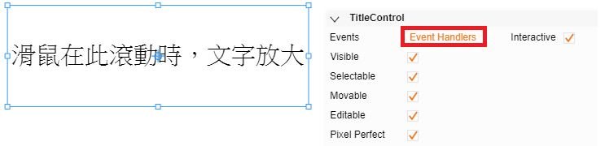

2. Select the Scroll tab and perform coding

Program code:

`dataModel.getDataByTag('textscroll').s('text.font', '30px Arial')`

The program code in the screenshot enables the following operation: a mouse scroll on the text object will change the text display to a font size of 30 px and the font will be changed to Arial

3. Result

-------------------------------------------------------------------------------------------------------------------------------
**How to look up the attribute classes and the attribute names**

Moving the mouse to the rightmost part of an attribute and hovering over the paperclip-like button will display the class and name of the attribute.
 
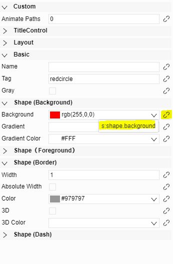
