# 圖紙事件處理  

### *注意！ 下列Tag屬性名稱會使用在接下來的範例之中，範例標籤(Tag)內容：
> -Circle --> circle
-Square --> square
-Triangle --> triangle
-TextScroll(滑鼠在此滾動時，文字放大) --> textscroll
-Star --> star
-燈泡--> lightb
-Light Status--> LS
-ON按鈕--> onon
-OFF按鈕--> offoff
-Close按鈕--> Close

- ! 以物件Tag控制該物件屬性語法：dataModel.getDataByTag('該物件標籤(Tag)名稱').屬性類別('屬性名稱', 屬性值);
- ! ex: dataModel.getDataByTag('offoff').s('2d.visible', true)
- ! 使用事件處理(Event Handler)時，請務必將旁邊的可交互(Interactive)打勾，才可作用事件處理內的程式指令

## 1. Click Event(點擊事件) :

觸發點：當滑鼠游標點擊(單擊)該物件時觸發
作用點：滑鼠點擊物件並放開點擊時作用

範例：點擊燈泡時，將Light Status Box(包含按鈕)打開

1. 點選燈泡，並開啟事件處理(Event Handler)

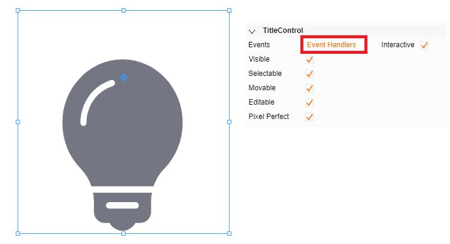

2. 點選Click(點擊)頁籤，進行Coding(編寫程式碼)

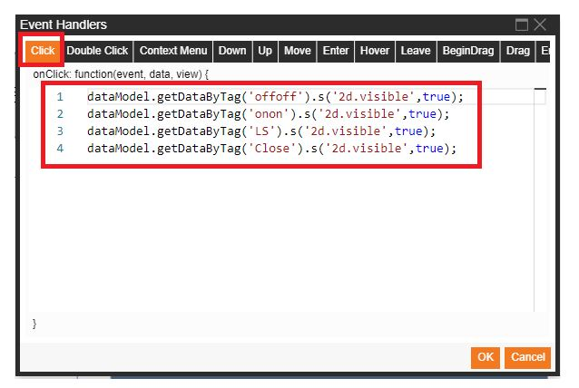

程式碼:

dataModel.getDataByTag('offoff').s('2d.visible',true);
dataModel.getDataByTag('onon').s('2d.visible',true);
dataModel.getDataByTag('LS').s('2d.visible',true);
dataModel.getDataByTag('Close').s('2d.visible',true);

圖中程式碼意思為，當滑鼠點擊燈泡時，會將ON按鈕、OFF按鈕、Light Status Box、Close按鈕四個物件顯示

3. 結果呈現

## 2. Double Click Event(雙擊事件) :

觸發點：當滑鼠游標快速點擊該物件兩下(雙擊)時觸發
作用點：滑鼠快速雙擊物件並放開雙擊時作用

範例：雙擊燈泡後，將Light Status Box(包含按鈕)隱藏

1. 點選燈泡，並開啟事件處理(Event Handler)

2. 點選Double Click(雙擊)頁籤，進行Coding(編寫程式碼)

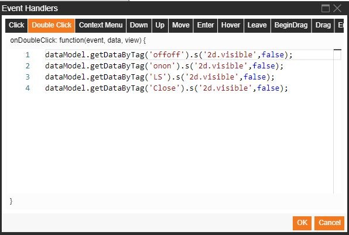

程式碼：

dataModel.getDataByTag('offoff').s('2d.visible',false);
dataModel.getDataByTag('onon').s('2d.visible',false);
dataModel.getDataByTag('LS').s('2d.visible',false);
dataModel.getDataByTag('Close').s('2d.visible',false);

圖中程式碼意思為，當滑鼠雙擊燈泡時，會將ON按鈕、OFF按鈕、Light Status Box、Close按鈕四個物件隱藏

3. 結果呈現

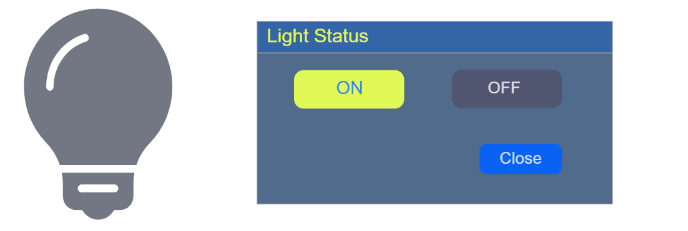

## 3. Context Menu Event(上下文選單事件) : 

觸發點：當滑鼠游標在該物件上時，使用滑鼠右鍵點擊時觸發
作用點：滑鼠右鍵點擊時作用

範例：在燈泡上按滑鼠右鍵，將Light Status Box(包含按鈕)顯示

1. 點選燈泡，並開啟事件處理(Event Handler)

2. 點選Context Menu(上下文選單)頁籤，進行Coding(編寫程式碼)

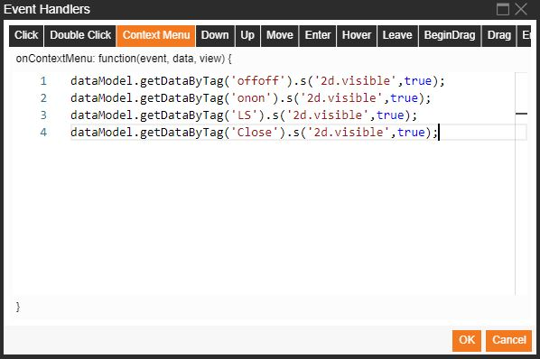

程式碼：

dataModel.getDataByTag('offoff').s('2d.visible',true);
dataModel.getDataByTag('onon').s('2d.visible',true);
dataModel.getDataByTag('LS').s('2d.visible',true);
dataModel.getDataByTag('Close').s('2d.visible',true);

圖片程式碼意思為，當滑鼠在燈泡上使用滑鼠右鍵做點擊時，會將ON按鈕、OFF按鈕、Light Status Box、Close按鈕四個物件顯示

3. 結果呈現

## 4. Mouse Down Event (按下事件) :

觸發點：當滑鼠按下該物件時觸發
作用點：滑鼠按下該物件且不放開時作用

範例：滑鼠按下圓圈，圓圈變為黃色

1. 點選圓圈，並開啟事件處理(Event Handler)

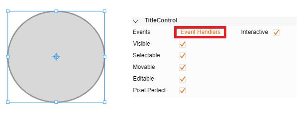

2. 點選Down(按下)頁籤，進行Coding(編寫程式)

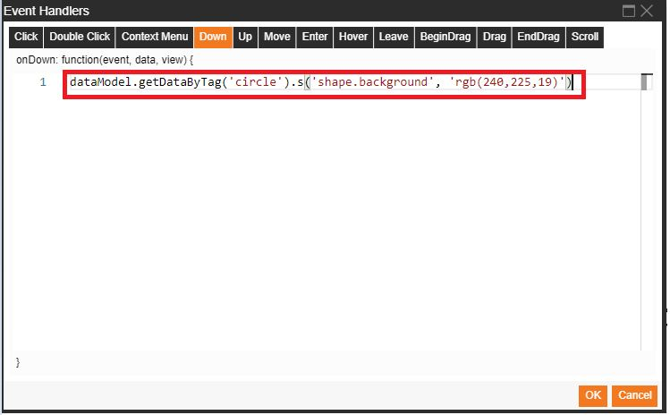

程式碼：

dataModel.getDataByTag('circle').s('shape.background', 'rgb(240,225,19)');

圖中程式碼意思為，當滑鼠在圓圈上，按下滑鼠且不放開時，圓圈變為黃色

3. 結果呈現

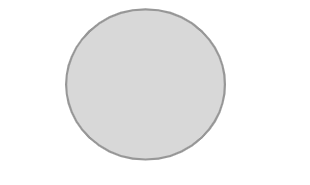

## 5. Mouse Up Event (抬起事件) :

觸發點：當滑鼠放開該物件按下動作時觸發
作用點：滑鼠放開該物件時作用

範例：滑鼠放開圓圈，圓圈變為藍色

1. 點選圓圈，並開啟事件處理(Event Handler)

2. 點選Up(抬起)頁籤，進行Coding(編寫程式)

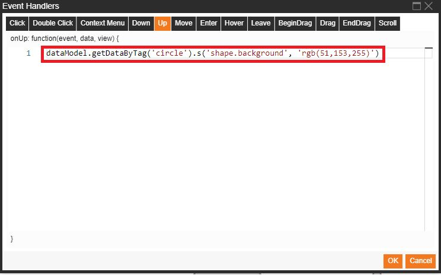

程式碼：

dataModel.getDataByTag('circle').s('shape.background', 'rgb(51,153,255)');

圖中程式碼意思為，當滑鼠在圓圈上，放開滑鼠按下時，圓圈變為藍色

3. 結果呈現

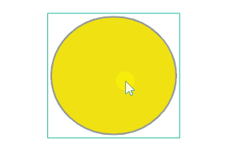

## 6. Move Event (移動事件) :

觸發點：當滑鼠在該物件上移動時觸發
作用點：滑鼠在該物件上移動時作用

範例：滑鼠在方框內進行移動時，圓圈位置進行改變

1. 點選方框，並開啟事件處理(Event Handler)

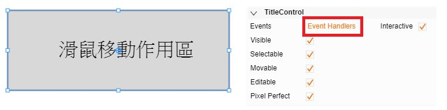

2. 點選Move(移動)頁籤，進行Coding(編寫程式)

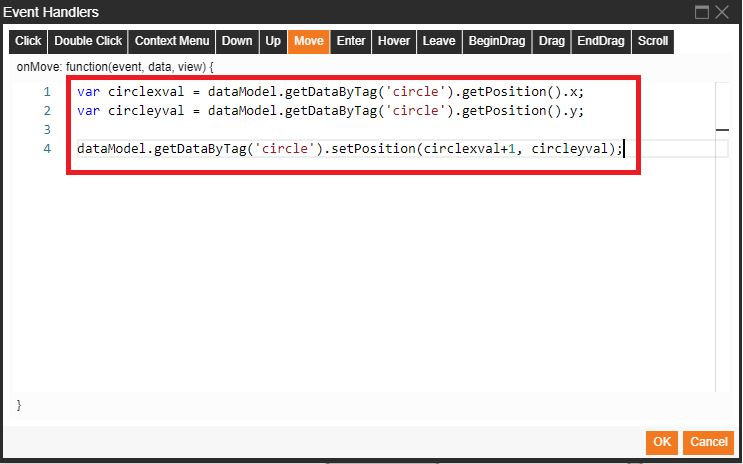

程式碼：

var circlexval = dataModel.getDataByTag('circle').getPosition().x;
var circleyval = dataModel.getDataByTag('circle').getPosition().y;
dataModel.getDataByTag('circle').setPosition(circlexval+1, circleyval);

圖中程式碼意思為，各別取得圓圈X與Y軸位置，當滑鼠在方框內移動時，圓圈的位置會進行改變

3. 結果呈現

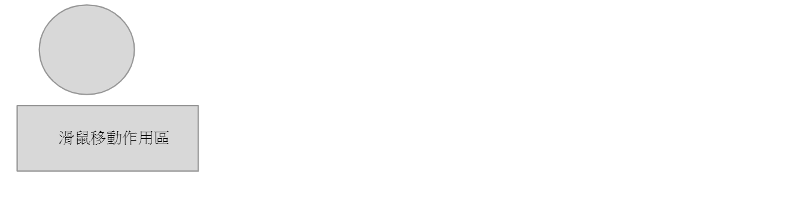

## 7. Enter Event (進入事件) :

觸發點：當滑鼠移(進)入該物件時觸發
作用點：滑鼠並在該物件內時作用

範例：滑鼠移(進)入三角形時，三角形變為紅色

1. 點選三角形，並開啟事件處理(Event Handler)

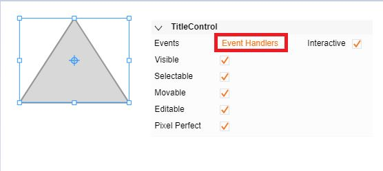

2. 點選Enter(進入)頁籤，進行Coding(編寫程式)

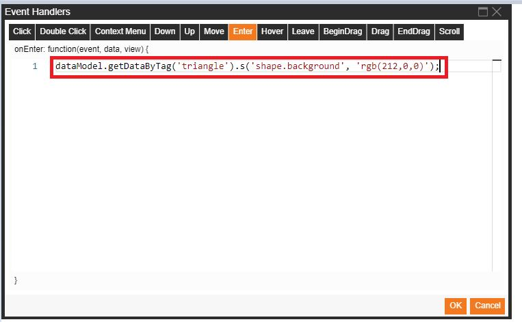

程式碼：

dataModel.getDataByTag('triangle').s('shape.background', 'rgb(212,0,0)');

圖中程式碼意思為，當滑鼠移(進)入至三角形時，三角形變為紅色

3. 結果呈現

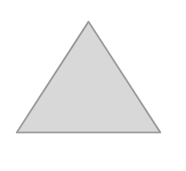

## 8. Hover Event (懸停事件) :

觸發點：當滑鼠移入並且停留在該物件時觸發
作用點：滑鼠停留該物件時作用

範例：滑鼠移(進)入三角形，並且滑鼠停留在三角形上時，三角形變為白色

1. 點選三角形，並開啟事件處理(Event Handler)

2. 點選Hover(懸停)頁籤，進行Coding(編寫程式)

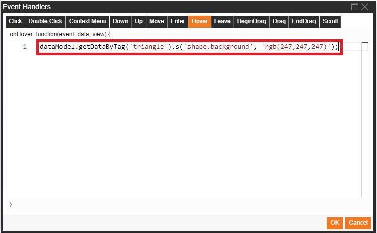

程式碼：

dataModel.getDataByTag('triangle').s('shape.background', 'rgb(247,247,247)');

圖中程式碼意思為，當滑鼠移(進)入至三角形且停留在三角形上時，三角形變為白色

3. 結果呈現

## 9. Leave Event (離開事件) :

觸發點：當滑鼠移出該物件時觸發
作用點：滑鼠離開該物件時作用

範例：滑鼠離開(移出)三角形時，三角形變為粉紅色

1. 點選三角形，並開啟事件處理(Event Handler)

2. 點選Leave(離開)頁籤，進行Coding(編寫程式)

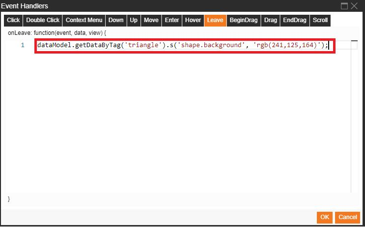

程式碼：

dataModel.getDataByTag('triangle').s('shape.background', 'rgb(241,125,164)');

圖中程式碼意思為，當滑鼠離開(移出)三角形時，三角形的背景顏色變為粉紅色

3. 結果呈現

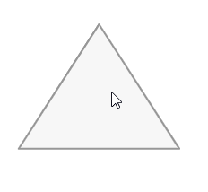

## 10. BeginDrag Event (開始拖曳) :

觸發點：當滑鼠按住該物件時進行拖曳時觸發
作用點：物件拖曳的第一時間作用

範例：拖曳星星形狀，第一時間進行星星旋轉角度的改變

1. 點選星星形狀，並開啟事件處理(Event Handler)

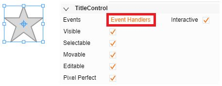

2. 點選BeginDrag(開始拖曳)頁籤，進行Coding(編寫程式)

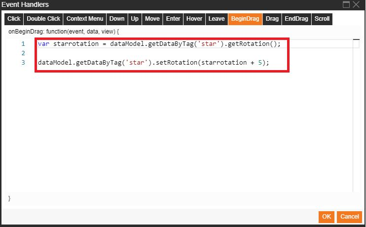

程式碼：

var starrotation = dataModel.getDataByTag('star').getRotation();
dataModel.getDataByTag('star').setRotation(starrotation+5);

圖中程式碼意思為，取得星星目前的選轉角度值，當滑鼠開始拖曳星星時，星星在拖曳的第一時間進行順時針加五度旋轉角度的改變

3. 結果呈現

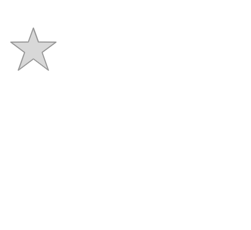

## 11. Drag Event (拖曳) :

觸發點：當滑鼠按住該物件時進行拖曳時觸發
作用點：物件拖曳期間作用

範例：拖曳星星形狀，拖曳期間進行星星的大小變化，寬度加1，高度加1

1. 點選星星形狀，並開啟事件處理(Event Handler)

2. 點選Drag(拖曳)頁籤，進行Coding(編寫程式)

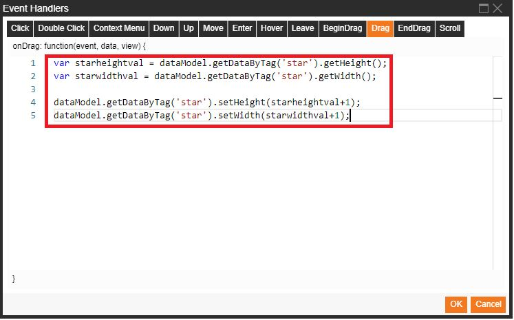

程式碼：

var starheightval = dataModel.getDataByTag('star').getHeight();
var starwidthval = dataModel.getDataByTag('star').getWidth();
dataModel.getDataByTag('star').setHeight(starheightval+1);
dataModel.getDataByTag('star').setWidth(starwidthval+1);

圖中程式碼意思為，取的星星的高度與寬度值，且在滑鼠拖曳星星期間，星星的寬度加1，高度加1進行變化

3. 結果呈現

## 12. EndDrag Event (結束拖曳) :

觸發點：當滑鼠拖曳該物件且放開滑鼠時觸發
作用點：拖曳開物件後，放開滑鼠時作用

範例：拖曳星星形狀，拖曳結束並且放開滑鼠時，進行星星旋轉角度的改變

1. 點選星星形狀，並開啟事件處理(Event Handler)

2. 點選EndDrag(結束拖曳)頁籤，進行Coding(編寫程式)

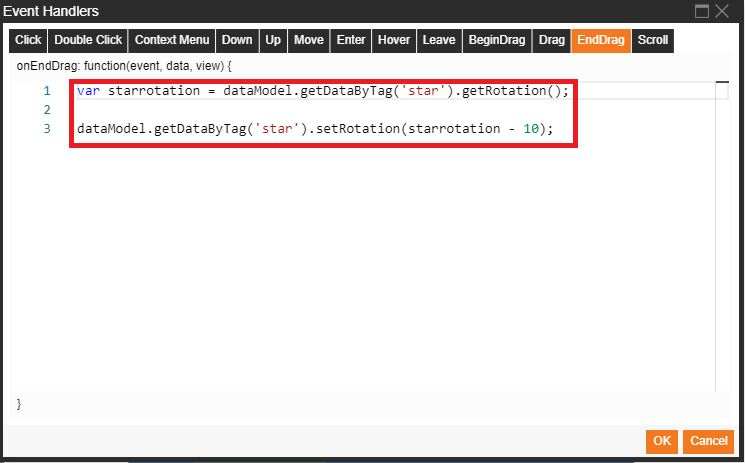

程式碼：

var starrotation = dataModel.getDataByTag('star').getRotation();
dataModel.getDataByTag('star').setRotation(starrotation - 10);

圖中程式碼意思為，取得星星目前的選轉角度值，並且滑鼠拖曳星星結束並且放開滑鼠時，進行逆時針加10度旋轉角度的改變

3. 結果呈現

## 13. Scroll Event (滾動) :

觸發點：當滑鼠在該物件上時，使用滑鼠滾輪時觸發
作用點：滑鼠滾輪滾動時作用

範例：滑鼠滾輪滾動時，文字大小變為30px

1. 點選文字，並開啟事件處理(Event Handler)

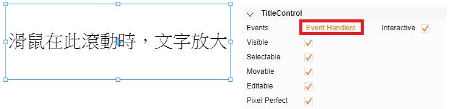

2. 點選Scroll(滾動)頁籤，進行Coding(編寫程式)

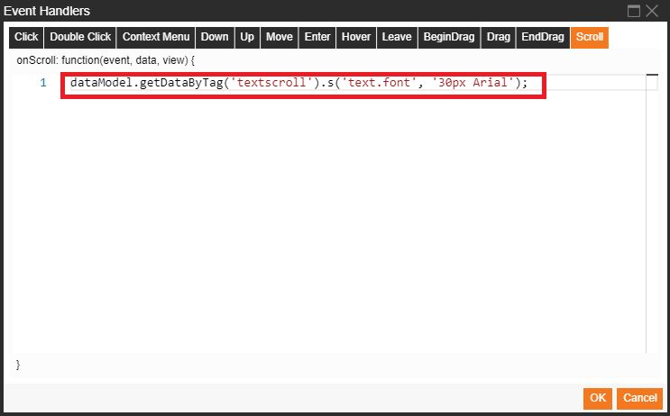

程式碼：

dataModel.getDataByTag('textscroll').s('text.font', '30px Arial');

圖中程式碼意思為，滑鼠在文字上滾動時，文字大小變為30px，且為字體為Arial

3. 結果呈現
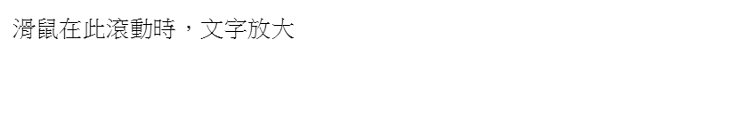

-------------------------------------------------------------------------------------------------------------------------------
**屬性類別與屬性名稱查詢方式

將滑鼠移至該屬性後方，停留在像是迴紋針按鈕上，即顯示該屬性類別與名稱
 
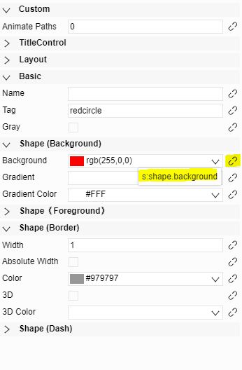