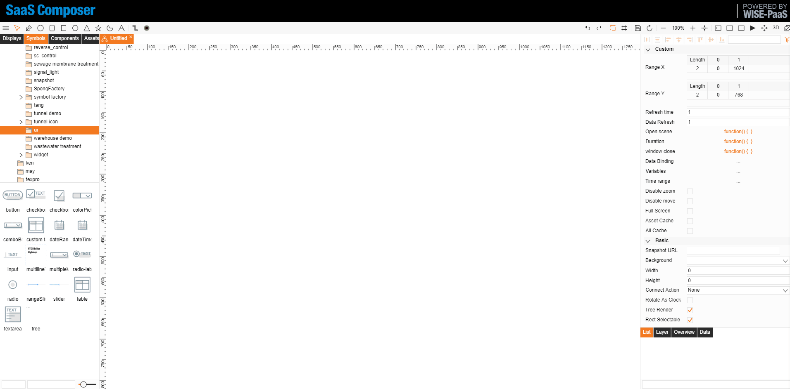
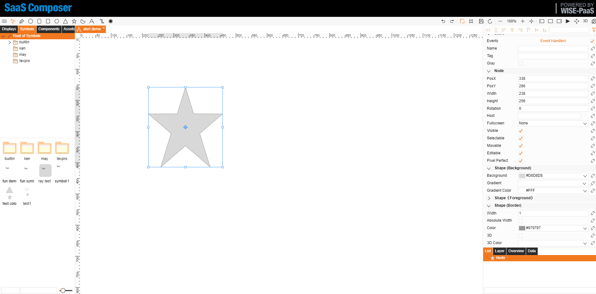

# Event Processing  

Event processing can be defined in display elements, symbol, and symbol elements.

## I.	Define in display elements

Defining in display elements method:
1.	Select the element to be defined in the display, click the event processing button to open the event processing definition window.
2.	Select the desired event and write a standard JavaScript function for it.
3.	Click confirm to close the window and check the box to the right of the event processing box.

## II.	Define in symbol

Defining in symbol method:
1.	Create a new symbol, click the event processing button to the right of the icon to open the definition window.
2.	Select the desired event and write a standard JavaScript function for it.
3.	Click confirm to close the window and drag the symbol on to the display.
4.	Check the box to the right of the icon event processing.