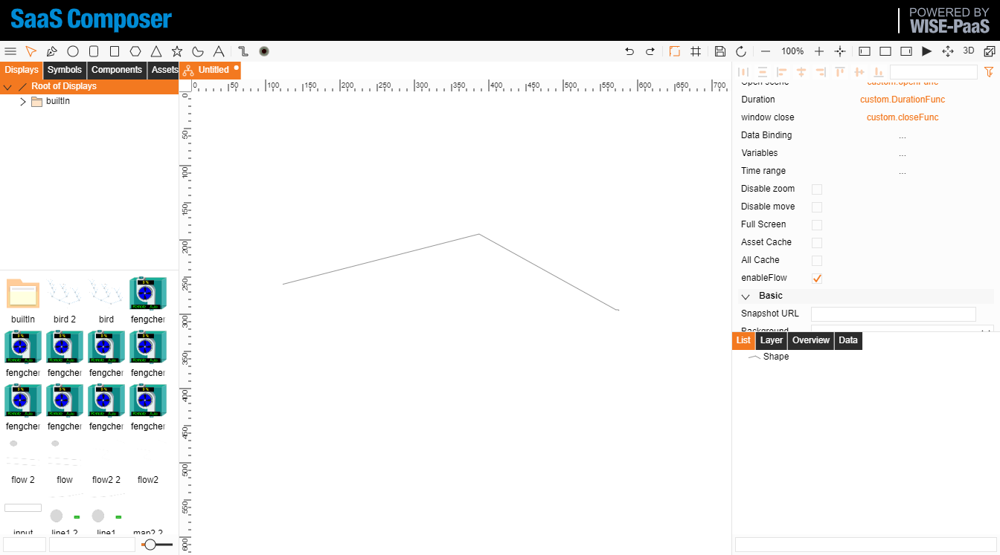
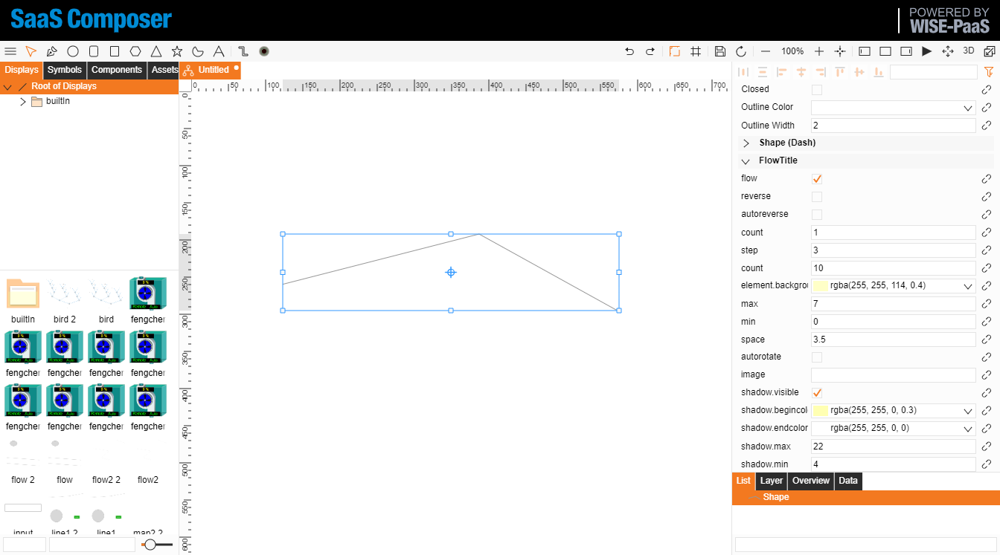
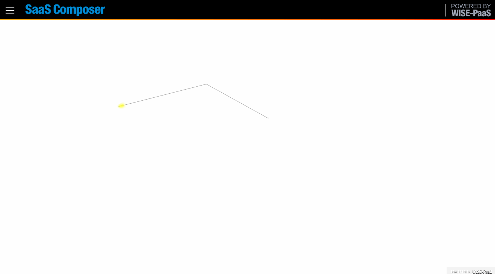
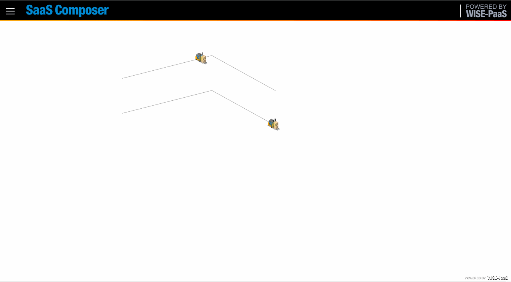
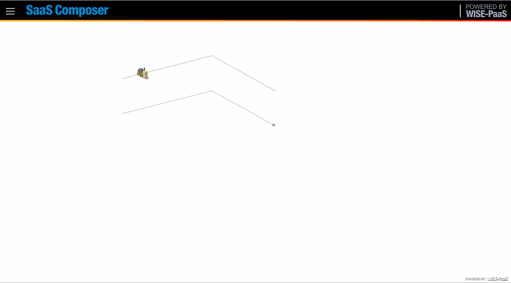
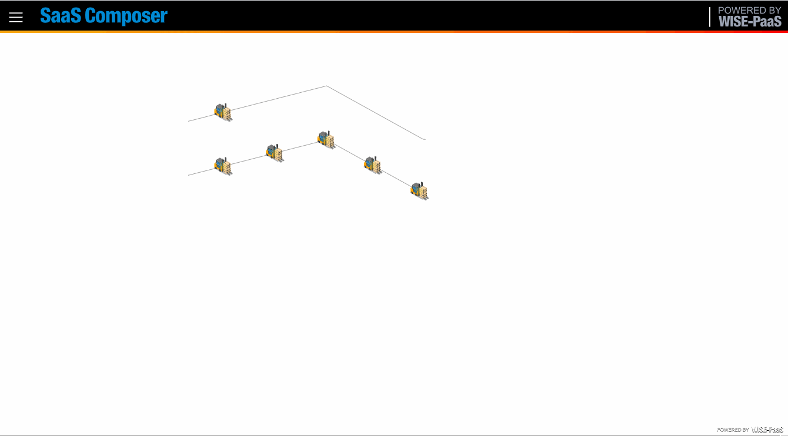
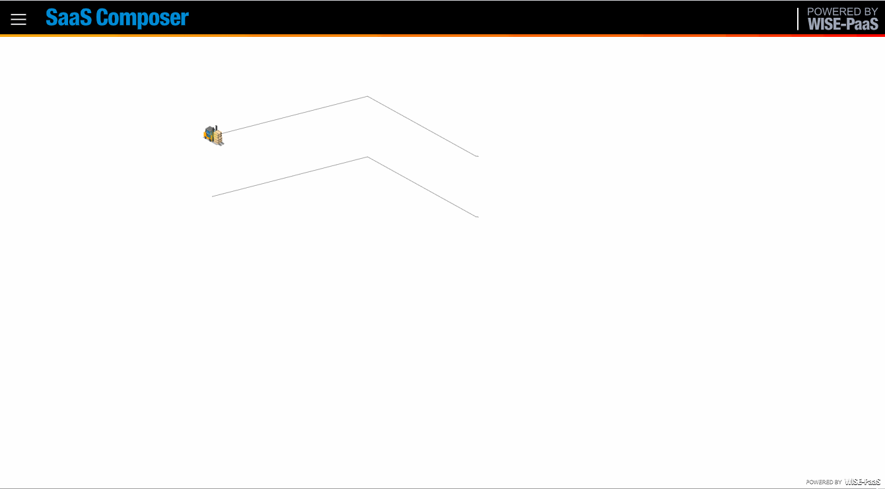
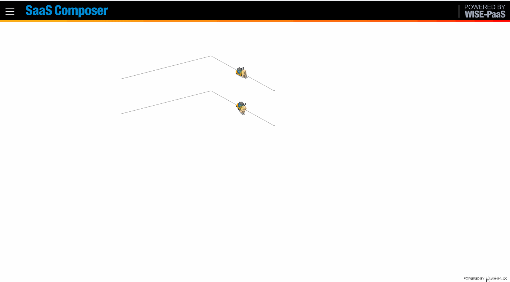
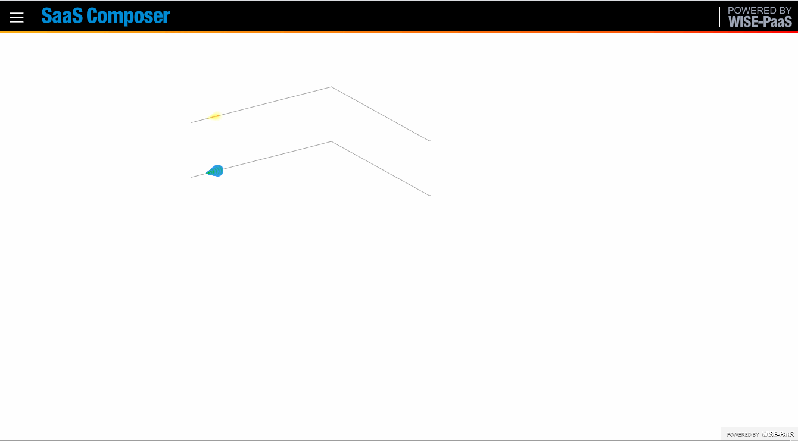

# Flow  

Draw shape `line` in display.

Check `EnableFlow` i display property.

  

In line property `FlowTitle` tab, check flow to enable.

  

In Viewer.  

  

# Flow property

`reverse` : control flow direction.  
`autoreverse` : auto change direction alternately.  
`count` : count of flow group.  

  

`step` : flow step.  

  

`element count` : count element in each flow group.  

  

`element background` : element background color.  
`element max` : Maximun size of element in a group.  

  

`element min` : Minimun size of element in a group.  
`element space` : Space in a group.  

  

`autorotate`  

  

`image` : Use image as flow element.  
`shadow visible` :   
  

`shadow begin color` :   
`shadow end color` :   
  

`shadow max` : Maximun size of shadow. 
`shadow min` : Minimun size of shadow. 

