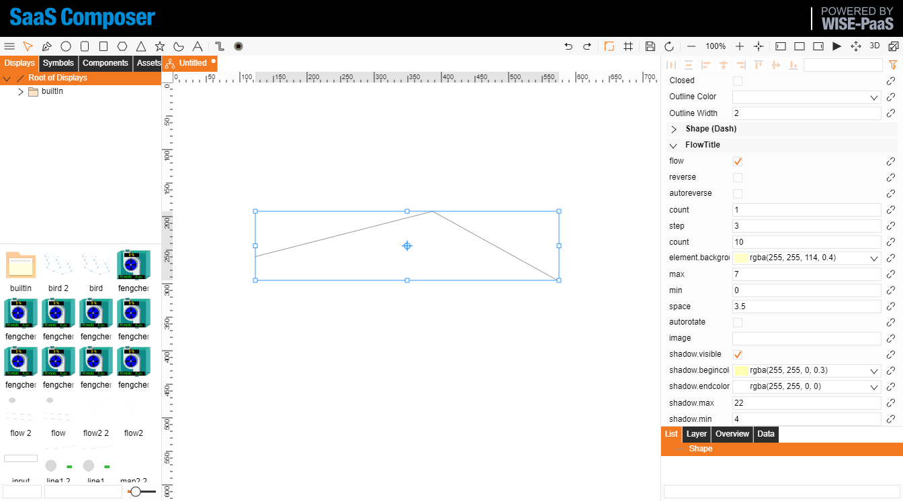
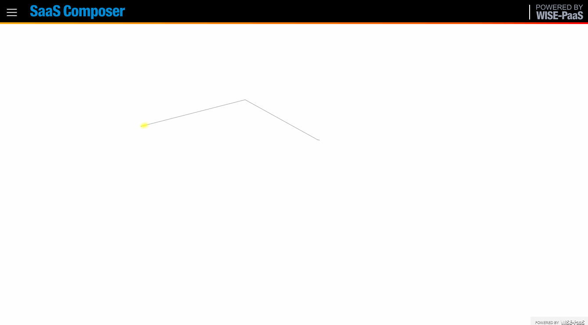
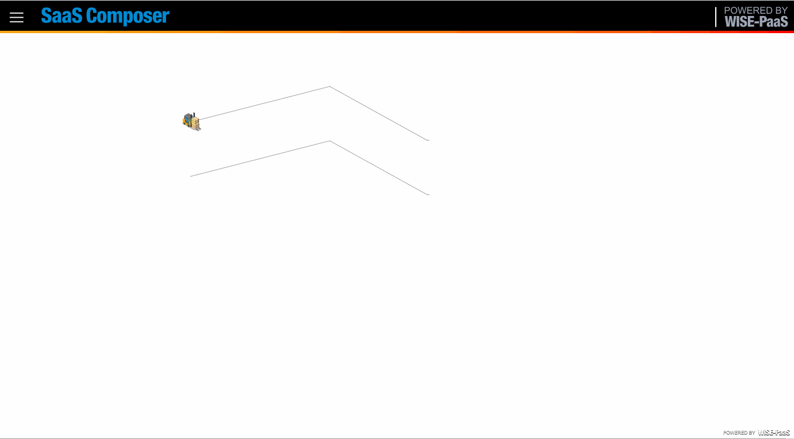
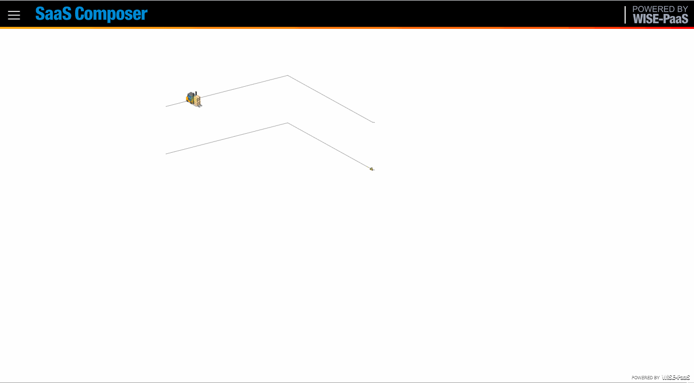
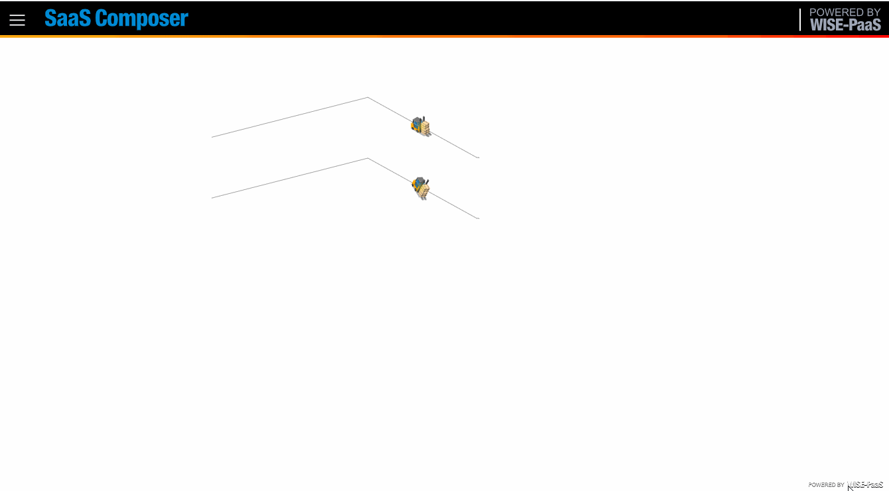
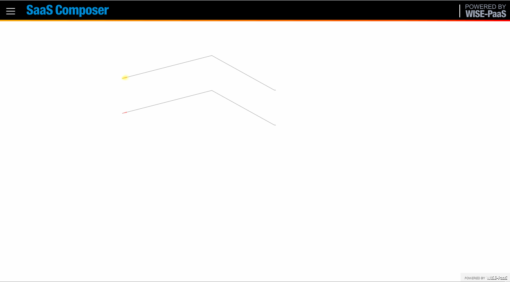

# Flow  

在圖紙上繪製線條 `line`.

在圖紙屬性啟用流動功能 `EnableFlow`.

  

在線條屬性中配置 `FlowTitle`, 點選 `flow` 啟用.

  

瀏覽觀看結果.  

  

# Flow property

反向 `reverse` : 控制是否反向流動.  
往返流動 `autoreverse` : 是否自動往返流動.  
群組數 `count` : 流動群組數.  
  
步進數 `step` : 步進數.  
  
個數 `element count` : 組中元素個數.  
  
元素顏色 `element background` : 元素背景色.  
元素最大尺寸 `element max` : 元素最大尺寸.  
  
元素最小尺寸 `element min` : 元素最小尺寸.  
元素最間距 `element space` : 元素最間距.  
  
元素轉動 `autorotate` : 元素(圖片)依照線條方現轉動  
  

圖片 `image` : 使用圖片取代光點.  
顯示陰影 `shadow visible` :   
  

陰影漸層起始 `shadow begin color` :   
陰影漸層結束 `shadow end color` :   
  

陰影最大尺寸 `shadow max` : Maximun size of shadow. 
陰影最小尺寸 `shadow min` : Minimun size of shadow. 