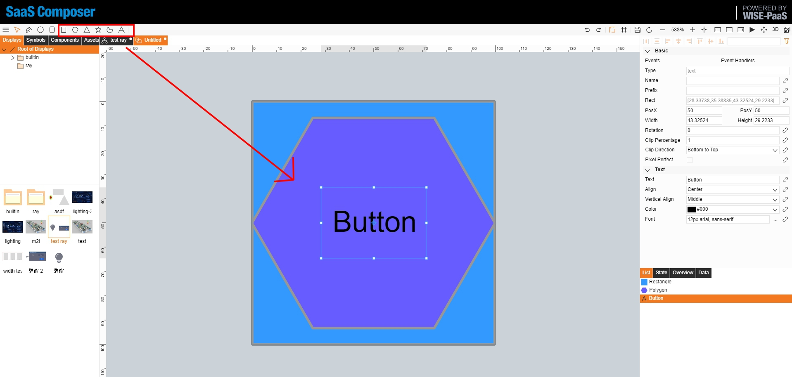
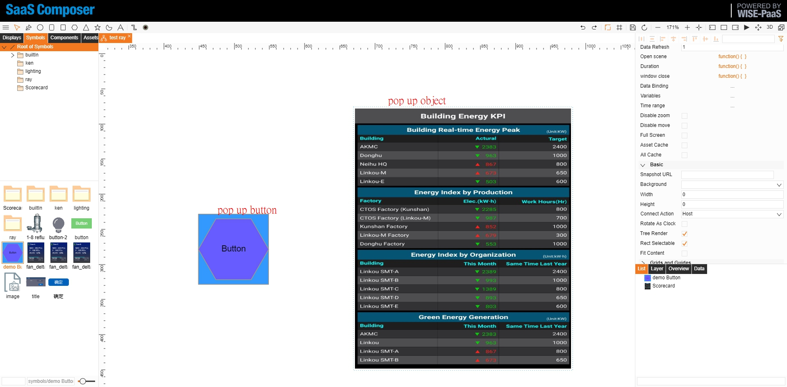

# Popup Windows  

There are many ways to present the popup window on the screen. One of the fastest ways is as follows: 

A “Symbol” is used to control the popup window, and an object is used to display the window (the object can be Symbols or Assets, depending on the requirements). 

## 1. Button object (Symbol):
	Create a Symbol to be the “button object”

	Among the attributes of Symbol, select/open the attribute of Event Handlers.

    
    Paste the following Javascript code in the “Click” event. 

		var nodes = data._69O?data._69O._as:[]
		for(var i = 0;i < nodes.length;i++){
			nodes[i].s('2d.visible', !nodes[i].s('2d.visible'))
		}
		//Connect the connection icon to the button to display or hide the object in Step 6. 
	Save the Symbol file. 
	
## 2. Create an object that requires a popup window, and use the assets.jpg to display the popup window

## 3. Drag the created button “Symbol” and popup “Assets” to the drawing sheet 

## 4. Click “Event Handlers” in the “Events” attribute for both Symbol and Assets.

## 5. Enter the drawing sheet attributes and change the "Connect Action" setting to "Host"

## 6. Connect the icon of the object that requires a popup window to the button

## 7. After the file is saved, the object with a popup window can be displayed or hidden by clicking the button 

