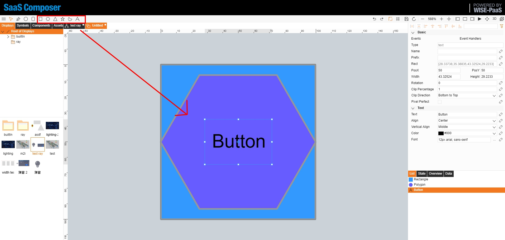
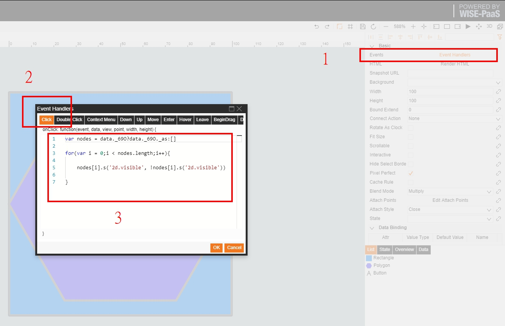
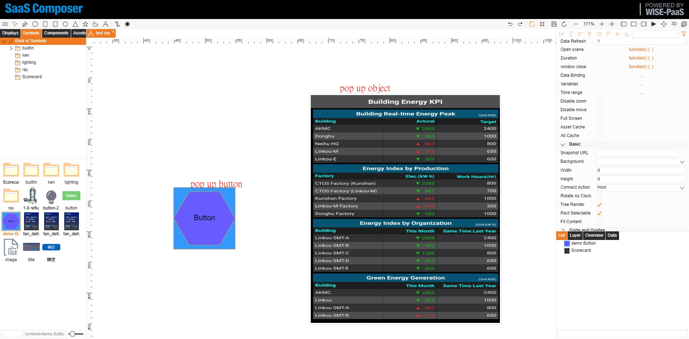
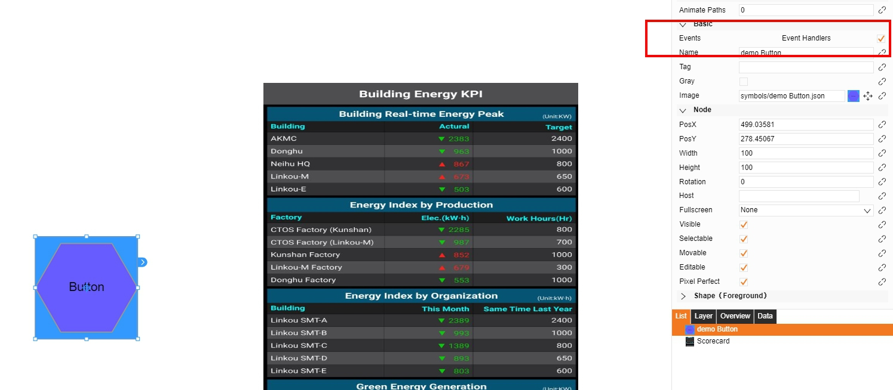
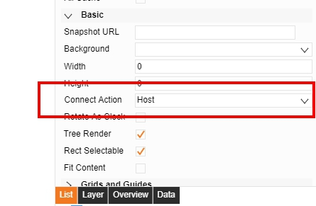
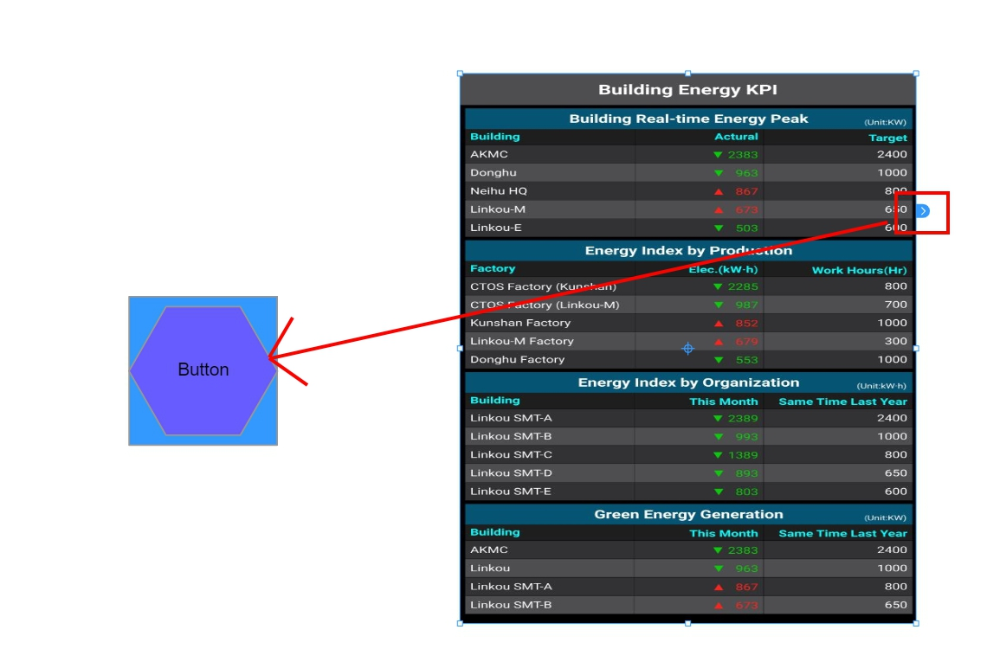

畫面上呈現彈跳視窗的方式有許多種，以下是其中一較快速的方式：

需要由一個主"Symbol"來做操控，和另一個物件來做彈跳視窗的顯示（可以是 symbols 或是 Assets，依照使用需求)

1. 按鈕物件(symbol) :
	建立Symbol來當作"按鈕物件"，

	在symbol屬性內，點選/開啟Event Handlers屬性，

    
    在"click"事件裡貼上以下的Javascript邏輯

		var nodes = data._69O?data._69O._as:[]
		for(var i = 0;i < nodes.length;i++){
			nodes[i].s('2d.visible', !nodes[i].s('2d.visible'))
		}
		//針對步驟6，吸附圖示連接到按鈕物件，做顯示或隱藏
	儲存symbol檔案
	
2. 建立需要被彈跳的物件，以下由assets .jpg圖檔作為彈跳呈現

3. 拖拉建立好的 按鈕symbol跟彈跳assets到圖紙中

4. 針對2個物件的在Events屬性,勾選"Event Handlers"

5. 到圖紙屬性，選擇"Connect Action" 改成 "Host"

6. 拖拉彈跳物件的吸附圖示連接到按鈕物件

7. 存檔後，點擊按鈕物件即可顯示或隱藏彈跳物件

