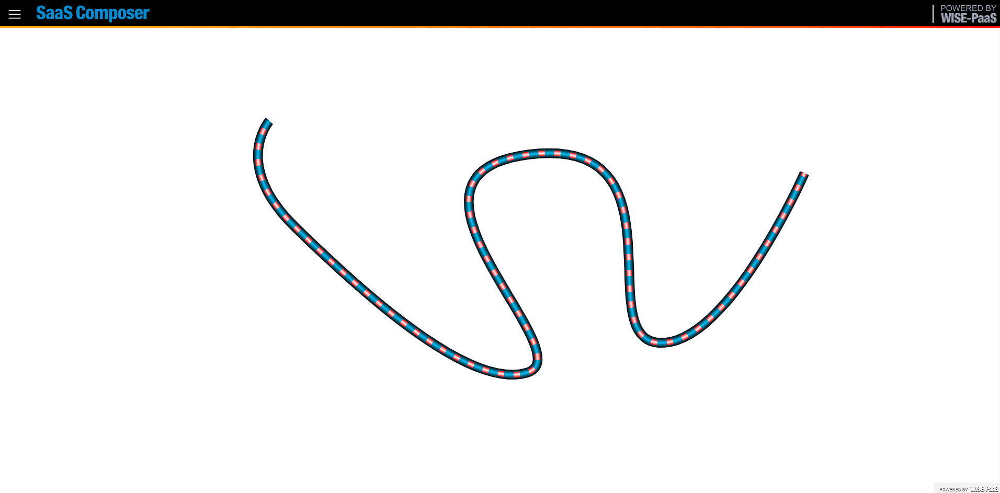
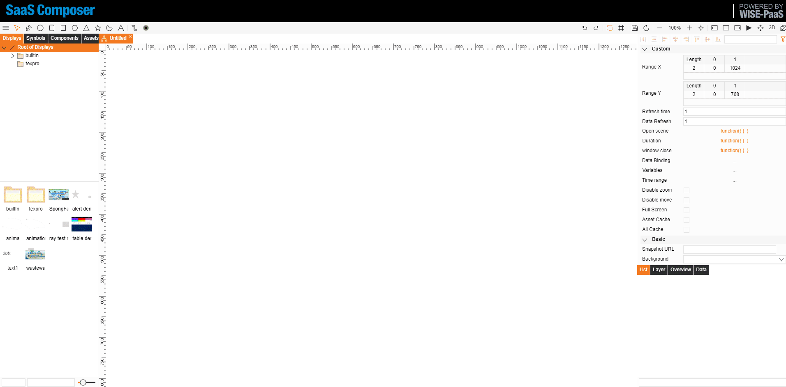
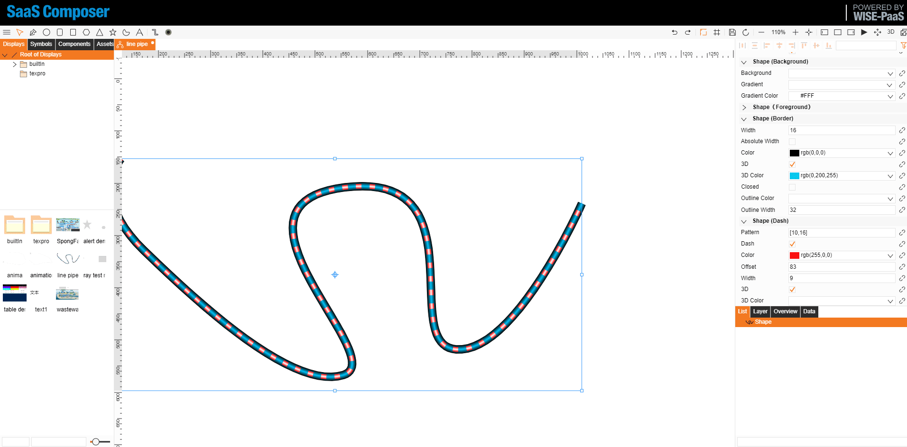

# Sketching pipes  

Pipes are sketched using irregular shapes, and the dynamic effects of the pipes. Animate effect are done using the offset properties of the shape's dashed lines

## I.	Rendering pipes

## II.	Sketching pipes

Steps for sketching pipes:
1.	Select the irregular shape in the upper left corner to draw a line object; you can define the length and turning points.
2.	Click on the line that was sketched, find the shape (border) fields on the right and modify the width and color attributes to draw the appearance of the pipe.
3.	To the right, select the shape (dashed line) field, check the dashed line and the style used for the inside of the pipe will appear; modify the dashed line attribute to draw the inside of the pipe.

## III.	Pipe dynamics

Steps for sketching pipe dynamics:
1.	The dynamic effect of the flow of the pipe can be achieved by modifying the dashed line offset value
2.	Define a global variable “I” in the “open scene” attribute
3.	Click the small link to the right of the offset attribute of the right side of the shape (dashed line) field to open the data binding page
4.	Select "**Advanced**" in animation
5.	Write the following function in the function box:
	
		function(input,output) {
			i+=5;
			return i;
			}    

Value 5 represents the amount of movement of the flow of water each time, which can be defined.