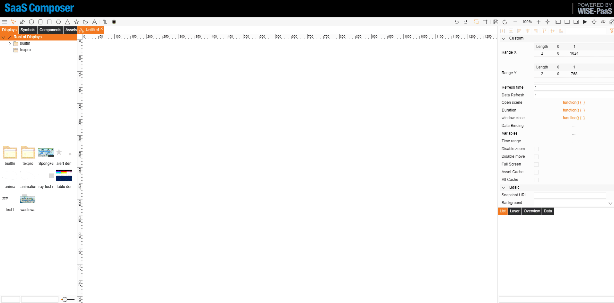
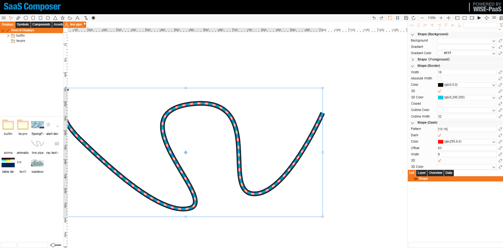

管道利用不規則圖形來繪製，管道的動態效果利用圖形虛線的偏移屬性來完成

# 1-管道效果圖

# 2-管道繪製

管道繪製步驟：
1. 左上角選擇不規則圖形，然後繪製一條線，可自行條件長度以及轉捩點
2. 點擊繪製的線，右側找到圖形（邊框）欄，修改其中的寬度、顏色等屬性來繪製管道外觀
3. 選擇右側圖形（虛線）欄，勾選虛線，出現管道內部樣式，修改虛線屬性來繪製管道內部

# 3-管道動態效果

管道動態效果繪製步驟：
1. 通過修改虛線偏移值可以做到管道流水的動態效果
2. 在開啟場景中定義一個全域變數 i
3. 點擊右側圖形（虛線）欄鐘偏移屬性右邊的小連結，打開資料綁定頁面
4. 在動畫中選擇 Advanced
5. 在函數框內寫入如下函數：     
function(input,output){

        i+=5;
        return i;
        //5 代表水流每次的移動量，可自行定義      

}    

