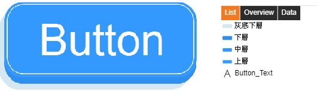
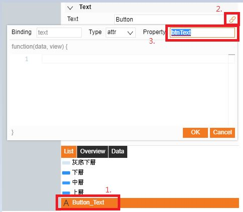
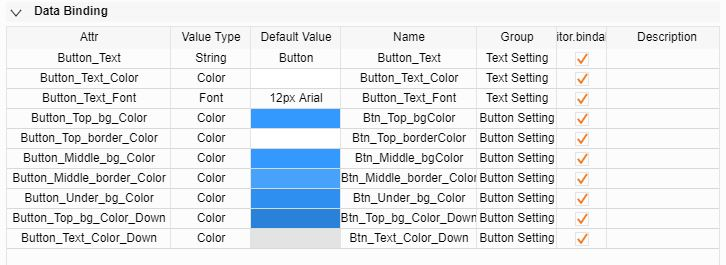
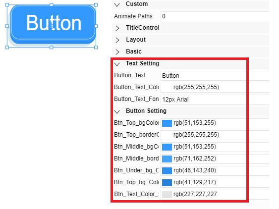
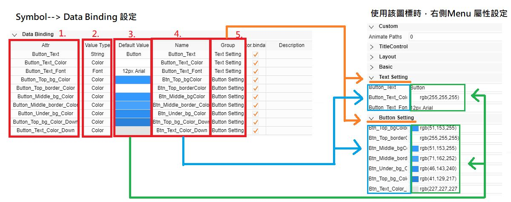
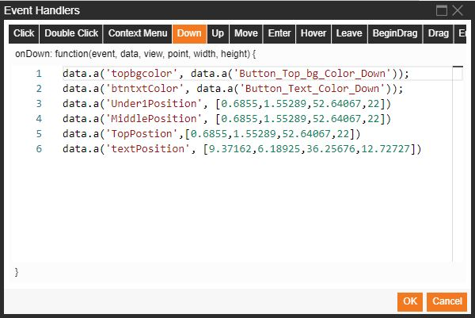
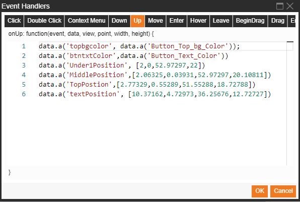
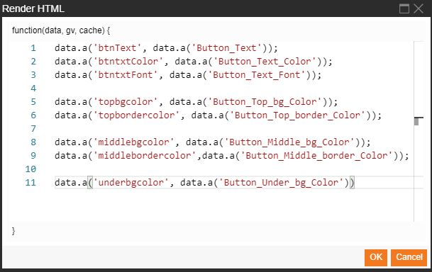

# Symbols Event Detail  

## Event Handlers
The trigger events for symbol event handlers are the same as those for display event handlers.
Please refer to the document related to display event handling for further operation details.

The following uses a button symbol as an example to provide details of how to create a symbol:

# 1. Create a button graph

The button consists of 4 round rectangle (Round Rect) objects and 1 text (Text) object.
Each object is named to facilitate identification.

# 2. Perform Property naming for the existing attributes of each object

To control the existing attributes of an object with program code instructions, Property names must be provided to the attributes of the object.
Take the text object of the button symbol as an example:

Select the text and set up the name as btnText under Text>Text attribute>paperclip button>Property, as shown in the following figure:

The other existing attributes that will be used are named in the same fashion as above.
- Button_Text: Text>Text->btnText
- Text>Color->btntxtColor
- Text>Font->btntxtFont
- Top layer: Layout>Rect->TopPostion
- Background>Background->topbgcolor
- Board>Color->topbordercolor
- Middle layer: Layout>Rect->MiddlePostion
- Background>Background->middlebgcolor
- Board->Color->middlebordercolor
- Underlying layer: Layout>Rect->Under1Position
- Background>Background->underbgcolor
			 
# 3. Data Binding

For data binding, settings will be shown below the Menu on the right while this symbol is in use.
In other words, related attribute values can be set up via these attributes.

To set up or data binding for symbol attributes, use the Menu on the right

In an actual scenario where the symbol is used in a display, select the symbol to show the related attributes below the Menu on the right.

Details of the corresponding relationship between the data binding setup of symbol attributes and the actual use of those symbol attributes

1. Attr: set up the name of the attribute; the attribute name is used to retrieve the attribute for control when a program code instruction needs to control the attribute.
2. ValueType: set up the data type, which can be various types, including a string, a color, a font, a boolean, an integer, and the like.
3. Default Value: set up the default value, where the default value for the corresponding attribute of this symbol is set.
4. Name: set up the display name of the attribute, which is the name displayed to the user when using the symbol.
5. Group: set up a category of an attribute group, which enables grouping and categorization of the data binding.

# 4. Code Writing

The program code instructions can be written to handle an event either with global event handling or with event handling of individual objects, depending on the application scenario.
Here, we aim to achieve overall control of the symbols; therefore, the program codes for event handling will be written in global event handling code instead of for individual objects.

**Down event**

**Down event program code**

`data.a('topbgcolor', data.a('Button_Top_bg_Color_Down'))`
`data.a('btntxtColor', data.a('Button_Text_Color_Down'))`
`data.a('Under1Position', [0.6855,1.55289,52.64067,22])`
`data.a('MiddlePosition', [0.6855,1.55289,52.64067,22])`
`data.a('TopPostion',[0.6855,1.55289,52.64067,22])`
`data.a('textPosition', [9.37162,6.18925,36.25676,12.72727])`

Explanation: When the button is pressed, the background color of the top-layer button will turn into the color specified by the **Button_Top_bg_Color_Down** attribute, the text color of the button will turn into the color specified by the **Button_Text_Color_Down attribute**, and the positions of the top-layer, middle-layer, underlying-layer buttons and the button text will be changed.

**UP event**

**UP event program code**

`data.a('topbgcolor', data.a('Button_Top_bg_Color'))`
`data.a('btntxtColor',data.a('Button_Text_Color'))`
`data.a('Under1Position', [2,0,52.97297,22])`
`data.a('MiddlePosition',[2.06325,0.03931,52.97297,20.10811])`
`data.a('TopPostion',[2.77329,0.55289,51.55288,18.72788])`
`data.a('textPosition', [10.37162,4.72973,36.25676,12.72727])`

Explanation: When the button is released, the background color of the top-layer button will return to the original color, which means changing back to the color specified by the **Button_Top_bg_Color** attribute; the button text will also return to the original color, which means changing back to the color specified by the **Button_Text_Color** attribute; the positions of the top-layer, middle-layer, underlying-layer buttons and the button text will be restored to their original positions.

# 5. Result

## Render Elements (Render HTML)
Rendering elements in a symbol means that upon execution of a frame, a specified action is performed with respect to the symbol.
Take the button symbol as an example. The program code instructions for element rendering of this button are provided below.

**Program code**
(1) `data.a('btnText', data.a('Button_Text'))`
(2) `data.a('btntxtColor', data.a('Button_Text_Color'))`
(3) `data.a('btntxtFont', data.a('Button_Text_Font'))`
(4) `data.a('topbgcolor', data.a('Button_Top_bg_Color'))`
(5) `data.a('topbordercolor', data.a('Button_Top_border_Color'))`
(6) `data.a('middlebgcolor', data.a('Button_Middle_bg_Color'))`
(7) `data.a('middlebordercolor', data.a('Button_Middle_border_Color'))`
(8) `data.a('underbgcolor', data.a('Button_Under_bg_Color'))`

** Program code explanation:

(1) **Text** > The Text:btnText property is for the text of the button; the text setting value is set via the Button_Text property,
	   and the button text is rendered as the specified text upon execution.
(2) **Text** > The Color:btntxtColor property for the color of the text of the button; the color setting value is set via the Button_Text_Color property,
	   and the button text is rendered as the specified color upon execution.
(3) **Text** > The Font:btntxtFont property for the font type of the text of the button; the font size and type setting value of the text are set via the Button_Text_Font property,
       and the button text is rendered as the specified font size and type upon execution.
(4) **Background** > The Background:topbgcolor property for the background color of the top-layer button; the top-layer background color setting value is set via the Button_Top_bg_Color property,
       and the background color is rendered as the specified color upon execution.
(5) **Border** > The Color:topbordercolor property for the border color of the top-layer button; the top-layer border color setting value is set via the Button_Top_border_Color property,
       and the top-layer border color is rendered as the specified color upon execution.
(6) **Background** > The Background:middlebgcolor property for the background color of the middle-layer button; the middle-layer background color setting value is set via the Button_Middle_bg_Color property,
       and the background color is rendered as the specified color upon execution.
(7) **Border** > The Color:middlebordercolor property for the border color of the middle-layer button; the middle-layer border color setting value is set via the Button_Middle_border_Color property,
       and the middle-layer border color is rendered as the specified color upon execution.
(8) **Background** > The Background:underbgcolor property for the background color of the underlying-layer button; the underlying-layer background color setting value is set via the Button_Under_bg_Color property,
       and the underlying-layer background color is rendered as the specified color upon execution.
