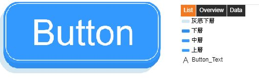
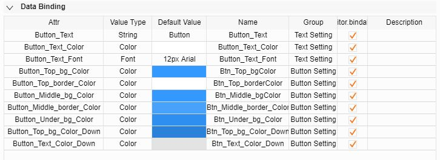
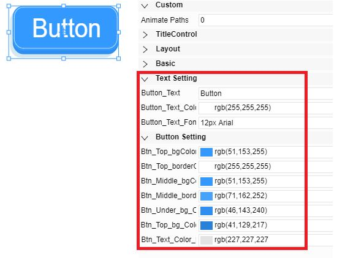
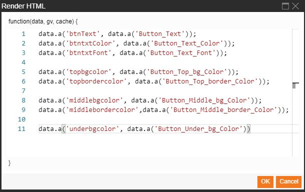

# 圖標事件處理  

## 事件處理(Event Handlers)：
在圖標事件處理內的每一觸發事件，都與圖紙(Display)的事件處理相同，
相關操作內容，請參考圖紙(Display)的事件處理文件。

製作一個圖標，以下使用按鈕圖標作為範例：

# 1. 製作按鈕圖形

按鈕的部分總共拉出4個圓矩形體(Round Rect)物件，1個文字(Text)物件構成，
並將每一物件的名稱(Name)進行命名，以利辨識每一物件

# 2. 給予每一物件的現有屬性進行Property命名

如想使用程式碼指令控制物件現有的屬性，就必須將該物件的屬性給予Property名稱。
以按鈕圖標文字為例：

點選文字，在Text>Text屬性>迴紋針按鈕>Property給予名稱btnText，如下圖：

依照以上的方式，將其他會使用到的現有屬性，也進行Property命名

物件: "Button_Text"
> - Text -> Text -> btnText
> - Text -> Color -> btntxtColor
> - Font -> Text -> btntxtFont

物件: "上層"
> - Layout -> Rect -> TopPostion
> - Background -> Background -> topbgcolor
> - Board -> Color -> topbordercolor

物件: "中層"
> - Layout -> Rect -> MiddlePosition
> - Background -> Background -> middlebgcolor
> - Board -> Color -> middlebordercolor

物件: "下層"
> - Layout -> Rect -> Under1Position
> - Background -> Background -> underbgcolor
			 
# 3. 自行建立屬性(Data Binding)

在此自行建立的屬性，當使用者使用此圖標時，可在右側Menu下方看到這些屬性設定，
意即使用者可以透過這些屬性，進而設定相關屬性值。

圖標屬性建立設定，右側Menu

實際在圖紙使用此圖標時，點選該圖標，相關屬性會顯示在右側Menu下方

圖標屬性建立設定與實際使用該圖標屬性對應之關係說明

1. Attr: 屬性名稱設定，當程式碼指令要控制此屬性時，就使用Attr名稱抓取此屬性進行控制。
2. ValueType: 資料類型設定，可設定為字串、顏色、字型、布林、整數...等資料類型。
3. Default Value: 預設值設定，可在此設定此圖標相關屬性預設的預設值。
4. Name: 屬性顯示名稱，此處設定的名稱，是給予使用者在使用此圖標時所看見的名稱。
5. Group: 屬性群組分類，可將自行設定的屬性進行群組分類。

# 4. 撰寫程式碼

可依情況自行決定程式碼指令需在全域事件處理或是每一物件事件處理進行程式碼指令撰寫，
而此範例是要控制整體圖標，因此，事件處理的程式碼會寫在全域的事件處理內，並非每一物件的事件處理內。

**Down事件**

**Down事件程式碼**

data.a('topbgcolor', data.a('Button_Top_bg_Color_Down'));
data.a('btntxtColor', data.a('Button_Text_Color_Down'));
data.a('Under1Position', [0.6855,1.55289,52.64067,22]);
data.a('MiddlePosition', [0.6855,1.55289,52.64067,22])
data.a('TopPostion',[0.6855,1.55289,52.64067,22])
data.a('textPosition', [9.37162,6.18925,36.25676,12.72727])

說明：當按鈕被按下時，上層按鈕背景顏色會變為Button_Top_bg_Color_Down屬性給予的顏色，
	  按鈕文字顏色會變為Button_Text_Color_Down屬性給予的顏色，
	  並且將上、中、下層按鈕以及按鈕文字的位置都會改變。

**UP事件**

**UP事件程式碼**

data.a('topbgcolor', data.a('Button_Top_bg_Color'));
data.a('btntxtColor',data.a('Button_Text_Color'))
data.a('Under1Position', [2,0,52.97297,22])
data.a('MiddlePosition',[2.06325,0.03931,52.97297,20.10811])
data.a('TopPostion',[2.77329,0.55289,51.55288,18.72788])
data.a('textPosition', [10.37162,4.72973,36.25676,12.72727])

說明：當按鈕被放開時，上層按鈕背景顏色會變回原來的顏色，意即變回Button_Top_bg_Color屬性的顏色，
	  按鈕文字也會變回原來的顏色，意即變回Button_Text_Color屬性的顏色，
	  並且也將上、中、下層按鈕以及按鈕文字的位置都變回原位。

# 5. 結果

## 渲染元素(Render HTML)
在圖標內的渲染元素為，當畫面一執行時，就給予此圖標進行指令動作，
如按鈕圖標範例為例，下圖為此按鈕的渲染元素程式碼指令：

**程式碼:**
data.a('btnText', data.a('Button_Text'));
data.a('btntxtColor', data.a('Button_Text_Color'));
data.a('btntxtFont', data.a('Button_Text_Font'));
data.a('topbgcolor', data.a('Button_Top_bg_Color'));
data.a('topbordercolor', data.a('Button_Top_border_Color'));
data.a('middlebgcolor', data.a('Button_Middle_bg_Color'));
data.a('middlebordercolor', data.a('Button_Middle_border_Color'));
data.a('underbgcolor', data.a('Button_Under_bg_Color'));

**程式碼說明：**
data.a('btnText', data.a('Button_Text'));
> 按鈕文字的Text>Text:btnText屬性，文字設定值是透過Button_Text屬性給予，
並在一執行時就將按鈕文字渲染成設定的文字。

data.a('btntxtFont', data.a('Button_Text_Font'));

> 按鈕文字顏色的Text>Color:btntxtColor屬性，顏色設定值是透過Button_Text_Color屬性給予，
並在一執行時就將按鈕文字渲染成設定的顏色。

data.a('btntxtFont', data.a('Button_Text_Font'));

> 按鈕文字字形的Text>Font:btntxtFont屬性，文字大小與字形設定值是透過Button_Text_Font屬性給予，
       並在一執行時就將按鈕文字渲染成設定的文字大小與字形。

data.a('topbgcolor', data.a('Button_Top_bg_Color'));
> 上層按鈕背景顏色Background>Background:topbgcolor屬性，上層背景顏色設定值是透過Button_Top_bg_Color屬性給予，
       並在一執行時就將背景顏色渲染成設定的顏色。

data.a('topbordercolor', data.a('Button_Top_border_Color'));
> 上層按鈕框線顏色Border>Color:topbordercolor屬性，上層框線顏色設定值是透過Button_Top_border_Color屬性給予，
       並在一執行時就將上層框線顏色渲染成設定的顏色。

data.a('middlebgcolor', data.a('Button_Middle_bg_Color'));
> 中層按鈕背景顏色Background>Background:middlebgcolor屬性，中層背景顏色設定值是透過Button_Middle_bg_Color屬性給予，       並在一執行時就將背景顏色渲染成設定的顏色。

data.a('middlebordercolor', data.a('Button_Middle_border_Color'));
> 中層按鈕框線顏色Border>Color:middlebordercolor屬性，中層框線顏色設定值是透過Button_Middle_border_Color屬性給予，       並在一執行時就將中層框線顏色渲染成設定的顏色。

data.a('underbgcolor', data.a('Button_Under_bg_Color'));
> 下層按鈕背景顏Background>Background:underbgcolor屬性，下層背景顏色設定值是透過Button_Under_bg_Color屬性給予，
       並在一執行時就將下層背景色渲染成設定的顏色。