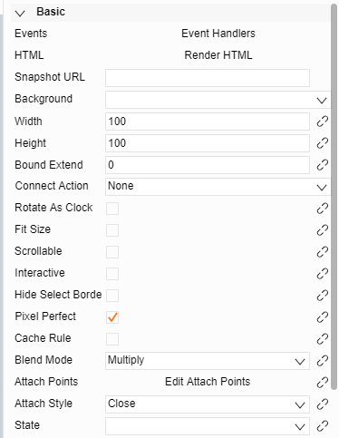

# Symbol related attributes

## I.	Basic attributes

1.	Events :    
A logic function for processing mouse events, it can be defined for the icon
2.	HTML :    
A function for rendering icon elements
3.	Snapshot URL :    
Thumbnail icon; if specified, a thumbnail will be automatically generated
4.	Width and Height           
The size of the symbol

## II.	Symbol data binding attribute

1.	Attr:    
The name of the bound attribute: The value of this attribute can be obtained via data.a (Attr)
2.	Value Type:   
The value type of the bound attributes, string, multi-line text, numerical …etc.
3.	Default Value:   
The default value of the bound attribute
4.	Name:   
The name of the bound attribute shown in the display. If not written, the value of Attr is shown.

	The buttons on the bottom left are, in order: New, delete, import.The button on the lower right is used to adjust the order of the attributes.
