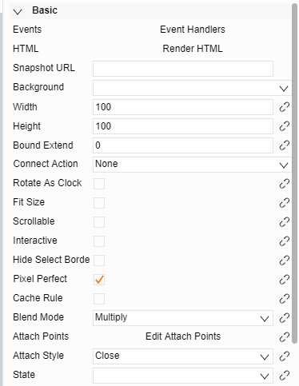
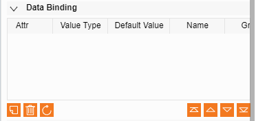

# 圖標基本屬性  

## 1-基本屬性

1. 事件

	可在圖示中定義滑鼠事件處理邏輯函數
2. 元素       

	編寫函數對圖示元素進行渲染操作
3. 快照地址

	圖示縮略圖，若不填自動生成一個縮略圖
4. 寬度高度

	圖示的大小

## 2-圖示資料綁定屬性

1. Attr

	綁定的屬性的名稱：可以通過 data.a(此名稱）獲取該屬性的值

2. 數值型別       
	綁定的屬性的值得類型，字串、多行文本、數位等

3. 預設值       
	綁定屬性的預設值

4. 名稱       
	綁定的屬性在圖紙中顯示的名稱，若不寫則顯示Attr的值左下方按鈕依次為：
       新建、刪除、導入右下方按鈕用來調整屬性的順序

