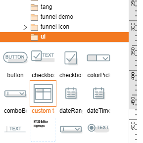
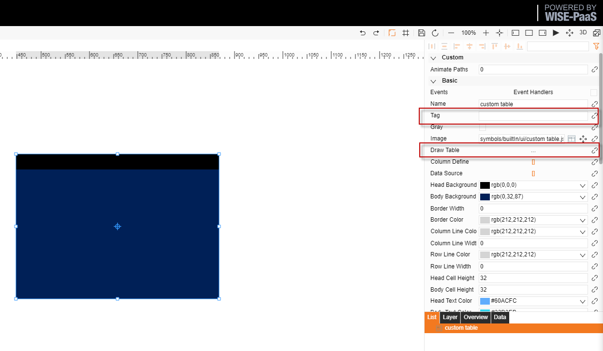
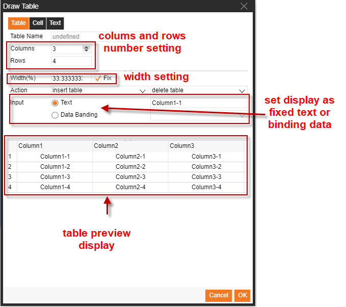
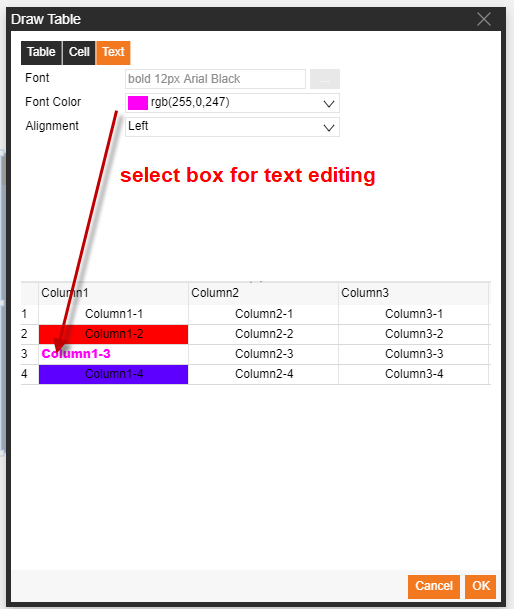
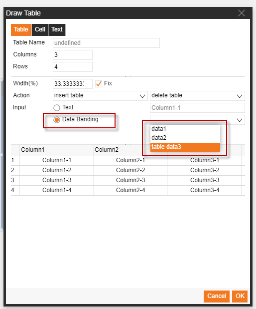
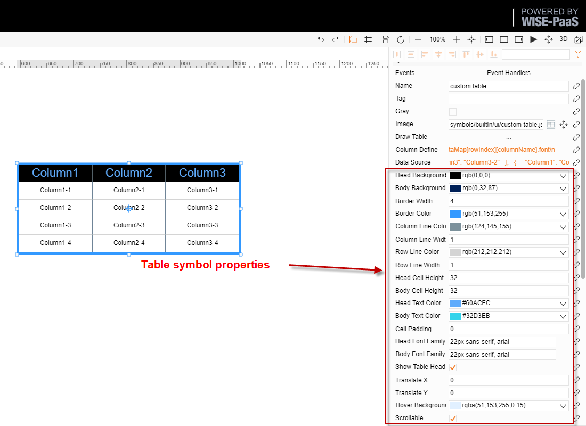

# Custom Table Data Binding

1.  Table icon location: symbols/builtIn/ui/custom table.json

2.  Instructions:

Drag the icon onto the drawing sheet, fill in the label field (mandatory), and then click the Draw Table button

3.  Create the table content

4.  Set the table format

5.  Bind the data to the table

 Bind relevant data to the self-defined data. 

6.  Bind the data to the corresponding cells in the table

7.  Adjust the formatting

>  After clicking the Save button, users can adjust the table size on the drawing interface by dragging the borders of the table; the header and format of the columns and rows can also be adjusted.  

8.  Revise the header

>   Click the Row Definition button and revise the value of “displayName” (do not change any other settings)

