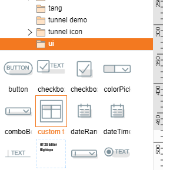
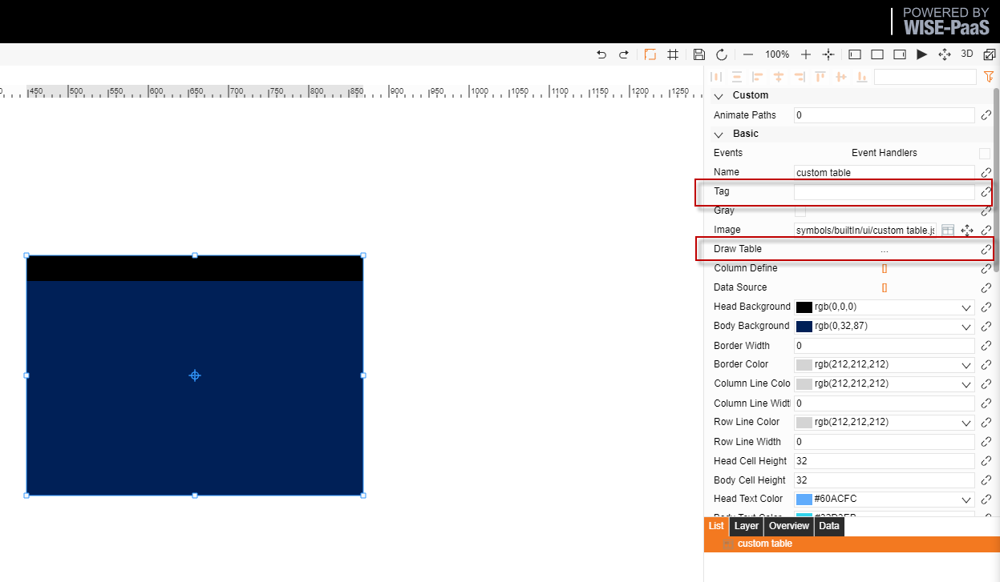
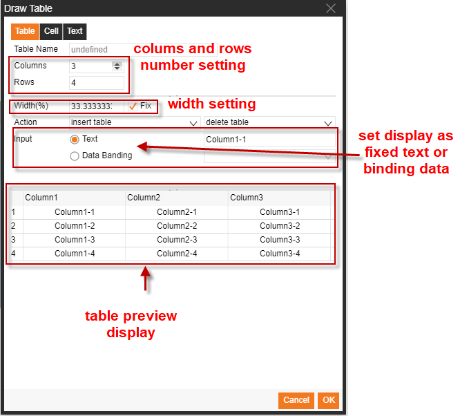
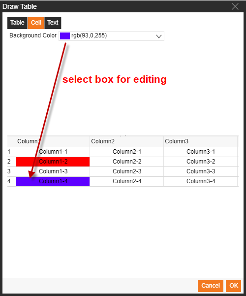
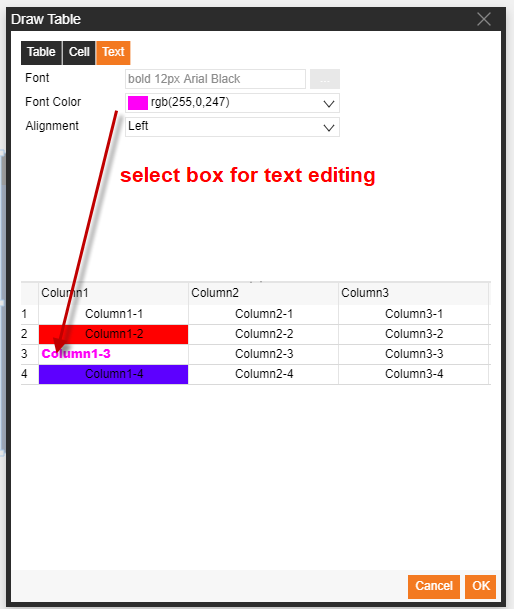
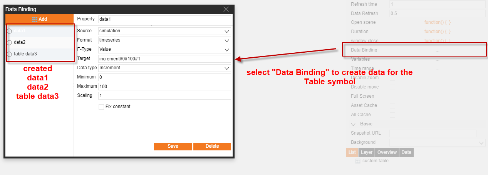
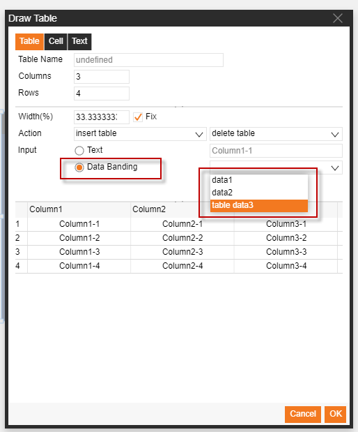
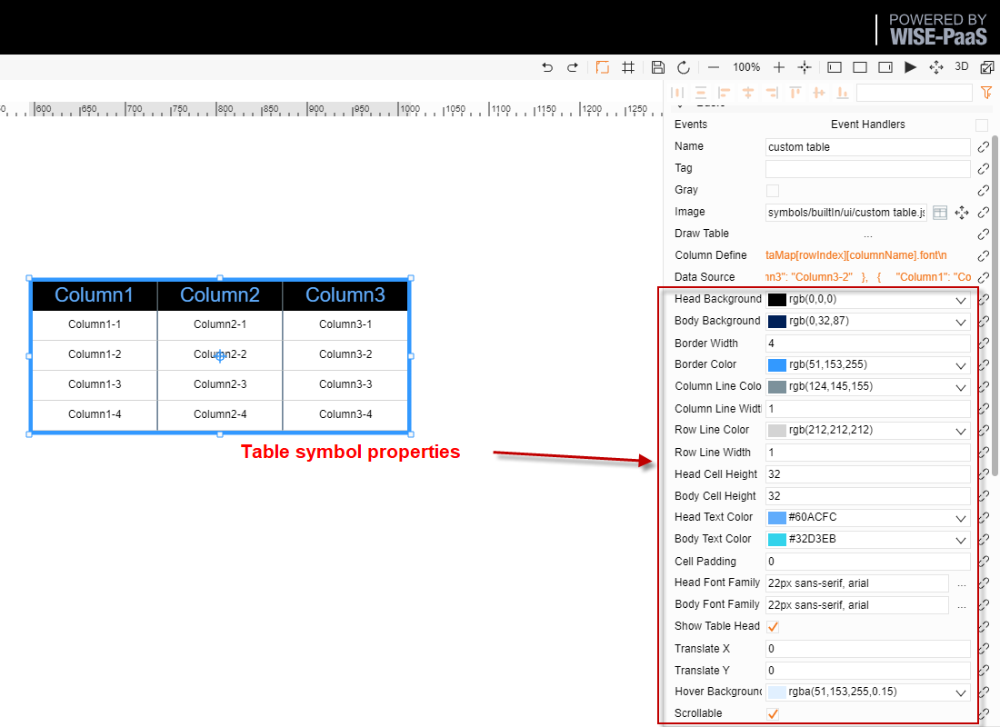
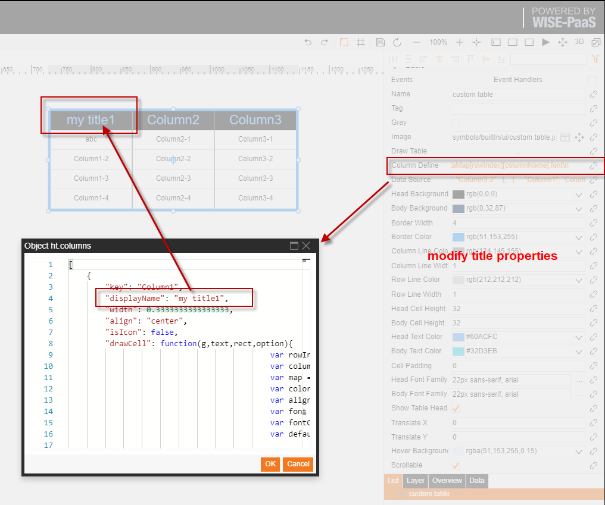

# Custom Table Data Binding

1.  表格圖示位置 symbols/builtIn/ui/custom table.json

2.  使用方法:

將圖示拖到圖紙當中，填寫標籤欄（必須填寫），然後點擊表格繪製按鈕  

3.  表格內容繪製  

4.  表格樣式繪製  

5.  表格資料綁定  

  點擊保存之後可以在圖紙介面，拖拉表格改變大小，並可以對表頭以及行列格式作出調整 

6.  將綁定好的資料綁定到表格對應的儲存格當中

7.  格式微調  

    點擊列定義一欄，修改對應的 displayName 這一屬性的值即可（切勿修改其他）  

8.  修改表頭內容

    點擊列定義一欄，修改對應的 displayName 這一屬性的值即可（切勿修改其他）  

