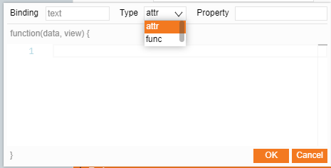
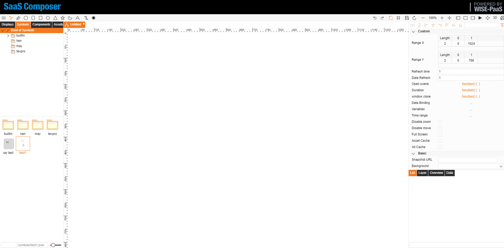
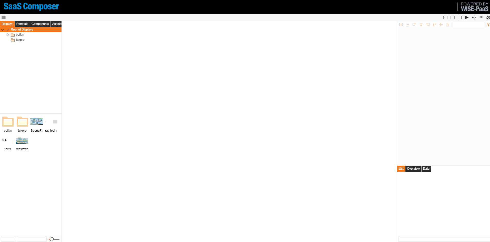

# Symbol Data Binding

Symbol data binding is divided into two forms:

--attr: Directly bind the corresponding attribute value.
--func: Perform some logical processing on the bound data value.
When the symbol element is selected in the display, the bound icon data is shown in the basic attributes.

## I.	Attribute binding

Symbol “attr” binding steps:
1.	Create a new symbol and create an element from the icon menu bar.
2.	Click on the blank space of the canvas, "Data binding" will appear in the attribute field on the right, click the "Add" button in the lower left corner to create a new attribute.
3.	Set the attribute “Attr”, value type, and preset value.
4.	Click on the element and click on the small link to the right of the attribute to be bound to open the data binding window.
5.	Select “attr” as the type, enter the “attr” value you just created in the attribute.

## II.	Function binding

Symbol “func” data binding steps:
1.	Create a new symbol and create an element from the icon menu bar.
2.	Click on the blank space of the canvas, "Data binding" will appear in the attribute field on the right, click the "Add" button in the lower left corner to create a new attribute.
3.	Set the attribute “Attr”, value type, and preset value.
4.	Click on the element and click on the small link to the right of the attribute to be bound to open the data binding window.
5.	Select “func” as the type, enter the JavaScript code for the icon in the function to complete the logical processing    
	
	Use the method data.a ('the Attr value created') to get the attribute value bound to the symbol.