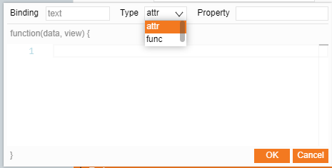
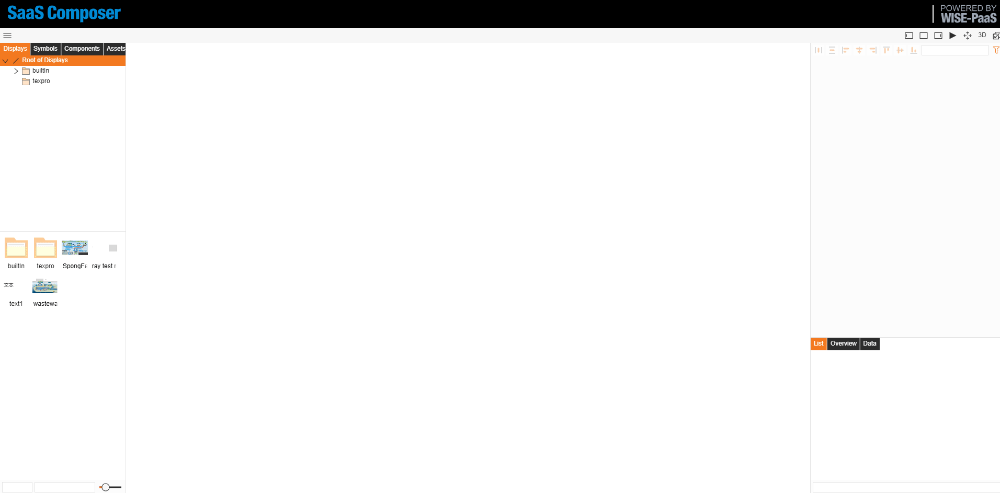

# 圖標資料綁定

圖標資料綁定分兩種形式：

--attr：
直接綁定對應的屬性值

--func：
對綁定的資料值進行一定的邏輯處理圖紙中選中圖示元素時會在基礎屬性中顯示圖示綁定的資料

## 1-attr形式綁定  

圖標資料綁定步驟：
1. 新建圖標，並在圖標中創建一個元素
2. 點擊元素，針對要綁定的屬性欄，點擊屬性右側的小連結，打開資料綁定視窗
3. 類型中選擇 attr ，在屬性中額外命名屬性名稱!
4. 點擊圖標空白處，右側屬性欄會出現“數據綁定”，點擊左下角“添加”’按鈕新建一個屬性
5. 完成屬性Attr、數值型別以及預設值的設置

## 2-func形式綁定  

圖標func資料綁定步驟：
1. 新建圖標，並在圖示中創建一個元素
2. 點擊圖標空白處，右側屬性欄會出現“資料綁定”，點擊左下角“添加”’按鈕新建一個屬性，
3. 完成屬性Attr、數值型別以及預設值的設置
4. 點擊元素，點擊將要綁定屬性右側的小連結，打開資料綁定視窗
5. 類型中選擇 func ，
在function中輸入標誌JavaScript代碼完成邏輯業務    
使用 data.a('創建屬性的 Attr 值') 
這一方法來獲取圖標綁定屬性值
