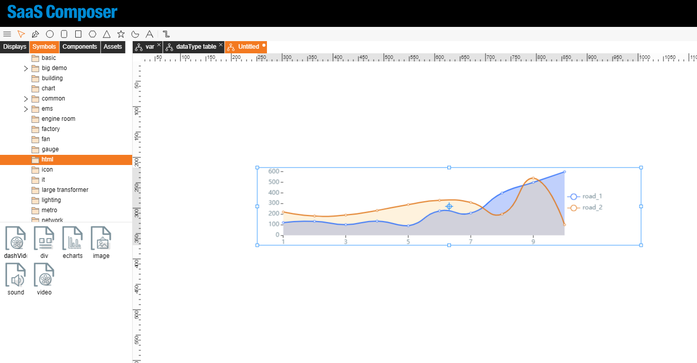
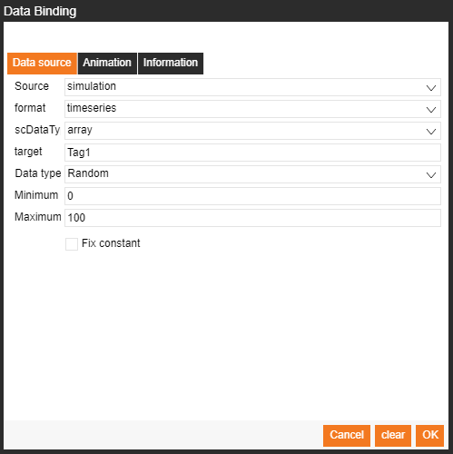
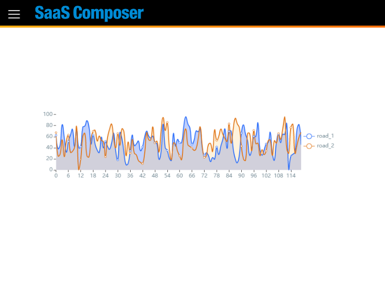

# E-CHART數據綁定(格式類型 ARRAY)
Select Symbols > builtIn > html > echart  

Bind data "line Data1" & "line Data2"  

with format "timeseries" and data type "array".  

Set x-axis can use series number.  

    function(){
        var ary = []
        for(var i = 0 ; i < 120; i++){
            ary.push(i)
        }
        return ary
    }

Preview：

