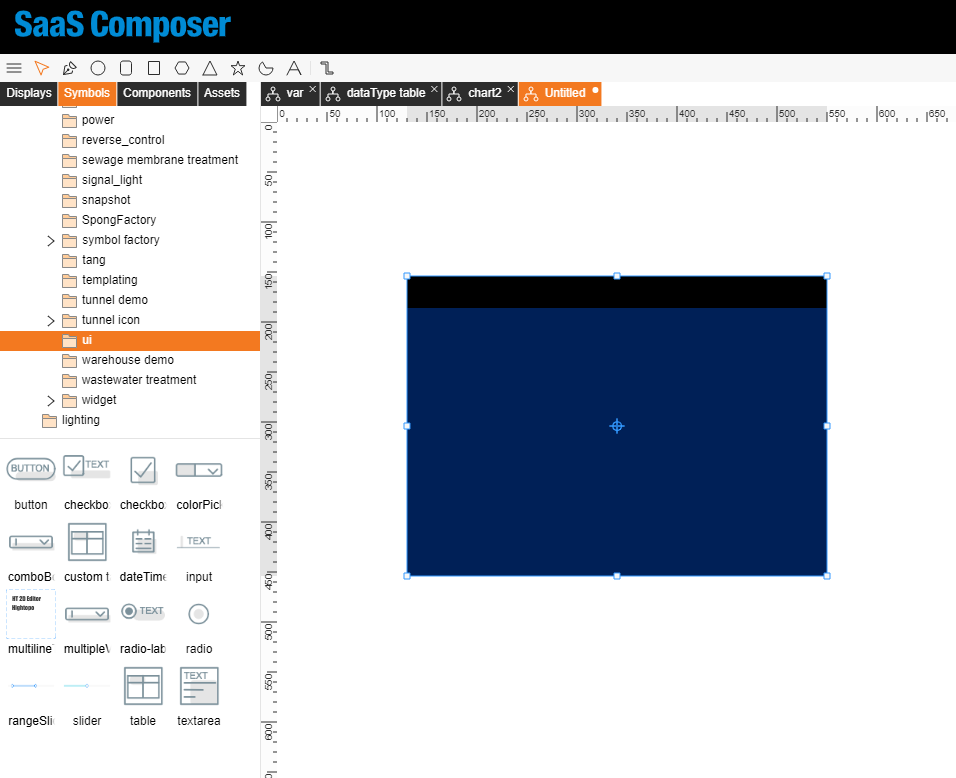
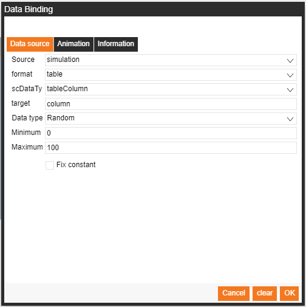
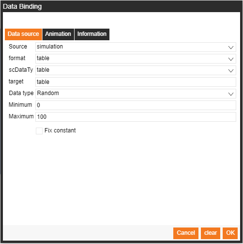
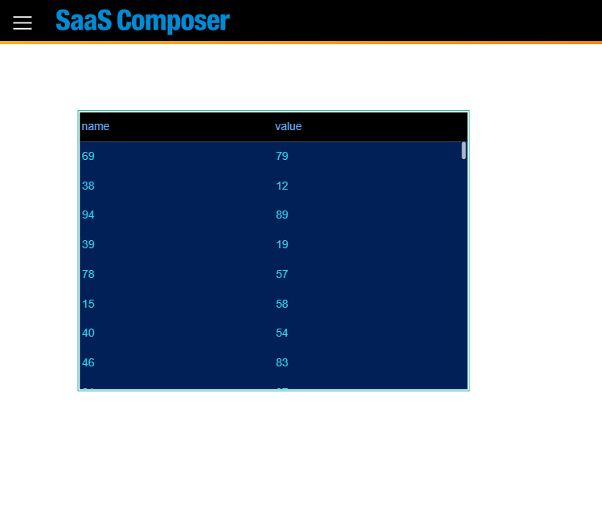

# Table Data Binding

Select Symbols > builtIn > ui > table  

Bind data "Column Define" with format "table" and data type "column"   

    [
        {
            "key": "username",
            "displayName": "User name"
        },
        {
            "key": "address"
        },
        {
            "key": "sex"
        }
    ]

`key` need to map raw data column name, you can use `displayName` to change table header text.

Bind data "Data Source" with format "table" and data type "table"   

    [
          {
            "username": "张三",
            "sex": "男",
            "address": "深圳宝安区"
          },
          {
            "username": "David",
            "sex": "男",
            "address": "厦门思明区"
          }
    ]

Preview  
