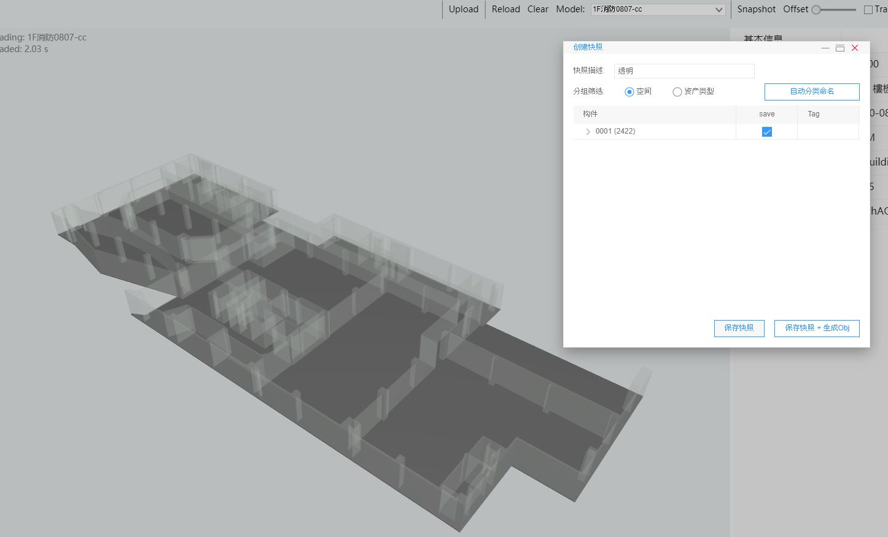
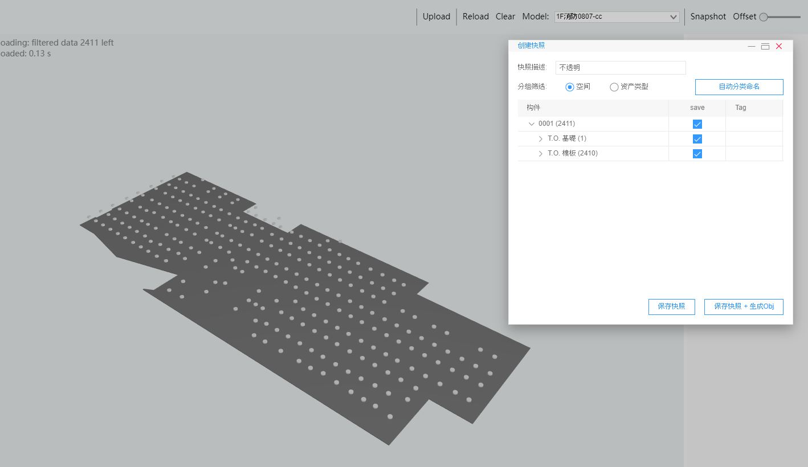

# BIM server

# Login  

Please contact SaaS Composer Product PM apply the login account.  

# .ifc format  

Save BIM model to .ifc foramt file，Please use **IFC2x3 Coordination View 2.0** ifc format  
  

# Upload .ifc file  

When ifc file upload success, the model will show in the center area, then we can edit model and save snapshot in BIM-server.

# Save snapshot in BIM server  

Edit model checkout (show or hide) objects, then save.  

1. Click SnapShot in toolbar  

  

  

2. Write description (option), then save snapshot  

  

3. After create snapshot, will show success dialog message.

  

4. can preview snapshot in snapshot file list  

  

# Uploaded model objects unseen in BIM editor  

  

model objects is `0`  

Click filter tab  

      

uncheck all filter  

    

Click `refresh` button  

    

# Download snapshot IFC resource  

Click `Download IFC resource` in toolbar  

  

`.snap.json` is snapshot file  
filename `.json` is model file  

  

In SaaS Composer Editor import BIM, 加載BIM-->離線快照，drag Model json and SnapShot json file into inputbox 

  

Then wIll see the model 

  

# Transparent object  

1. Separate Transparent object and nontransparent object in two different snapshot.  

  

  

  

2. Import both model in SaaS Composer editor

3. check Transparent & Reverse Cull option in object properties.

  

4. Make two objects overlap

  

# Separate BIM object by Cobie Tag    

When we need to integrate COBie (Construction to Operations Building information exchange)  data in SaaS Composer. There are some preprocessing have to do in BIM server. Separate objects snapshot by Tag.

1. Create snapshot, Group Rule select `Grouped By Tag` or `Group by Property` then save snapshot.  

  

2. In 3D editor，load BIM model.

  

3. We can see all object separate by tag or property.    

  

4. If not separate by tag, all 3D objects in BIM will group as single object in 3D editor.  

  

