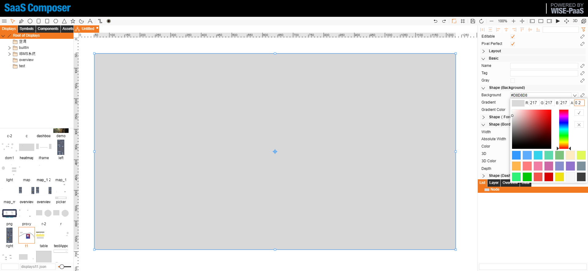

# Create Overlay Layer  

Please follow the steps below.  

- Establish a layer to be overlaid  
- Add the overlay display to a 3D scene  

### 2D Scene
Draw a rectangle as the background for full-screen expansion  

  

Set the opacity for the visibility of the overlay layer. Please set it to transparent for general applications, such that the overlay layer is easily visible.  

  

Set “Fullscreen” and “Fill”  

  

Adjust fullscreen lock and fullscreen spacing as desired  

  

Return to the attributes of “Display” and select “Host” for the “Connection Action” setting  

  

Select a symbol to add to the display and use the ‘blue arrow’ next to the symbol to perform the host connection action  

  

Add one symbol on the left and one on the right  

  

Set the alignment of the symbol on the left as “Left” for the Horizontal setting and as “Top” for the Vertical setting

  
  

Set the alignment of the symbol on the right as “Right” for the Horizontal setting and as “Top” for the Vertical setting  

  
  

Save as ‘Layer 1’  

  

Preview the effect of the current display  

  

### 3D Scene

Open the 3D scene and set ‘Layers’ by setting the list length to 1 and fill in the first entry with the file path of the overlay layer display, ‘displays/layer1.json’  

  

Preview the effect of the overlay layer (please go to the ‘Menu’ option in the management page, and open the overlay layer to preview the menu)  

### 

Open settin--> view --> turn on Layers--> Submit  
  

Menu-->Add node-->copy 3D scene file addrese patse to Sketchboard link and save.  
  

Click view button to preview the result.  
  

  

