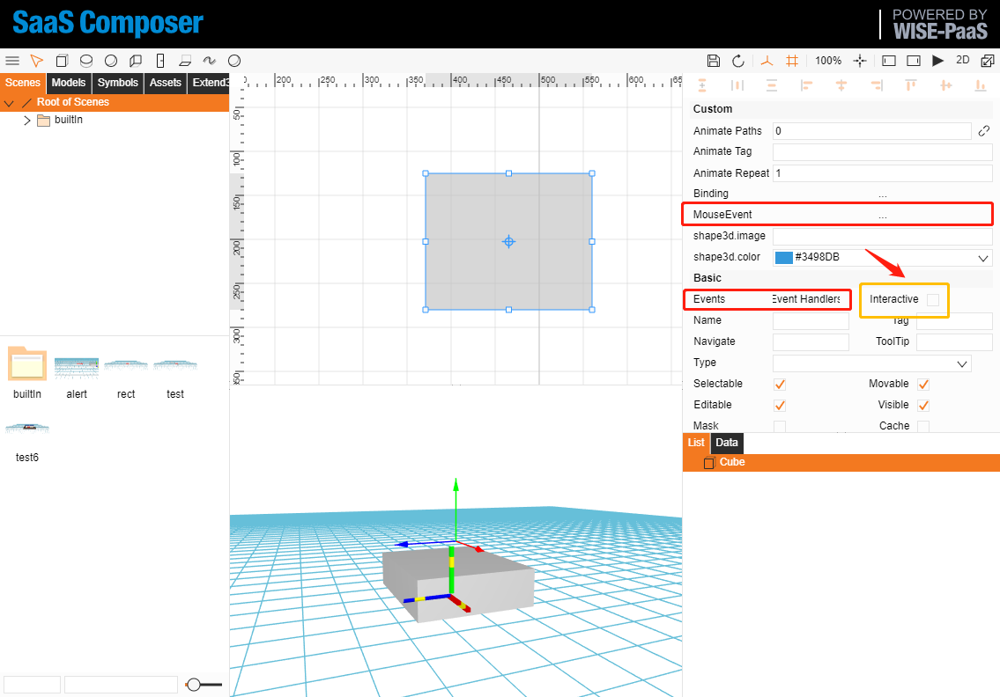
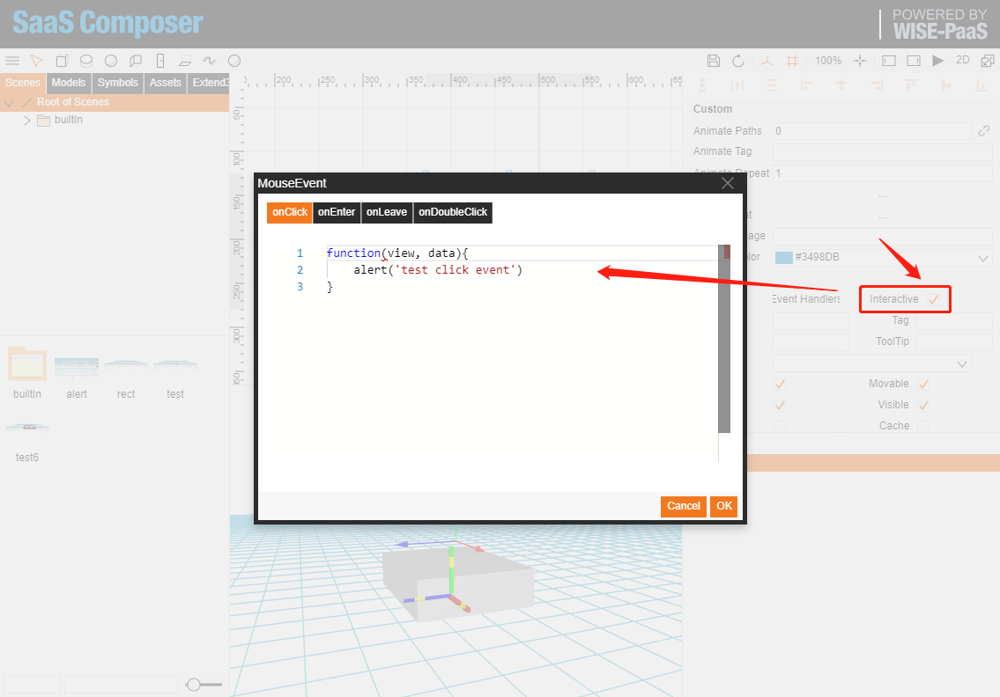
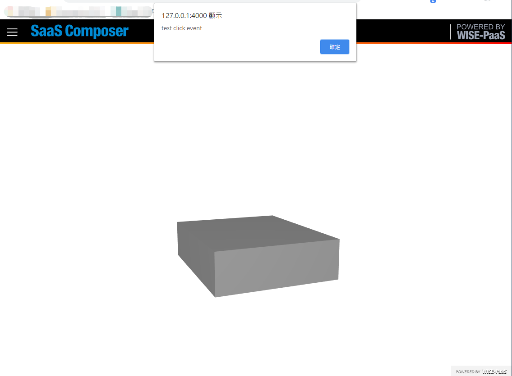
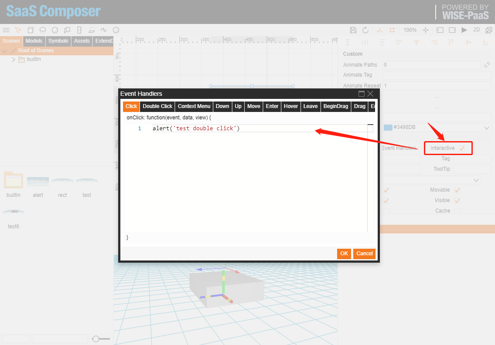
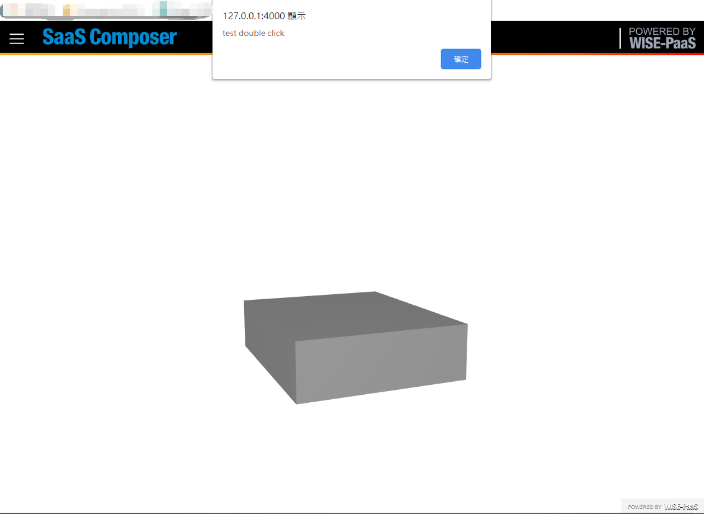

# 3D Event Handler  

3D Events function include **MouseEvent**、**Event Handler**。  
**MouseEvent** include in **Event Handler**, In new version of SaaS Composer can just use Event handler function replace mouse event.

  

1. Check **Interactive**  
2. Open **MouseEvent** dialog  
**Note.** Need add `function(view, data){ }`  

  
  

1. Check **Interactive**  
2. Open **Event Handler** dialog  

    
    