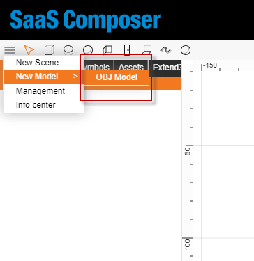
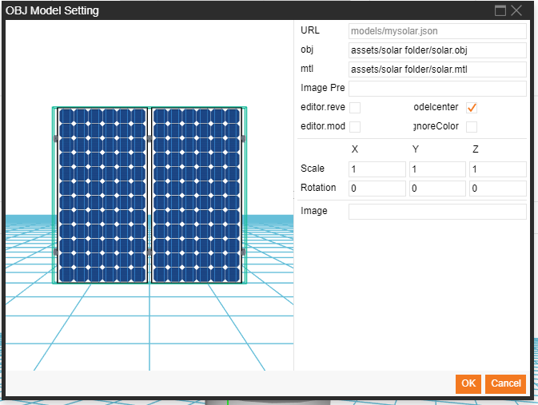
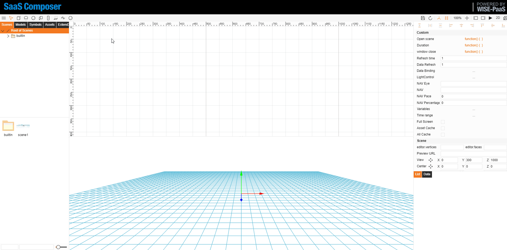

**Create a 3D model:**

1. In the upper left corner, there is a button with three bars. Click this button and move the mouse to "**New Model**", then move the mouse to "**New OBJ Model**" and click it to open the model creation window.

2. Create a new model by filling in the content for creating the OBJ model.

Description of the OBJ model creation parameters:
1.  Files required for creating the model
    The model's obj file, mtl file, and other PNG files that are dependencies of the mtl files
    **Need to set obj & mtl have same file name**
    **remove mtl file texture file path**
2. Description of the parameters
- Path: The path of the current model       
- obj: Path of the model's obj file       
- mtl: Path of the model's mtl file       
- First code of the graphic: The directory of the PNG files that the mtl file depend on. If not filled in, the complete file path must be written in the mtl file.            If filled in, only the file name must be written in the mtl file.
- Thumbnail: The path of the thumbnail displayed for the model. If not filled in, the system will automatically generate a thumbnail.

