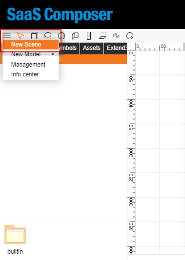
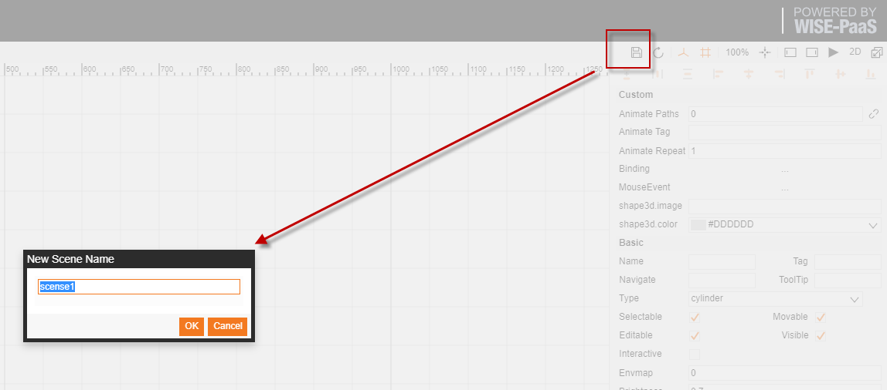
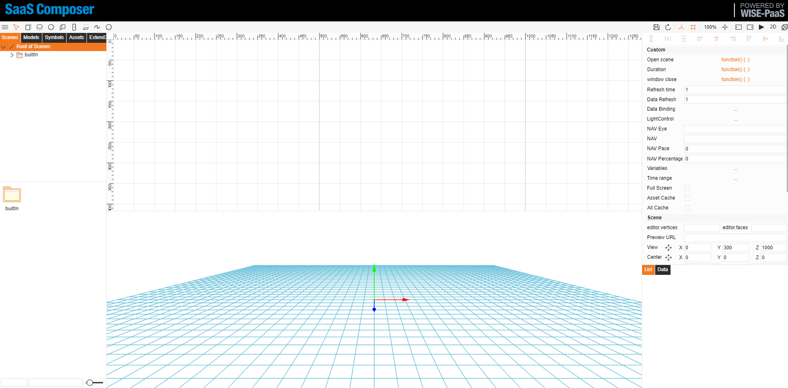

**3D scene creation:**

1. In the upper left corner, there is a button with three bars. Click this button and move the mouse to "New Scene" and click it to generate a blank scene.

2. Click on Save in the upper right corner of the action menu and fill in the scene name to create a 3D scene file

