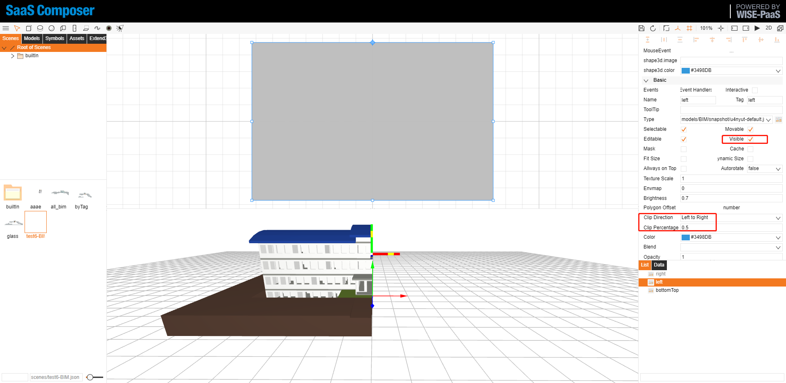

# 3D 裁切  

  

# 概念 

- 建立三個相同物件並重疊  
- 分別設定三個物件裁切方式  
- 改變錨點，旋轉中心  
- 依序改變裁切顯示及旋轉方式  

# 實作  

## 建立三個相同物件，依序設定。  

裁切方向 clip Direction: Bottom to Top  
裁切比例 clip Percentage: 0  
調整錨點 Anchor point  
可見: true  

  

clip Direction: right to left  
clip Percentage: 0.5  
調整錨點 Anchor point  
可見: false  

  

clip Direction: left to right  
clip Percentage: 0.5  
調整錨點 Anchor point  
可見: false  

  

## 開啟場景  

設定參數  

    window.step = 0

## 執行期間    

設定動態物件屬性  

    if (step < 1) {
        step += 0.05
        dataModel.getDataByTag('bottomTop').s('3d.clip.percentage', step)
    } else if (step === 1) {
        dataModel.getDataByTag('bottomTop').s('2d.visible', false)
        dataModel.getDataByTag('bottomTop').s('3d.visible', false)
        dataModel.getDataByTag('left').s('2d.visible', true)
        dataModel.getDataByTag('left').s('3d.visible', true)
        dataModel.getDataByTag('right').s('2d.visible', true)
        dataModel.getDataByTag('right').s('3d.visible', true)
    } else {
        if (step - 1 < 0.785) {
            dataModel.getDataByTag('bottomTop').s('2d.visible', false)
            dataModel.getDataByTag('bottomTop').s('3d.visible', false)
            dataModel.getDataByTag('left').s('2d.visible', true)
            dataModel.getDataByTag('left').s('3d.visible', true)
            dataModel.getDataByTag('right').s('2d.visible', true)
            dataModel.getDataByTag('right').s('3d.visible', true)
            step += 0.035
            dataModel.getDataByTag('left').setRotation(step - 1)
            dataModel.getDataByTag('right').setRotation(1 - step)
        }
    }
