# Head Light  

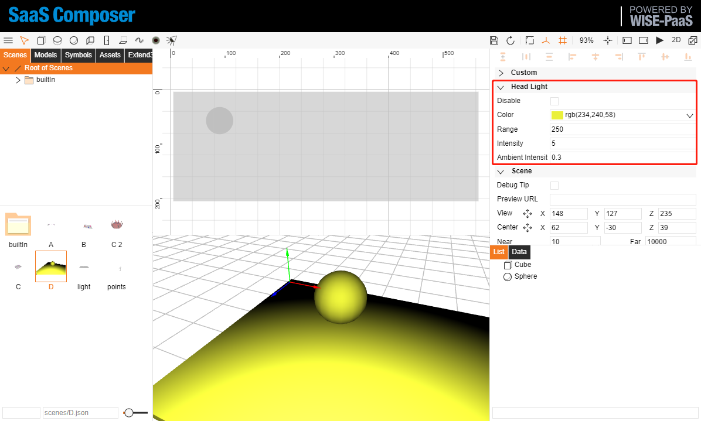  

Property         | default          | Note
-----------------|------------------|-------------
Disable          | false            | 
Color            | rgb(255,255,255) | 
Range            | 0                | 0: infinity
Intensity        | 1                | > 1: enhance, < 1: decline
AmbientIntensity | 0.7              |  

## Head Light Disable: false  

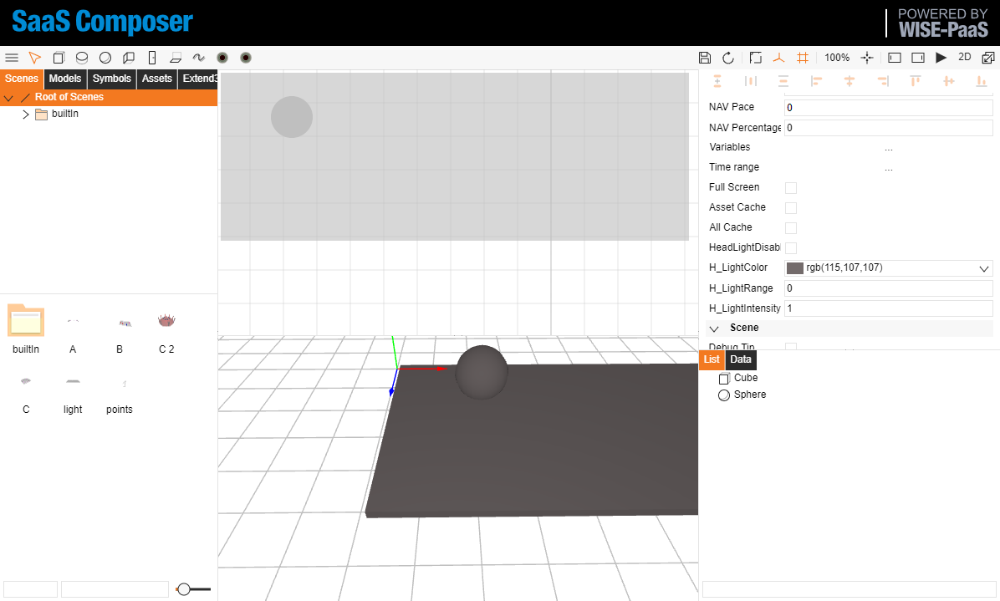  

## Head Light Disable: true  

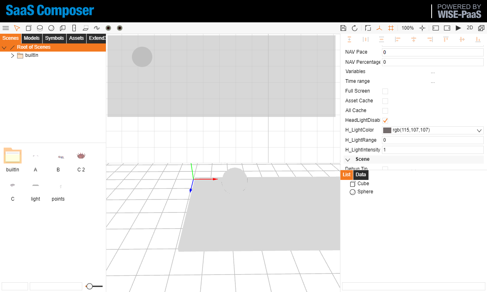  

## Head Light Color  

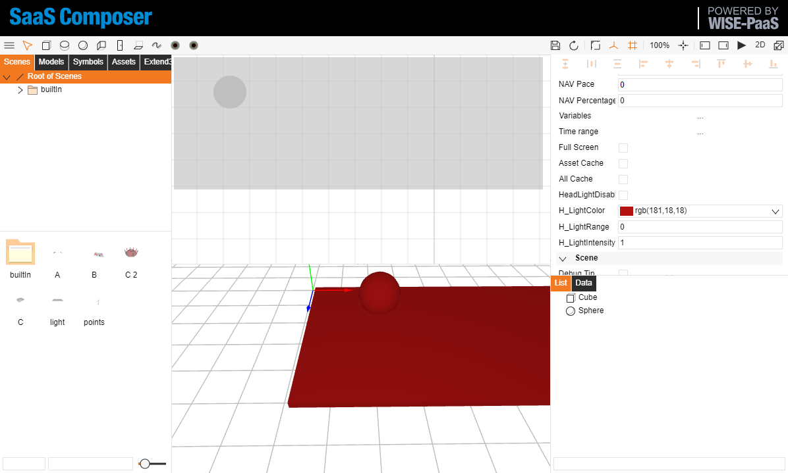  

## Head Light Ragne: 0  

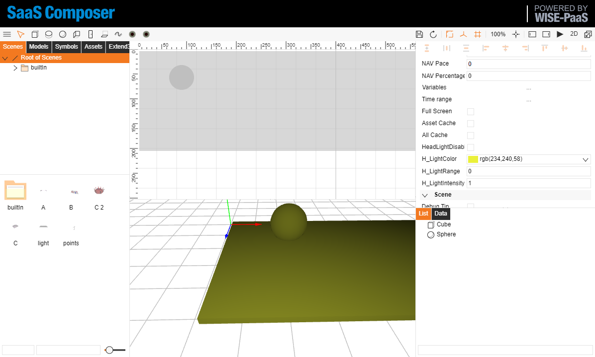  

## Head Light Ragne: Positive Number  

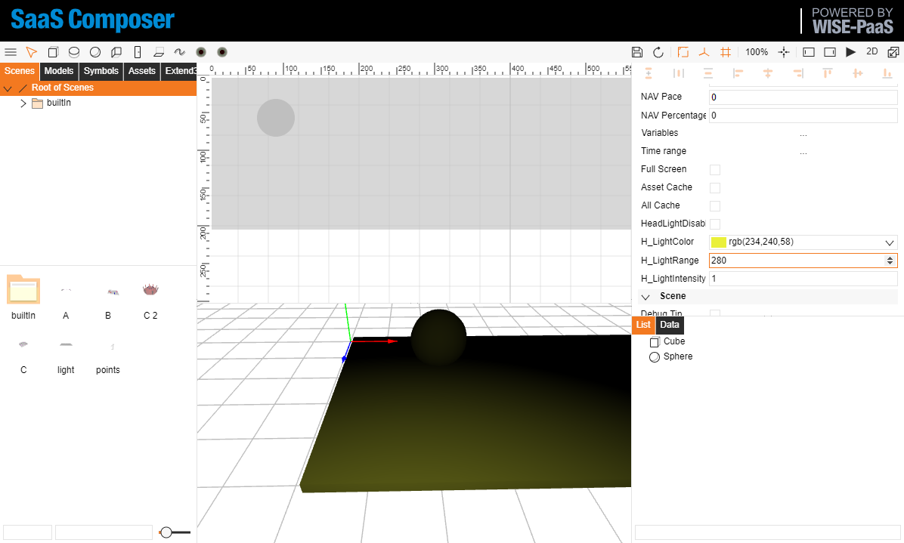  

## Head Light Intensity

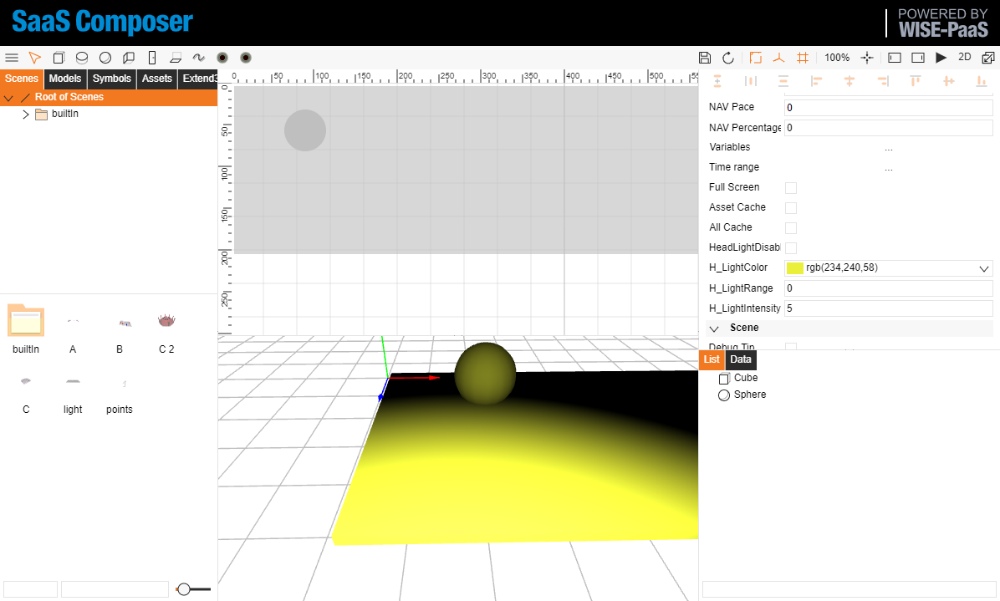  

## Head Light Ambient Intensity

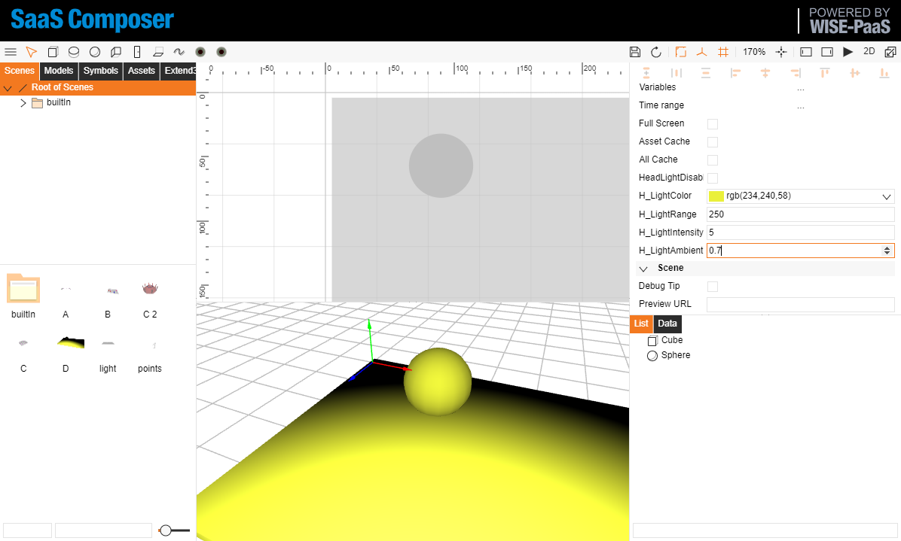  

  

# Light  

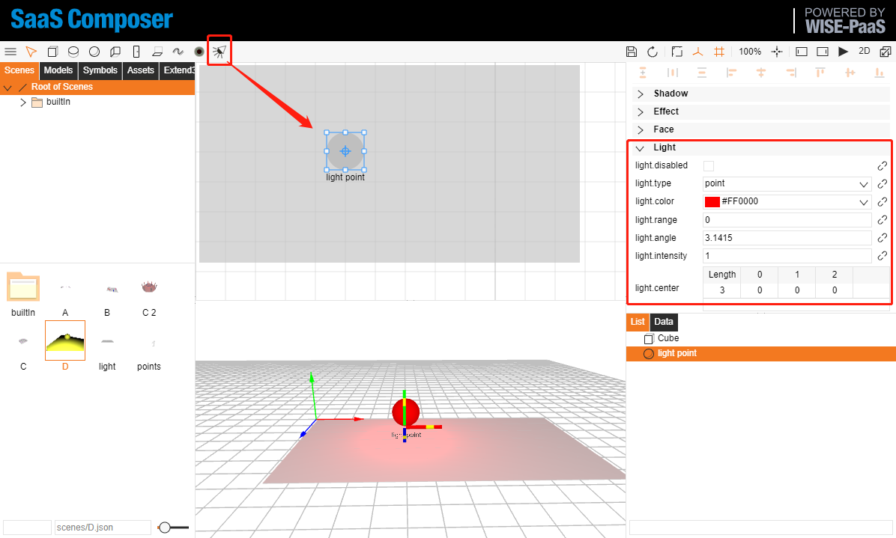  

Property         | default          | Note
-----------------|------------------|-------------
Disable          | false            | 
Type             | point            | point/ spot/ directional
Color            | #FF0000          | 
Range            | 0                | 0: infinity
Angle            | 3.1415           | radian 0 ~ PI
Intensity        | 1                | > 1: enhance, < 1: decline
Center           | [0,0,0]          | 0: infinity
Exponent         | 0                |  

## point light  

Depend on light point center, and `light.range`、`light.intensity`. 

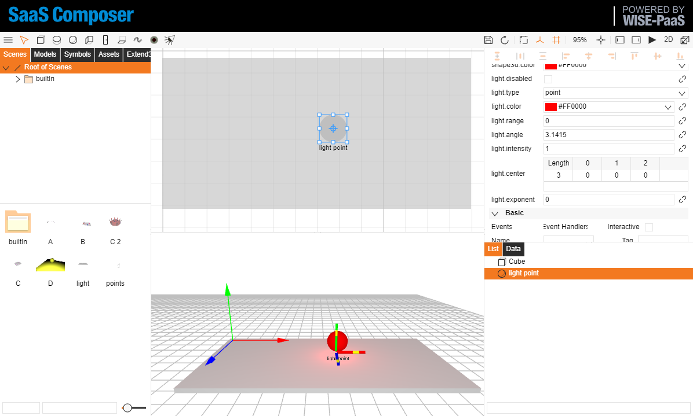  

## spot light  

Depend on light point center, and `light.center`、`light.range`、`light.angle`、`light.exponent`.  

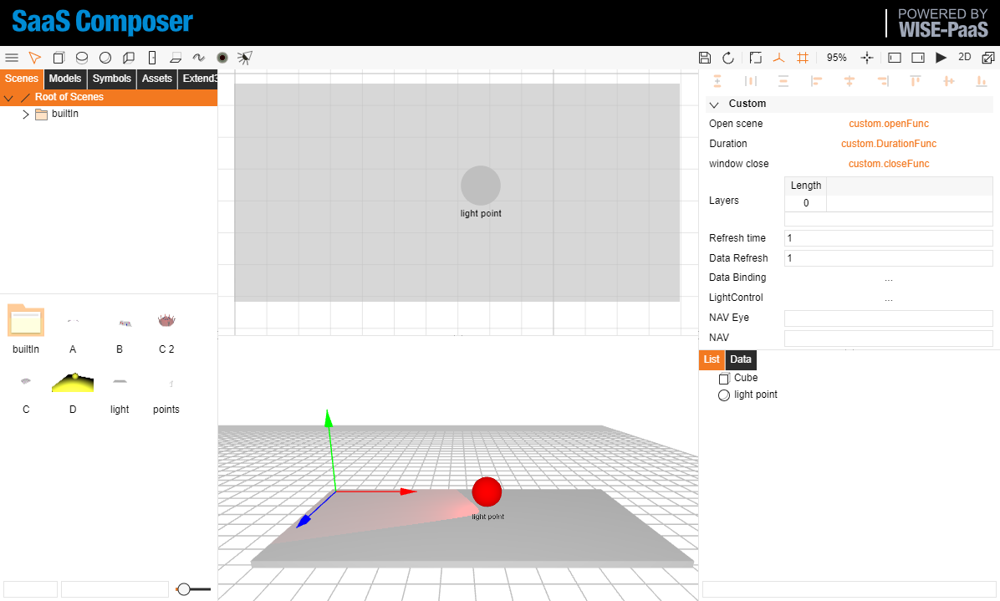  

## directional light  

Depend on distance between light point center with [0,0,0]。  

  

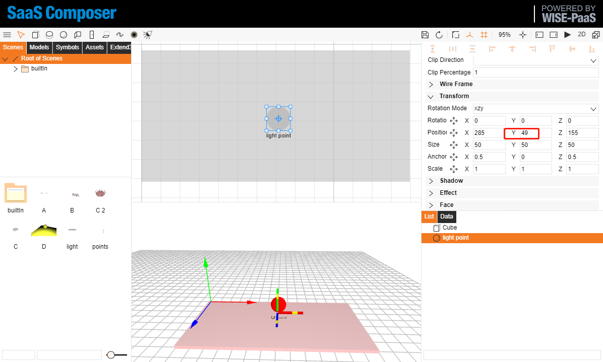  

## Shadow  

Enable 3D Scene shadow

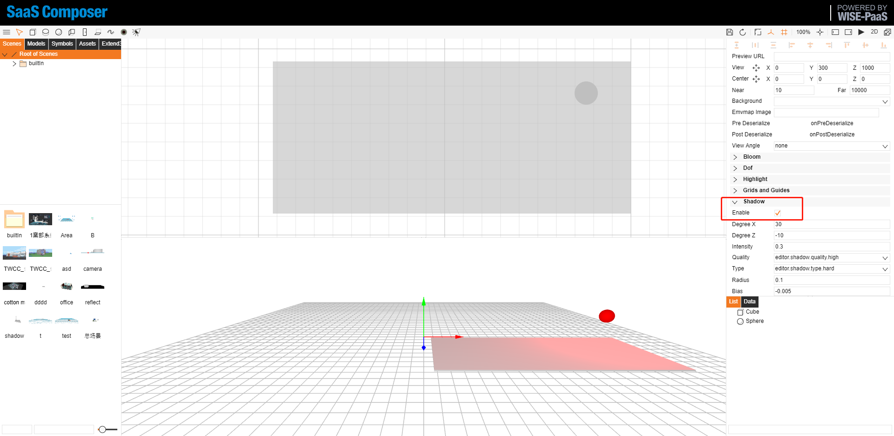  

3D Scene shadow property：  

    "a": {
        "sceneShadowEnabled": true,
        "sceneShadowDegreeX": 29.53,
        "sceneShadowDegreeZ": -9.64,
        "sceneShadowIntensity": 0.14,
        "sceneShadowQuality": "ultra",
        "sceneShadowType": "none",
        "sceneShadowRadius": 1.4,
        "sceneShadowBias": -0.0081,
        "sceneOrthographic": false
    },

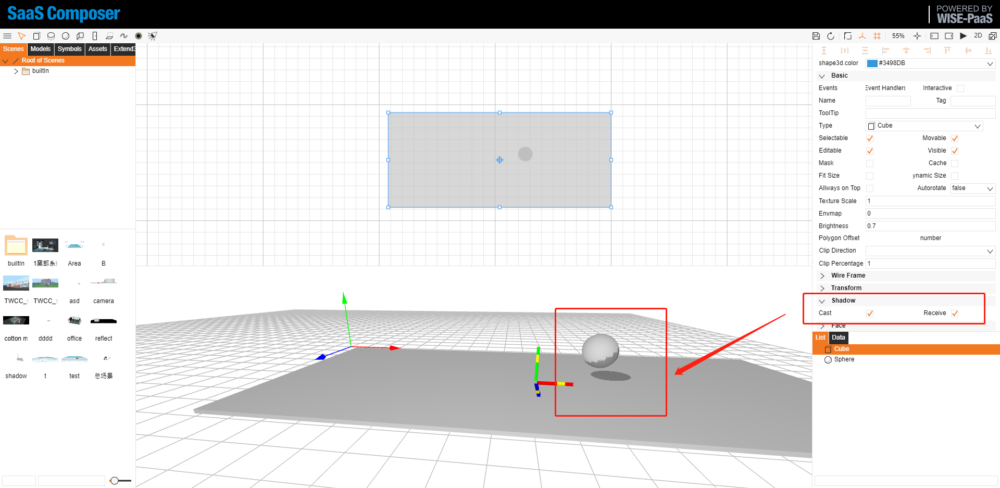  

3D object shadow property：  

    "s": {
        "shadow.receive": false,
        "shadow.cast": false
    }