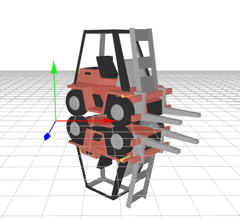
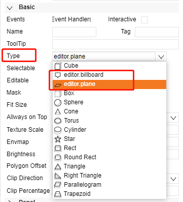
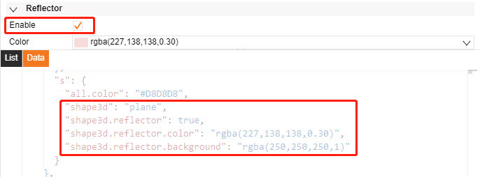
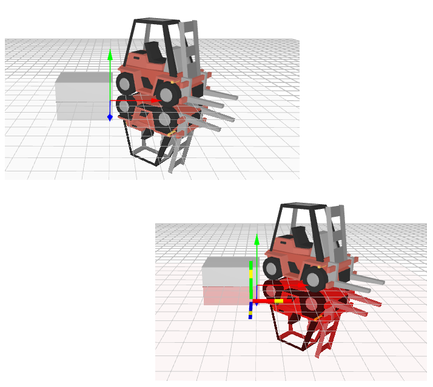
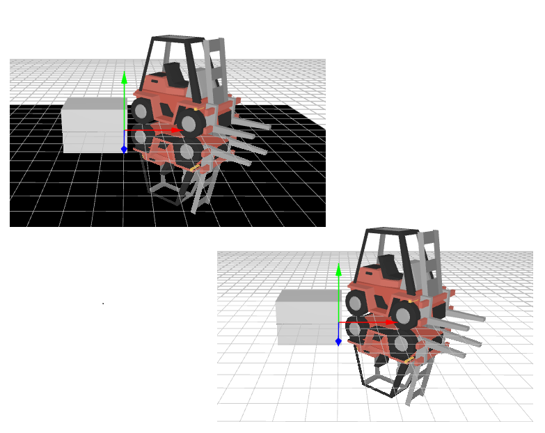
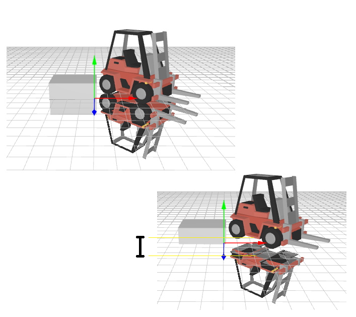
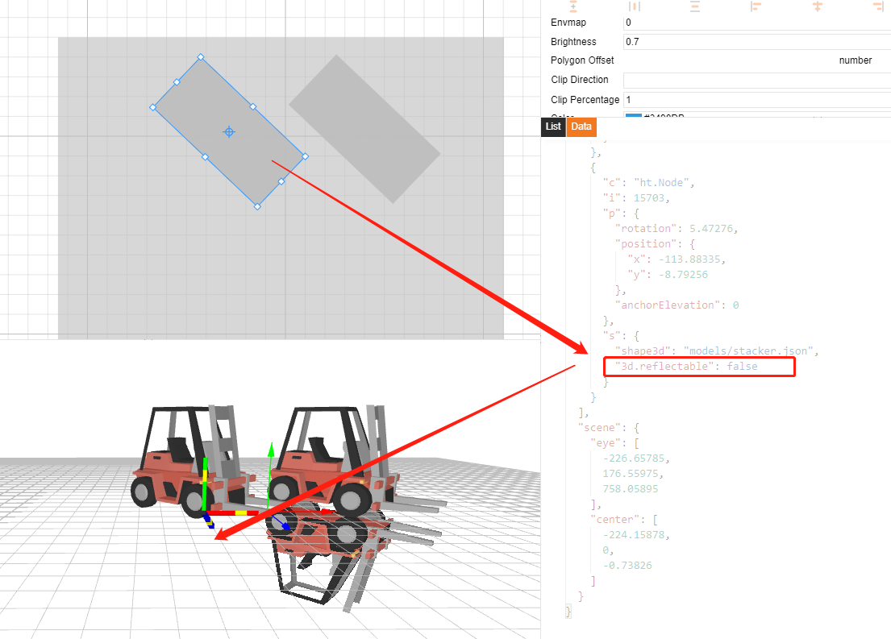

# Reflect  

  

shape3d.type is `billboard` or `plane` can set as a reflector

  

Property                     | default          | Note
-----------------------------|------------------|-------------
shape3d.reflector            | false            | 
shape3d.reflector.color      | rgb(128,128,128) | 
shape3d.reflector.background | null             | 
shape3d.reflector.clip       | 0.003            | 
 

`shape3d.reflector`：Default is false

  

`shape3d.reflector.color`： rgb(128,128,128)

  

`shape3d.reflector.background`：Reflector background, default is null

  

`shape3d.reflector.clip`：Reflector clip, default is 0.003

  

## Remove node reflector  

Set `3d.reflectable:false` to remove single object reflect.  

    node.s('3d.reflectable',false)

  