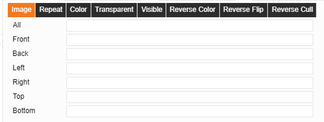

# Additional 3D Attributes
Additional 3D attributes include: Image, repeat, color, transparency, visibility, background color, background copy, background crop

  

## I.	Image

Paste the path of the image on the six sides or on the specified side to paste the image on the corresponding side of the model.

   

## II.	Color

Color the surface by selecting the color for the six sides or the specified side.

  

## III.	Transparency and visibility

Check the six sides or the specified side to set the visibility and transparency of the side(s).
Visibility and transparency are basically the same when configuring one side, but when configuring six sides, the visibility will make the object invisible while transparency will not.

  

## IV.	Background color, background copy, background crop

Configure the background attributes of the six sides.