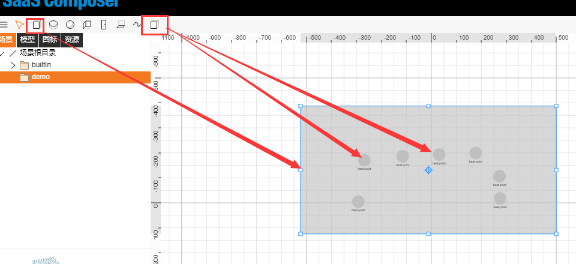
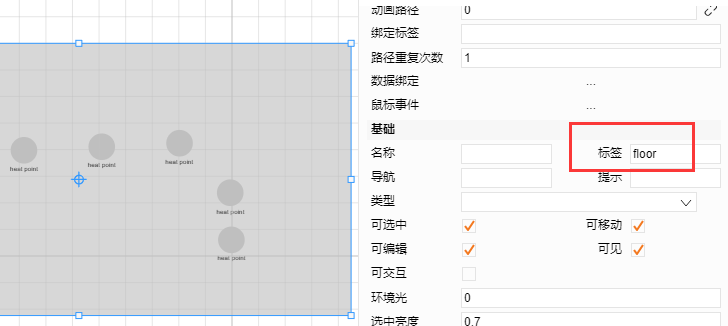
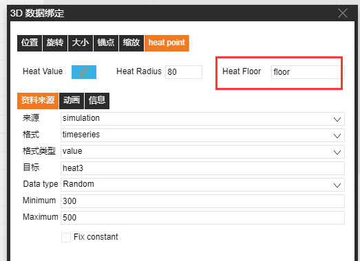
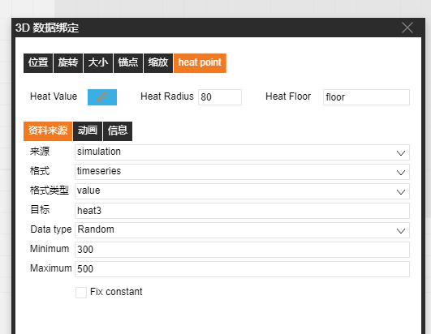
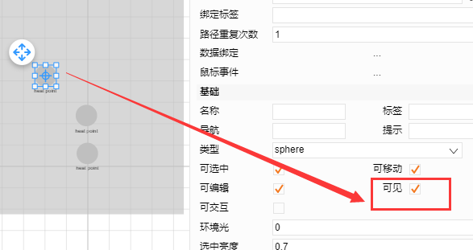

# 3D Heat map

1.	Draw heat points and create the heat map display medium: Select the heat points at the upper-right corner to draw heat points on the drawing sheet. Select **hexahedron** to create a heat map display medium (the heat map will be displayed at the location of the medium, and the height of the hexahedron can be adjusted).

2.	Heat map binding:

a) Select the hexahedron to enter the label of the heat map display medium

b) Select a heat point and click the data binding box to the right of the heat point. Select a heat point and fill in the “Heat Floor” field with the revised label content.

3.	Heat point attributes

`heatValue`: Current heat point value, which indicates the brightness of the heat points
`heatRadius`: Radius of the heat map

4.	Hide the heat points to preview the heat map

