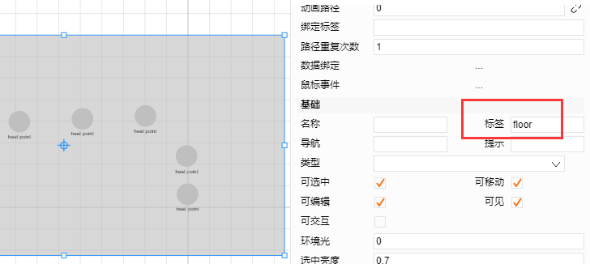
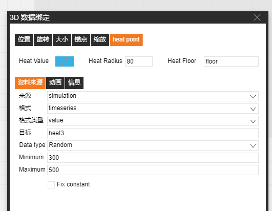

# 3D 熱點圖

1、熱點以及熱點圖像呈現媒介繪製：選擇右上角的熱點，在圖紙中繪製出熱點；選擇六面體繪製熱點圖像呈現媒介（熱點圖像將呈現在該媒介所在位置，六面體可調整高度）

2、熱點圖像綁定：

a) 選中六面體填寫熱點圖像呈現媒介標籤

>   b) 選中熱點，點擊右側資料綁定，選中heat point，將改標籤內容填寫在HeatFloor
>   屬性中

3、熱點屬性

heatValue：當前熱點的數值，數值不同顏色深淺不同

heatRadius：熱點圖像的半徑

4、將熱點隱藏即可預覽

 
