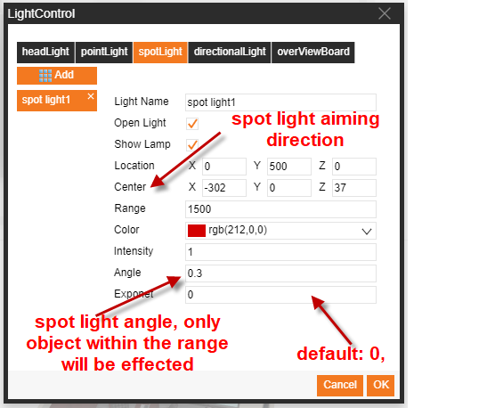
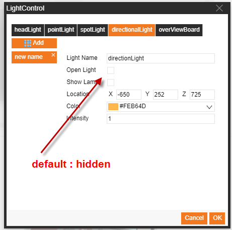

# 3D Lighting Control(Deprecate)  

Please consider using **3D Model Attributes > 3D Light Node** instead.

# I.	Head Lamp

There are four types of lighting control:
1. Head Lamp    
The SC has one head lamp by default. The head lamp is equivalent to a point light at the camera's position. The position of the light source varies with camera position    Users can experience basic lighting effects by roaming to any location without configuring any head lamp settings. You can also manually turn it on and off.
2. Point Light    
The point light emits light from all directions of the light source, affecting all objects within its influence range.
3. Spotlight    
The spotlight is oriented from the position of the light source to the position of the target point, and objects within the specified opening angle and influence range are affected by it.
4. Directional Light    
The directional light source is illuminates to infinity all objects in the scene in a specified direction, and the direction is determined by the connection from the light ball to the center point.

## 1. Head Lamp

Effect without head lamp

Effect with head lamp

Head lamp configuration method:

1.	Select the scene, find the light control in the attributes fields on the right, and click it to open the light configurations window.
2.	Select Head Lamp and set the attributes of the head lamp.
3.	Enable lighting control to turn the head lamp on and off; check to enable.
4.	Click "**Confirm**" to save your settings.

# II.	Point light

Effect with point light

Point light configuration method:

1.	Select the scene, find the light control in the attributes fields on the right, and click it to open the light configurations window.
2.	Select Point Light and click the Add button to add a point light object
3.	Set the attributes of the point light.
4.	Enable lighting control to turn the point light on and off; check to enable.
5.	Enable the light ball to control whether the small ball is displayed at the light source; check Display.
6.	Click "**Confirm**" to save your settings

# III.	Spotlight

Effect with spot light

Spotlight configuration method:
1.	Select the scene, find the light control in the attributes fields on the right, and click it to open the light configurations window.
2.	Select Spotlight and click the Add button to add a spotlight object.
3.	Set the attributes of the spotlight.
4.	Enable lighting control to turn the spotlight on and off; check to enable.
5.	Enable the light ball to control whether the small ball is displayed at the light source; check Display.
6.	Click "**Confirm**" to save your settings.

# IV.	Directional light

Effect with directional light

Directional light configuration method:
1.	Select the scene, find the light control in the attributes fields on the right, and click it to open the light configurations window.
2.	Select Directional Light and click the Add button to add a directional light object.
3.	Set the attributes of the directional light.
4.	Enable lighting control to turn the directional light on and off; check to enable.
5.	Enable the light ball to control whether the small ball is displayed at the light source; check Display.
6.	Click "**Confirm**" to save your settings.

# V.	Complete lighting control through code

Standard JavaScript code can be written in the opening scene to implement the lighting effectsThe call is as follows:

        animate3D.setLightingEffect(jsonData)
        // jsonData:  A json array of the light; you can set multiple lights at the same time; each light is a json object 
        Example:
            var jsonData= [{
                "name":"lightOne",
                "type" : "point",
                "color" : "rgb(255,0,0)",
                "range" : "300",
                "disabled": true,
                "location" : [-191,100,225]
            },{
                "name":"lightTwo",
                "type" : "point",
                "color" : "rgb(0,255,0)",
                "range" : "300",
                "disabled": true,
                "location" : [263,100,166]
             },{
                "name":"lightThree",
                "type" : "point",
                "color" : "rgb(0,0,255)",
                "range" : "300",
                "disabled": true,
                "location" : [222,100,-314]
            }]

        //Light object json object parameters
            {
                'name': The name of the light object; the lighting effect can be controlled and modified according to this name 
                'type': The default is the point light, which can be set to the spotlight or the directional light type
                'location': Position coordinates of the light (array of x, y, z)
                'color': Color of the light
                'intensity': Brightness, default is 1; greater than 1 is brighter; brightness is reduced for numbers less than 1 
                'disabled': Turn off the light effect; the default is false and can be set to true to turn off the light effect
                'range': The range of influence of the light; the default is 0, which means that it can be illuminated to infinity. If the value is set, the light illumination effect is attenuated as the object moves away from the light (the position of the light is used as a reference)
                'angle': Opening angle of the spotlight
                'center': The center point position (array of x, y, z) in the direction of illumination of the spotlight, preset to the origin [0, 0, 0]
                'exponent': Spotlight illumination attenuation index; the default value is 0; the larger the value, the weaker the lighting effect of objects further away from the center (using the illumination center as a reference)
             }

# VI.	Complete lighting control through code
Configured light objects can be controlled with the function during execution.

The method is as follows:    

	"Light Name".s ("Set Attribute", "Set Attribute Value")
	"Light Name".p3(X-position, Y-position, Z-position)

For example:

	lightOne.s('light.color','rgb(200,100,80)');
	lightOne.p3(0 ,100, 0);

