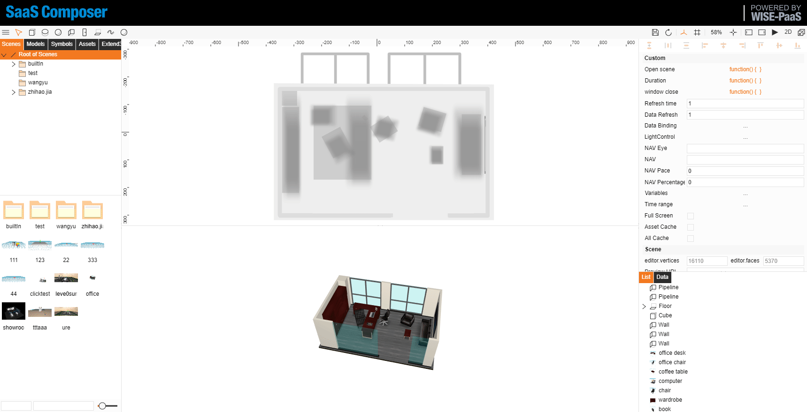
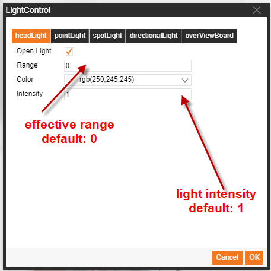
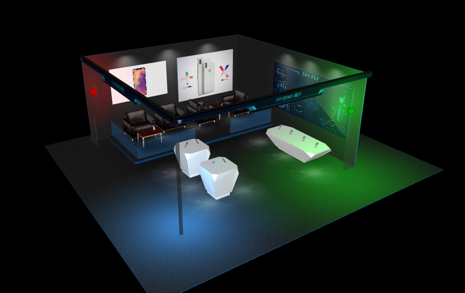
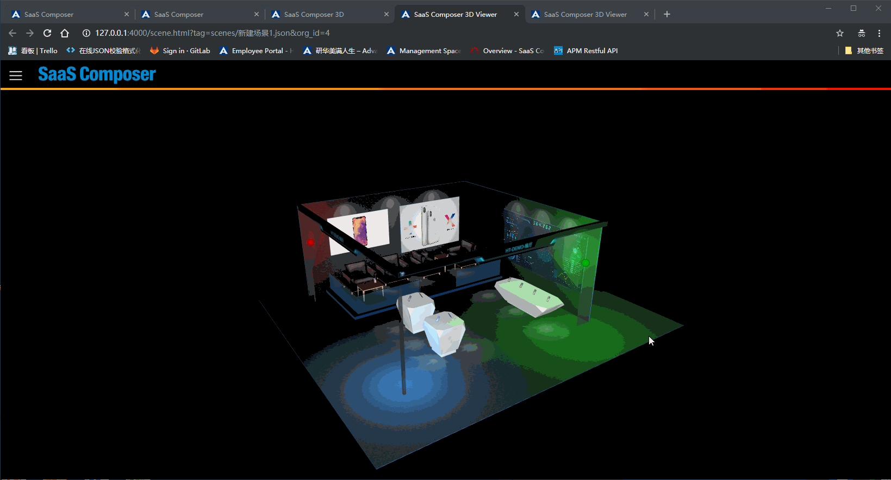
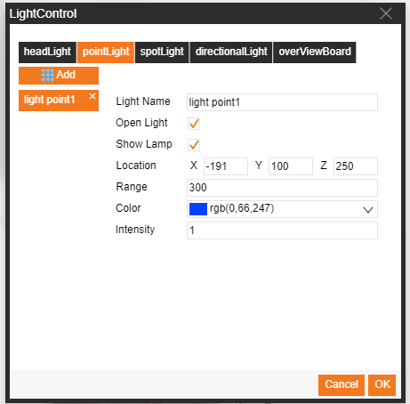
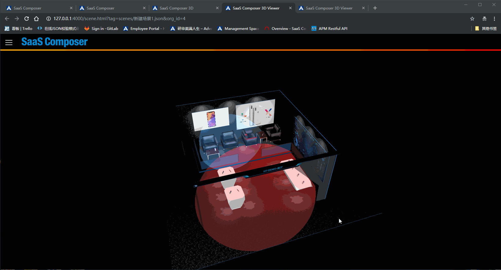
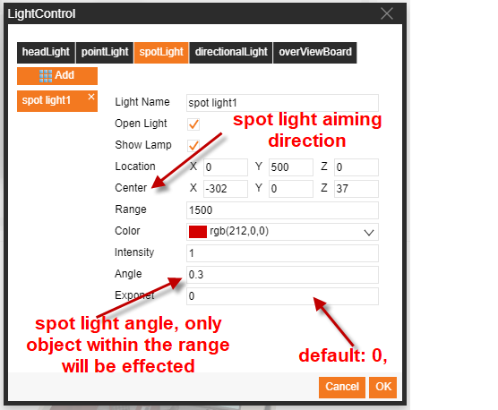
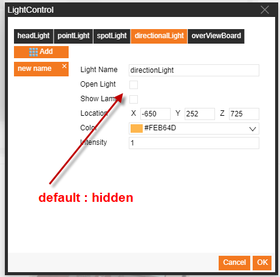

# 3D燈光控制(功能棄用)  

建議改用**3D模型屬性 > 3D 光線物件**功能取代

**燈光控制**

燈光控制共分為四種：
1. 頭燈
        SC默認內置了一盞頭燈，頭燈相當於在相機的位置有一個點光燈， 該燈源的位置隨相機位置變化自行變化
        用戶即使不做任何頭光設置，漫遊到任何位置都能體驗到基本光照效果。也可以手動設置關閉和開啟。
2. 點光燈
        點燈光從光源位置各個方向發出光線，影響其影響範圍內的所有物體
3. 聚光燈
        聚光燈從光源位置，以到目標點的位置為方向，在指定的張角和影響範圍內的物體受其影響
4. 方向光
        方向光源在無窮遠處，以指定的方向照射到場景內的所有物體，方向有光球到中心點的連線方向決定    

# 1-頭燈

無頭燈效果

有頭燈效果

頭燈設置方式：

1. 選擇場景，在右側屬性欄找到燈光控制，點擊打開燈光設置視窗
2. 選擇頭燈，設置頭燈屬性
3. 啟用燈光控制頭燈的開啟和關閉，勾選開啟
4. 點擊確定保存設置

# 2-點光燈

點光燈效果展示

點光燈設置方式：

1. 選擇場景，在右側屬性欄找到燈光控制，點擊打開燈光設置視窗
2. 選擇點光燈，點擊Add按鈕添加一個點光燈物件
3. 設置點光燈屬性
4. 啟用燈光控制點光燈燈的開啟和關閉，勾選開啟
5. 啟用燈光球控制光源處小球是否顯示，勾選顯示
6. 點擊確定保存設置

# 3-聚光燈

聚光燈效果展示

聚光燈設置方式：

1. 選擇場景，在右側屬性欄找到燈光控制，點擊打開燈光設置視窗
2. 選擇聚光燈，點擊Add按鈕添加一個聚光燈物件
3. 設置聚光燈屬性
4. 啟用燈光控制聚光燈的開啟和關閉，勾選開啟
5. 啟用燈光球控制光源處小球是否顯示，勾選顯示
6. 點擊確定保存設置

# 4-方向光

方向光效果展示

方向光設置方式：

1. 選擇場景，在右側屬性欄找到燈光控制，點擊打開燈光設置視窗
2. 選擇方向光，點擊Add按鈕添加一個方向光物件
3. 設置方向光屬性
4. 啟用燈光控值方向光的開啟和關閉，勾選開啟
5. 啟用燈光球控制光源處小球是否顯示，勾選顯示
6. 點擊確定保存設置

# 5-通過代碼完成燈光控制

可以在開啟場景中寫標準JavaScript代碼來實現設置燈光效果的功能調用如下如下：

        animate3D.setLightingEffect(jsonData)
        // jsonData: 燈光的一個json陣列，可以同時設置多個燈光，每一個燈都是一個json物件
        例：
            var jsonData= [{
                "name":"lightOne",
                "type" : "point",
                "color" : "rgb(255,0,0)",
                "range" : "300",
                "disabled": true,
                "location" : [-191,100,225]
            },{
                "name":"lightTwo",
                "type" : "point",
                "color" : "rgb(0,255,0)",
                "range" : "300",
                "disabled": true,
                "location" : [263,100,166]
             },{
                "name":"lightThree",
                "type" : "point",
                "color" : "rgb(0,0,255)",
                "range" : "300",
                "disabled": true,
                "location" : [222,100,-314]
            }]

        //燈物件json物件的參數
            {
                'name': 燈物件的名稱，可根據這個名字控制修改燈光效果
                'type': 默認為point點光燈，可設置為spot聚光燈，以及directional的方向光類型
                'location': 燈的位置座標 （x、y、z 的陣列）
                'color': 燈顏色
                'intensity': 燈強度，默認為1，大於1增強，小於1減弱
                'disabled': 關閉燈光效果，默認為false，可設置為true關閉燈效果
                'range': 燈影響範圍，默認為0代表可照射到無窮遠處，如果設置了值則光照射效果隨物體遠離光影而衰減（以燈位置作參考）
                'angle': 聚光燈照射的張角弧度
                'center': 聚光燈光源照射方向的中心點位置（x、y、z 的陣列），預設為原點[0, 0, 0]
                'exponent': 聚光燈光照射衰減指數，預設值為0，值越大離中心方向越遠的物體受光照影響效果越弱（以照射中心center做參考）
             }

# 6-控制設置好的燈光

可以在執行期間的函數中對設置好的燈光物件進行控制方法如下：

     “燈光名稱” .s(“設置屬性”，“設置屬性值”）
     "燈光名稱".p3(X-position, Y-position, Z-position)

例如：

     lightOne.s('light.color','rgb(200,100,80)');
     lightOne.p3(0,255,0);

 
