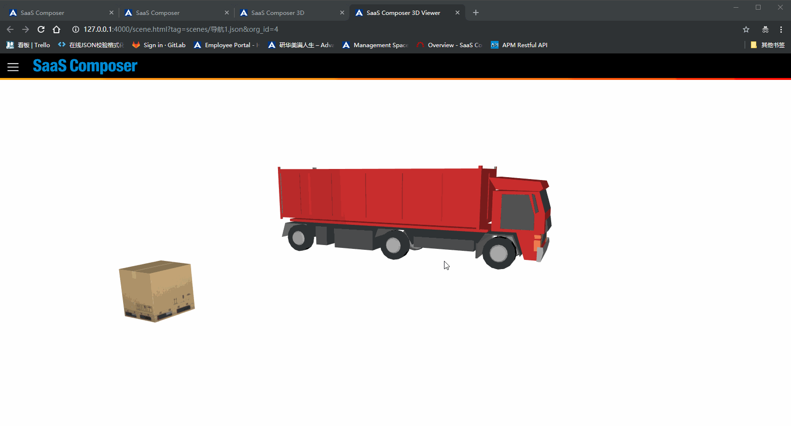
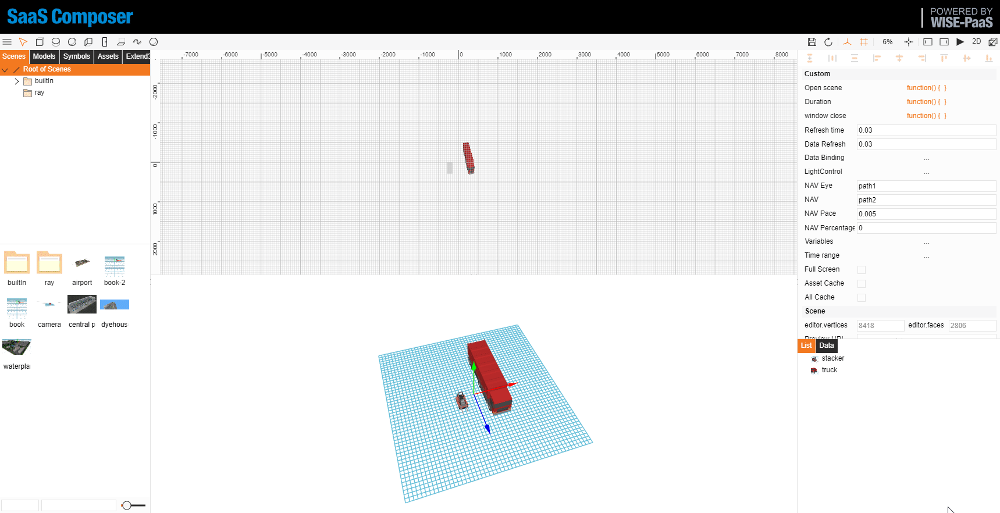

# Navigation patrol

The navigation patrol consists of three parts:  

1. Camera navigation path    
The camera's path of movement
2. Target navigation path    
The target movement path
3. Navigation speed    
Movement speed

Navigation patrol effect

## I.	Set the navigation patrol path

Navigation patrol configuration method:
1.	Select the scene and create two paths. At each of path’s “**Tag**” property, please provide naming to differentiate the difference. For example: path1, path2
- path1 equivalent to the observer’s **position**
- path2 equivalent to the observer’s **eyesight focus location** 
From the above gif example, while observer is moving along the outer ring, at the same time, the observer is watching at the location of the inner circle’s path.
2.	To smooth out the process of the movement ， suggest double click at each of the path’s turning point，to create arc like direction for the path。
3.	If wishing to increase the fluency of the animation(30 frames per second)，”**Refresh time**” and ”**Data Refresh**” can be lower down to 0.03(second)
-Depends on the preference of the setting, the rate of change can be alter。
4.	At "**NAV Eye**", input observer’s **position** “**Tag**” name
example: path1
5.	At "**NAV**", input observer’s **eyesight focus location** “**Tag**” name
example: path2
6.	At "**NAV Pace**" input the scale of the movement percentage.
- the unit is in **percentage of the total length of the path**, example:  input “0.1” is equivalent to move 10% of the total length at each refresh.
- from the above gif example, input “0.005” is equivalent to move 0.5% of the total length at each refresh 
- Fill in the navigation speed to control the entire navigation patrol time. Navigation patrol time = refresh rate ÷ navigation speed.
7.	The two paths can be divided into equal segments to realize the function of navigation patrol segmentation.
8.	Set the segment length to be small enough to implement the rotary patrol function

### Control with script  

Stop navigate animation can set `viewer3dUtil.navigationSwitch` parameter

	viewer3dUtil.navigationSwitch = false
	viewer3dUtil.navigationSwitch = true

Check `commonViewUtil.currentFiles[0].json.a['custom.navigationPercentage']` can get the camera position 
 in percentage.

## II.	Complete the animation path with code

Standard JavaScript code can be written during execution to implement the navigation patrol functionThe method and call interface are as follows: 

The secondary method divides the entire movement process into independent running processes according to the interval, and performs a simple motion process within a certain status field value [minValue, maxValue].

The execution of the trajectory function for an interval is determined based on the diffValue between the currentValue and the startValue (e.g., time).
1. 	Overlooking rotation
     
        animate3D.overlooking(diffValue,minValue,maxValue,circle)
			// diffValue: The difference between the currentValue and the startValue (e.g., time)
			// minValue: the start value of the motion track            
			// maxValue: the end value of the motion track            
			// circle: the number of rotations of the motion track
2. 	Camera movement
							
		animate3D.eyeMove(diffValue,minValue,maxValue,eyeArray)           
			// diffValue: The difference between the currentValue and the startValue (e.g., time)           
			// minValue: Start value of the motion track          
			// maxValue: End value of the motion track          
			// eyeArray: The position coordinates of the camera at the end of the motion track, an array comprised of x, y, and z [x, y, z]
3. 	Target movement

		animate3D.centerMove(diffValue,minValue,maxValue,centerArray)       
			// diffValue: The difference between currentValue and startValue (e.g., time)
			// minValue: Start value of the motion track       
			// maxValue: End value of the motion track		
			// centerArray: The position coordinates of the target at the end of the motion trajectory, an array comprised of x, y, and z [x, y, z]

Set the animation loop function:

Get initial position coordinates

	initValue = animate3D.record()    
   		// initValue: Returns the camera and the coordinates of the target as an array at the beginning of the screen animation The length of the array is 6; the first three digits are the camera coordinates, and the last three digits are the target coordinates    

Set loop animation

	startValue = animate3D.setCirculation = function (startValue,cycleLength,initValue)
		// startValue: The start value of the loop animation and returns a start value
		// cycleLength: Loop cycle	
		// initValue: The start coordinates in array form; the array length is 6, the first three digits are the camera coordinates, and the last three digits are the target coordinates

For example:

		// Get the current value of the state (the current time value)
		 	current_value = new Date().getTime();   
			if (typeof(start_value) == "undefined"){      
			start_value = current_value;
		// Get the start position coordinates
			init_value = animate3D.record()}
		// Set the animation loop cycle length
			diff_value = current_value - start_value;
			start_value = animate3D.setCirculation(start_value,25*1000,init_value);
		// Panoramic view
			animate3D.overlooking(diff_value,0,10*1000,1)
		// Camera position movementanimate3D.eyeMove(diff_value,10*1000,25*1000,[144,81,-203])
		// Target position movementanimate3D.centerMove(diff_value,10*1000,25*1000,[-267,181,-38])