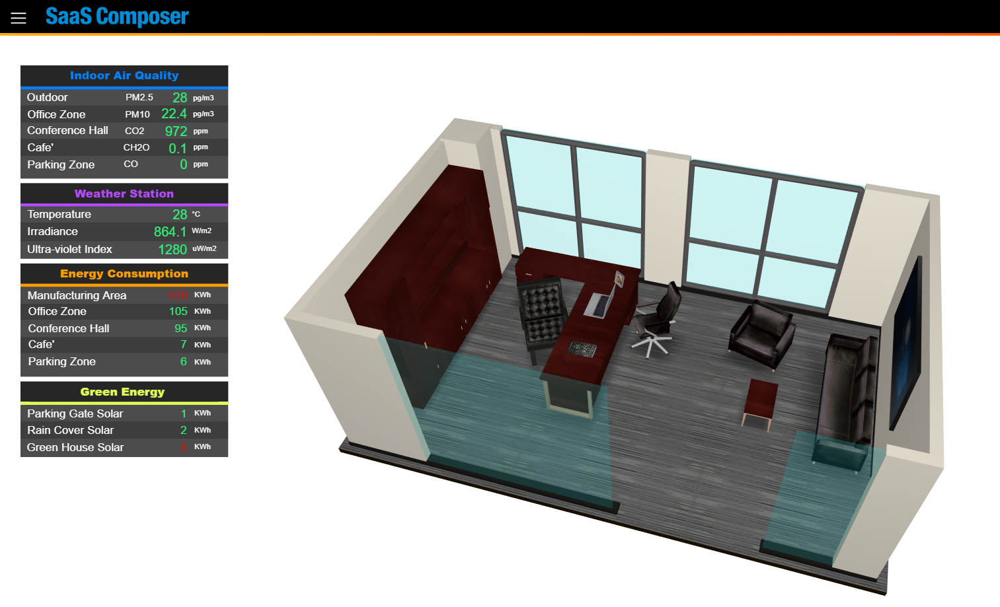
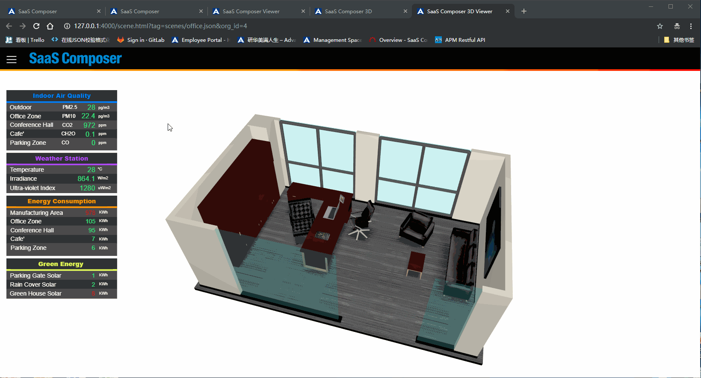
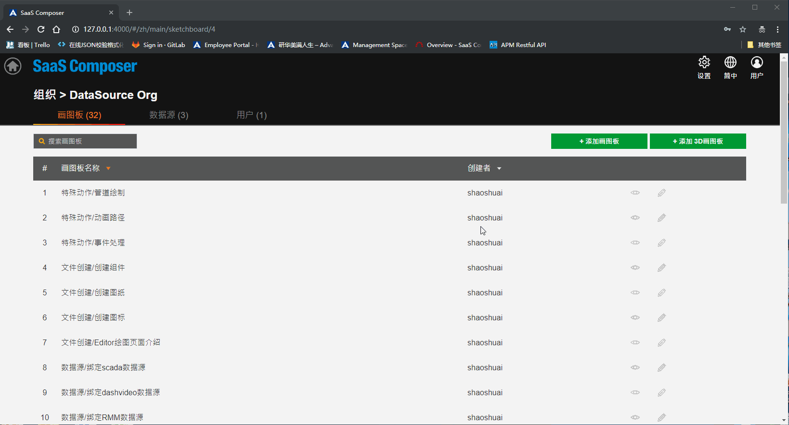
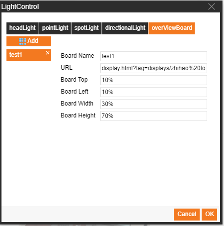

# Overview indicator

An overview indicator is a 2D panel displayed in a 3D image that does not change position as the 3D image moves

## I.	Set overview indicator

Overview indicator effect display

How to configure the overview indicator:
1.	Select the scene, find the light control in the attributes fields on the right, and click it to open the light configurations window.
2.	Select Overview Indicator to set overview indicator attributes    URL: URL of the preview page of the 2D graphic    Spacing, height, and width: You can use percentages or use primitives (for example: 50px).
3.	Click "**Confirm**" to save your settings

## II.	Complete overview indicators by code

Standard JavaScript code can be written in the opening scene to implement the overview indicator function.

The method and call interface are as follows:    

		animate3D.setOverViewBoard(jsonData)
			// jsonData: The json array object of the overview indicator page
			Example:
				var jsonData= [{
					"attribute":"http://127.0.0.1:4000/display.html?tag=displays/all_Item.json&org_id=2&&fullscreen=1",
					"style": {
						"position":"absolute",
						"top" :"160px",
						"left":"0px",
						"width" : ($("#mainDiv").width()/6) + "px",
						"height" : ($("#mainDiv").width()/6)*(415/220) + "px",
						"border" : "0px"
					}
				}]

			// The json object parameters of the overview indicator page
				{
					"attribute": Path of the overview indicator panel
					"style": The location of the overview indicator panel on the screen is controlled by the CSS properties
					}

