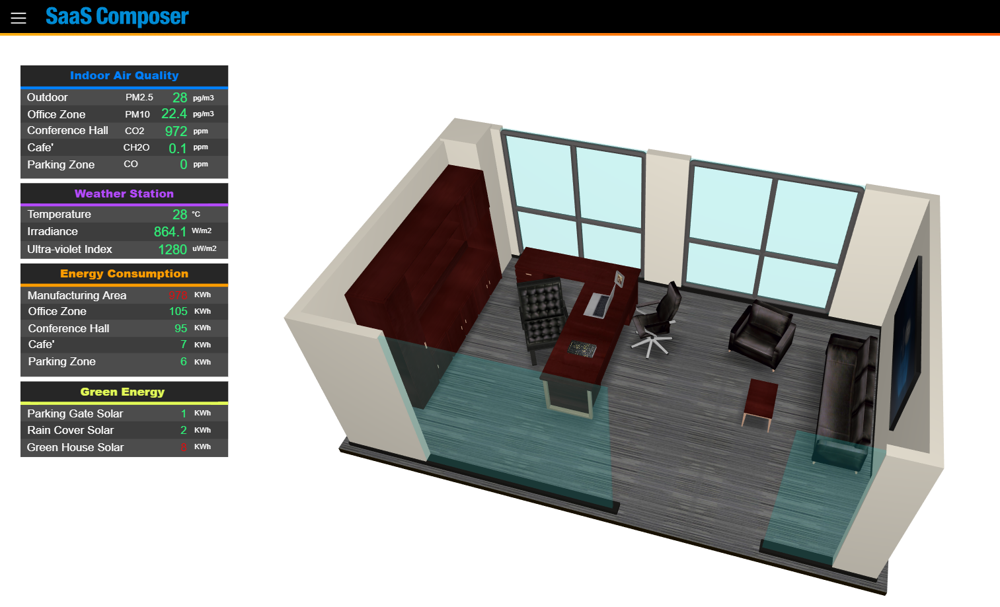
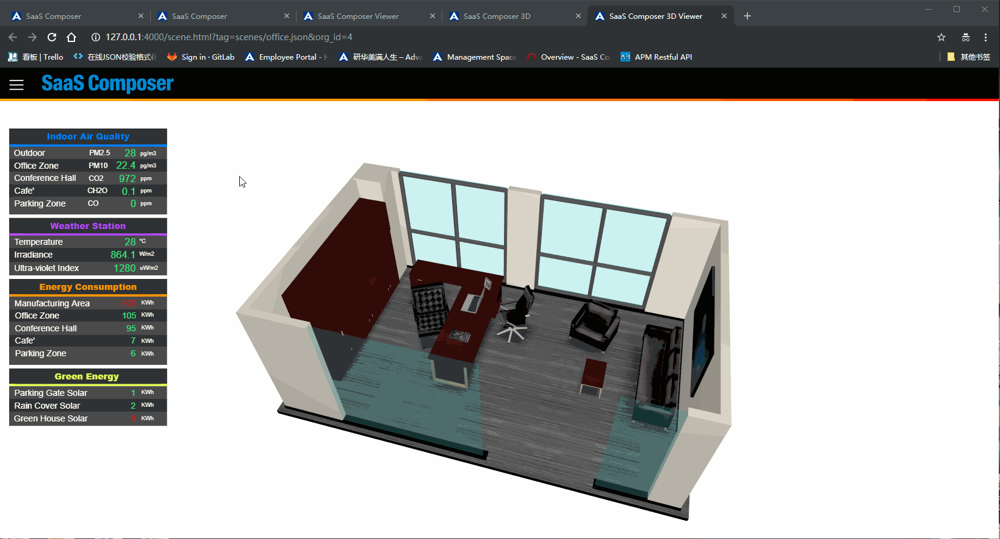
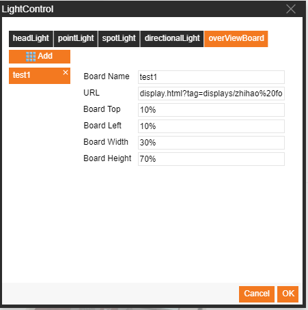

# 總覽指標

**在 3D 圖像中展示一個 2D 面板，該面板不會隨著 3D 圖像的移動而改變位置，即為總覽指標**

# 方法#1-設置總覽指標

總覽指標效果展示

總覽指標設置方式：

1. 選擇場景，在右側屬性欄找到燈光控制，點擊打開燈光設置視窗
2. 選擇總覽指標，設置總覽指標屬性
       URL：2D圖示預覽頁面的URL
       間距以及寬高度：可以使用百分比，也可以使用圖元（例如：50px）
3. 點擊確定保存設置

# 方法#2-通過代碼完成總覽指標

可以在開啟場景中寫標準JavaScript代碼來實現總覽指標功能方式及調用介面如下：

    animate3D.setOverViewBoard(jsonData)
        // jsonData: 總覽指標頁面的json陣列物件
        例：
             var jsonData= [{
                "attribute":"http://127.0.0.1:4000/display.html?tag=displays/all_Item.json&org_id=2&&fullscreen=1",
                "style": {
                    "position":"absolute",
                    "top" :"160px", 
                   "left":"0px",
                    "width" : ($("#mainDiv").width()/6) + "px",
                    "height" : ($("#mainDiv").width()/6)*(415/220) + "px",
                    "border" : "0px"
                }
            }]
        //總覽指標頁面的json物件的參數
            {
                "attribute": 總覽指標面板的路徑
                "style": 總覽指標面板在頁面中的位置，由其中的CSS屬性控制
            } 
