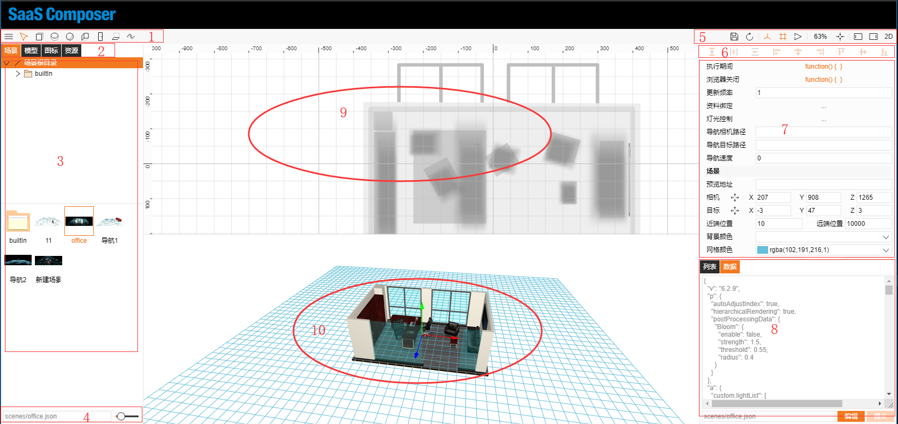
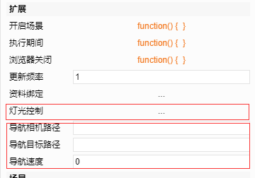
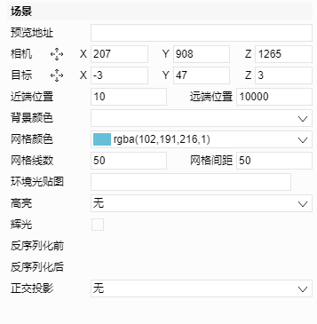

# Scene related attributes

## I.	Scene editor page

1.	Simple model drawing in 3D mode
Successively: Hexahedron, cylinder, sphere, wall, door/window, floor, pipe
2.	The four main file categories of 3D mode
           Scenes, models, icons, assets (where icons and assets are shared with 2D mode).
3.	A directory structure that corresponds to the selected file type
4.	Relative path of the selected file
5.	File, interface related functions and operations
6.	Hot keys for quick arrangement of sketch components
7.	Object attribute field
8.	File content list and json data
9.	3D file editor top view action screen
10.	3D file editor action page

## II.	Attribute field

A. Expanded section

1.	Same attributes as 2D
Scene on open. During execution, browser close, update frequency, data binding
2.	Lighting control
      Set head lamp, point light, and spotlight effects
3.	Camera navigation path, navigation target path, navigation speed
     Set navigation patrol function    

B. 	Basics

1.	Preview address:        
Represents the location of the thumbnail of the scene; if not filled in, a thumbnail will be automatically generated
2.	Camera, target
       Two positions control the viewing angle of the 3D model
3.	Near-far position      
The farthest and closest position that can be displayed
4.	Background color      
Background color of 3D scene
5.	Grid color, number of grid lines, grid spacing
Network guideline attribute when 3D scenes are drawn
6.	Ambient light graphic
7.	High brightness
When selected or hovered over by the mouse, the model will be shown in high brightness
8.	Glow
Add a glow effect to the scene model
9.	Before deserialization and after deserialization
Same as 2D
10.	Orthogonal projection
3D scene observation angle
