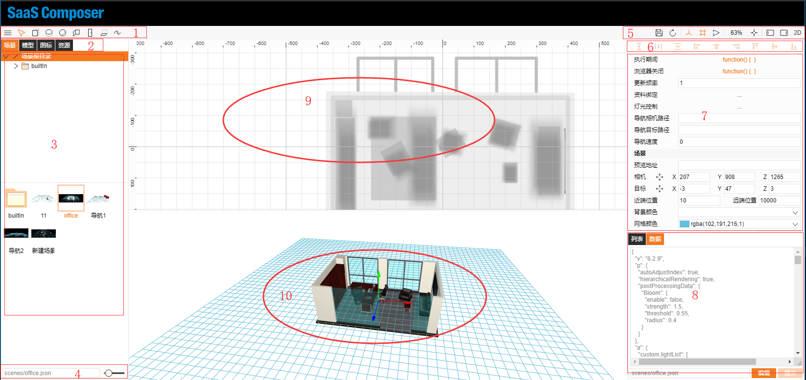
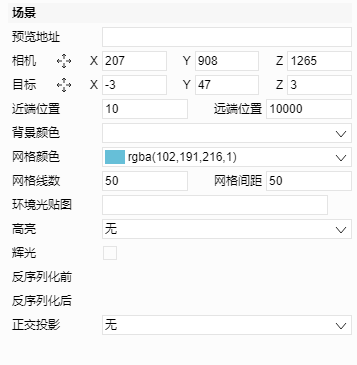

# 3D場景屬性介紹  

**場景相關屬性**

# 1-場景Editor頁面

1. 3D模式下簡單的模型的繪製
           依次為：六面體、圓柱、球體、牆面、門窗、地板、管道
2. 3D模式主要的四種檔分類：
           場景、模型、圖示、資源（其中圖示、資源與2D模式共用）
3. 與選取的檔種類相對的目錄結構
4. 所選擇檔的相對路徑
5. 檔、介面相關功能操作
6. 繪圖物件快速排版快速鍵
7. 物件屬性欄
8. 檔案內容清單及json資料
9. 3D檔編輯的俯視動作頁面
10. 3D檔的編輯動作頁面

# 2-屬性欄

1.擴展部分

1. 與2D相同屬性
      開啟場景。執行期間、流覽器關閉、更新頻率、資料綁定
2. 燈光控制
      設置頭燈、點光燈、聚光燈等燈光效果
3. 設置導航巡視功能
      導航相機路徑、導航目標路徑、導航速度      

2.基礎部分

1. 預覽地址：
       表示場景的縮略圖，若不填會自動生成一個縮略圖
2. 相機、目標
       兩個位置控制對3D模型的觀察角度
3. 近遠端位置
       可顯示的最遠以及最近位置
4. 背景顏色
       3D場景的背景色
5. 網格顏色、格線數、網格間距
       3D場景繪製時的網路輔助線屬性
6. 環境光貼圖
7. 高亮
        滑鼠選中或者懸浮時，模型高亮顯示
8. 輝光
        場景模型添加輝光效果
9. 反序列化前、反序列化後
        與2D相同
10. 正交投影
         3D場景的觀察角度 
