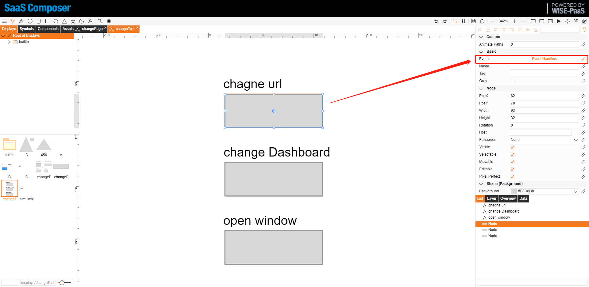
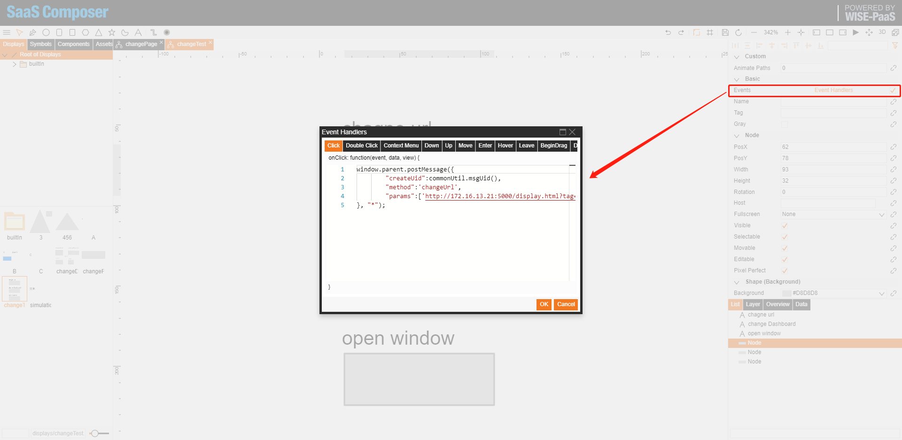

# Interact with Dashboard (change URl, change dashboard, open window)  

2019/10/18  

**Step-by-Step Guide**  

1. Add button to a display.  
2. Checked "**Events**".  
3. Open event handlers dialog.  
4. In click, type the following script.  

### Change Url  

    window.parent.postMessage({
            "createUid":commonUtil.msgUid(),
            "method":'changeUrl',
            "params":['http://172.16.13.21:5000/display.html?tag=displays/3.json&org_id=2&fullscreen=1']
    }, "*");

Where `commonUtil.msgUid()` is a built in method to get panel id for post message receiver.  
method is `changeUrl`  
Change the url in **params**.  

### Change Dashboard  

Change the url in **params**.  

    window.parent.postMessage({
            "createUid":commonUtil.msgUid(),
            "method":'changeDashboard',
            "params":['/d/J-pFSo5Wz/chagnedashboard?orgId=1']
    }, "*");

### Open Window  

Change the url in **params**.  

    window.parent.postMessage({
            "createUid":commonUtil.msgUid(),
            "method":'openWindowUrl',
            "params":['http://172.16.13.21:5000/display.html?tag=displays/3.json&org_id=2&fullscreen=1']
    }, "*");

Method                | params                          | example
----------------------|---------------------------------|-----------------------
setVariable           | ['variable name',['value']]     | ['var1',['1']]
setValue              | [Defined object by data source] |  
changeURl             | ['url']                         | ['']
changeDashboard       | ['dashboard path']              | ['/d/J-pFSo5Wz/chagnedashboard?orgId=1']
openWindowUrl         | ['url']                         | ['']

