# SaaS-Composer Viewer Panel Plugin 

**Latest Update: v1.1.1 May 29,2019**

**Release in dashboard-1.3.2**

**Version compatible: at least SaaS-Composer-1.1.2**

--

The SaaS-Composer Viewer Panel can show the panel you design by SaaS-Composer. 

In this plugin, you can bind the data source with any tag you set by SaaS-Composer. Or you can simply import the whole view file of SaaS-Composer that all data were already binded by selecting the data source.


## Quick Start  

### Add a new SaaS-Composer Viewer Panel  

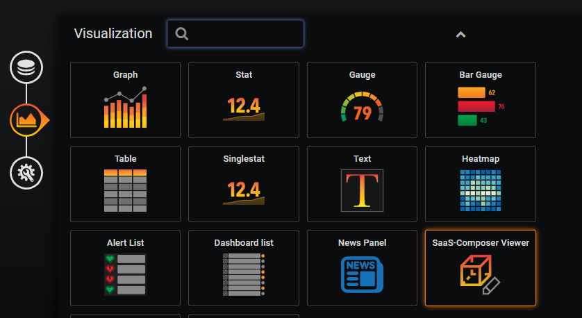  

### Click "Edit" to open the Panel properties console 

  

### Choose "General" tab to set the title for Panel

  

### Choose "Options" tab and Set connection information.  

  

### Fill in the doamin address.  
example：

If the domain address is："`https://saas-composer-2-0-2-adviiot-webacces-composer.wise-paas.com/#/zh/main/orglist`"

Please just fill in： "`https://saas-composer-2-0-2-adviiot-webacces-composer.wise-paas.com`"

  

### Click "Connect" button to connect domain. 
"**Connect Status**" column shows whether the connection is successful. If successful, the "**Current Domain**" column will keep this domain address until next time you change it successfully. ( Please refer to "[Change Domain](#Change-Domain)" section for more details.)

Connection Failed                           |  Connection Succeeded
--------------------------------------------|---------------------------------------
  |   
  

### Input "Org. Name" and you will get the "Org. Id".   

  


### Set frame content.    

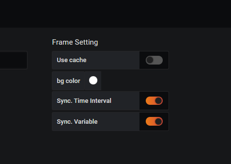  

### Choose "Displays" tab and click "Add" button to add a sketch view display and set the information.

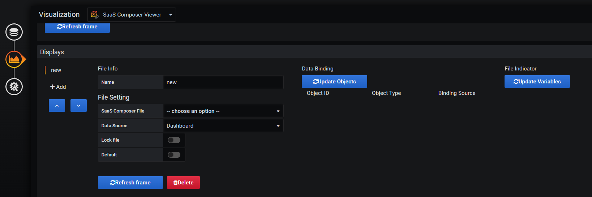  

### Select the file you want to display from "SaaS Composer File" column.
Check "**Default**" box is to make sure this file has the first priority to dispaly. ( Another way to change display file is to use the "[File Indicator](#File-Indicator)", please refer to the section for more details.) 

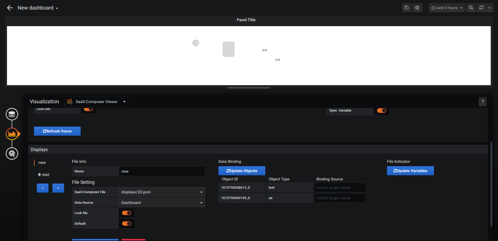  

### Select data source of the file from "Data Source" column. 

There are 2 selections. The default data source is "**Dashboard**", which need to set the data binding information from "**Metric**" tab and the "[Data Binding](#Data-binding-(metrics))" section. (Please refer to the section below for more details.) 

If you select "**SaaS Composer**" as data source, then you don't need to set up any data binding informations here. It will directly import the data that you binded on the SaaS Composer site.

  

## Data binding (metrics)

### Choose "Metrics" tab and set the data.

Select the "**Data Source**" that you've already set up at the "**Configuration / Data Sources**" page. 

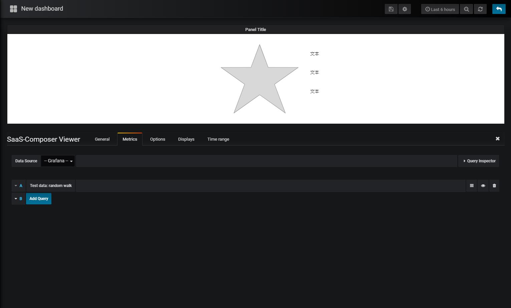  

### Time Series Data as the Data Source

Time Series data contains a timestamp, a metric target name and a numeric value.

### Back to "Displays" tab and set the data binding informations.

Fill in the "**Binding Source** (metric target name)" to bind the data to the target object. 

  

IF you are not sure what the metric target name should be, please press "**F12**" to check.

  

# Tips: Supplementary information for animation.

use common animation                    |  use script for animation
----------------------------------------|------------------------------------
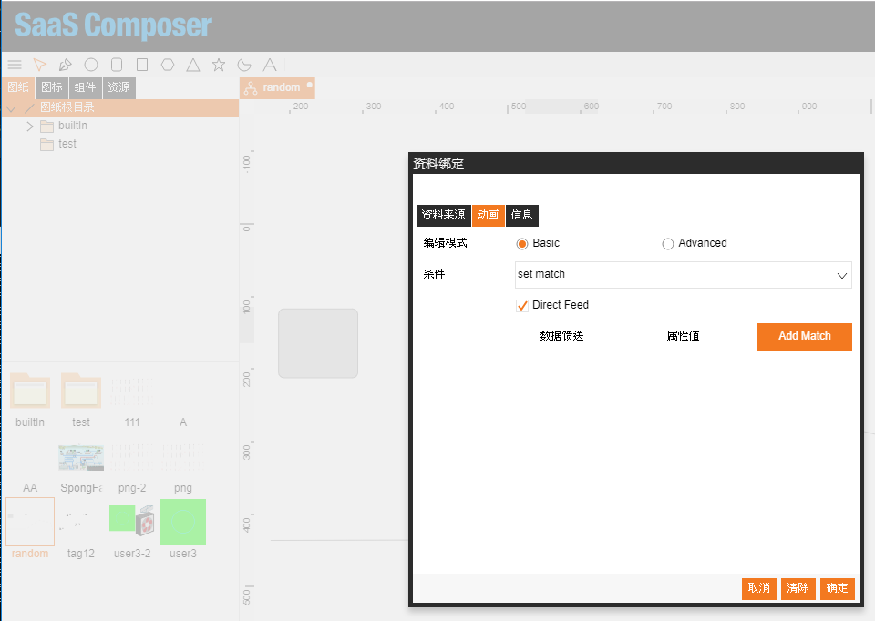  |   

### Change the "Refreshing rate".
Click  button on the top bar and select the time range to refresh data in specific interval, e.g., refresh every 5s.

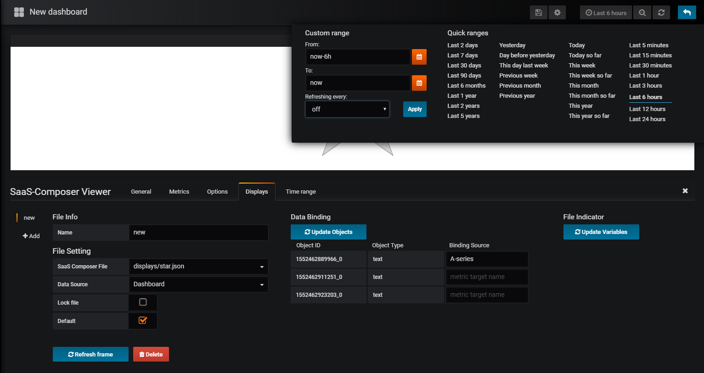  

## File Indicator
### Indicate the file with dashboard "Variables".

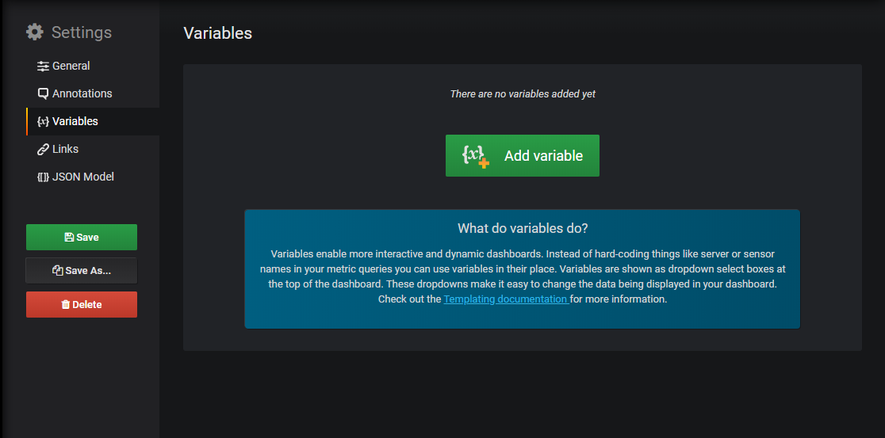  

### Add new variables.  
Fill in "**Name**", "**Type** (choose "**Custom**")","**Custom Options**". Check the "**Multi-value**" box and click "**Add**" button down below to add the variables you just set.

  

### Comfirm variables.
Click "**New**" button on the left to save the change.  

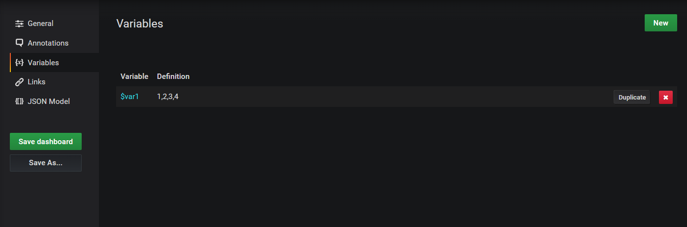  

### Update variable list.
Back to "**Displays**" tab, click "**Update Variables**" button, then it will show the variable list you just set.  

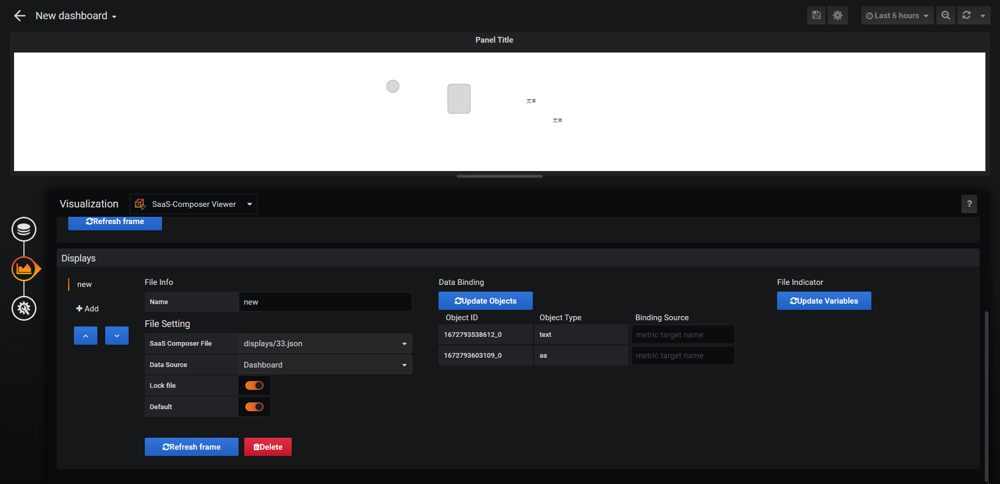  

### Mapping variables.
Choose variable mapping the display file. Then, you can switch the display file from selecting the indicator variables at the upper left corner above the display frame.

  

### Select variables.

The variable selector at the upper left corner above the display frame will be hidden. At the same time, you can still see it and edit it at the "**Display**" tag.

 

## Change Domain
### Choose "Options" Tab and uncheck the "Lock URL" box.
When the "**Lock URL**" box is unchecked, the "**Connect Status**" column will show "**User editing**", and the "**Domain URL**" can now be changed. 

After changing, please click "**Connect**" button to connect to the new domain.


### Case1: Connection failed.
If the new "**Domain URL**" can not be successfully connected, then the "**Current Domain** (words in red)" will not be changed. Everything will stay the same.


### Case2: Connection Succeeded.
If the new "**Domain URL**" successfully connected, it will pop up 2 button, "**reset data**" and "**don't reset**".
If you don't't click any of them, then the "**Current Domain** (words in green)" will not be changed. Everything will stay the same.


If you click "**don't reset**", the "**Current Domain** (words in green)" will be updated, but the "**Org. Name**", and all the setting in "**Displays**" tab page will stay unchanged. Thus, please make sure the new domain contains org and files that has the same group of names.

If you click "**reset data**", the "**Current Domain** (words in green)" will be updated. The "**Org. Name**", and all the setting in "**Displays**" tab page will be cleared. **CAUTION: Please be aware that this movement can not be reversed.**  Make sure before you click the button. 

don't reset                            |  reset data
:-------------------------------------:|:--------------------------------------:
  |  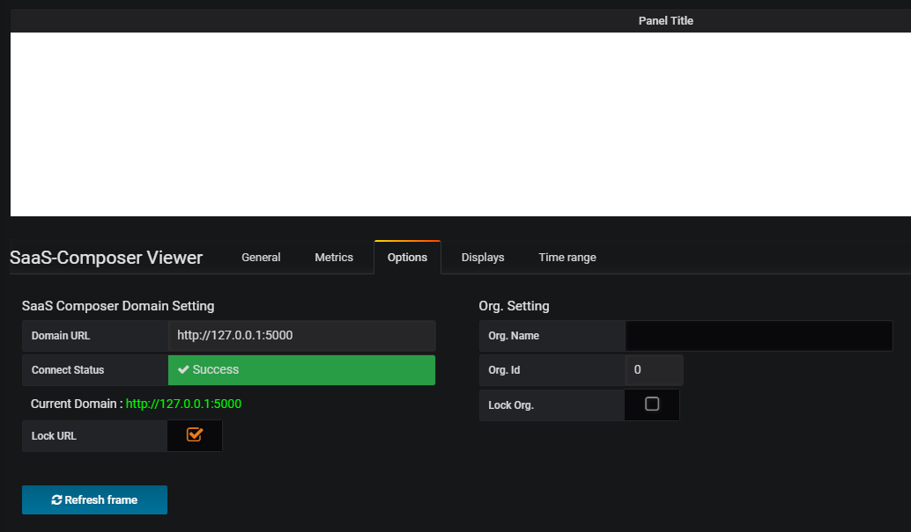 


## DEVELOPMENT

```
> npm install
> grunt
```

## CHANGELOG

#### 1.0.0 - Mar 14,2019

- Options tab： add Domain URL connection state UI (connect success/failed/editting)
- Options tab： if user successfully replace the current Domain URL address with a new address, user then have to decide reseting current data setting or not
- Displays tab： this tab devided into 3 parts (File info & setting / Data Binding (when the data source is dashboard) / File Indicator)
- Displays tab： File Setting part added a select box for selecting "Data Source" (form dashboard / from SaaS composer)

Release in dashboard-1.2.2

Version compatible: at least SaaS-Composer-1.1.2

#### 1.1.0

- Update the version of SC panel on the dashboard

#### 1.1.1 - May 29,2019

- Displays tab： The variable selector at the upper left corner above the display frame will be hidden. At the same time, you can still see it and edit it at the "Display" tag.

Release in dashboard-1.3.2

Version compatible: at least SaaS-Composer-1.1.2
