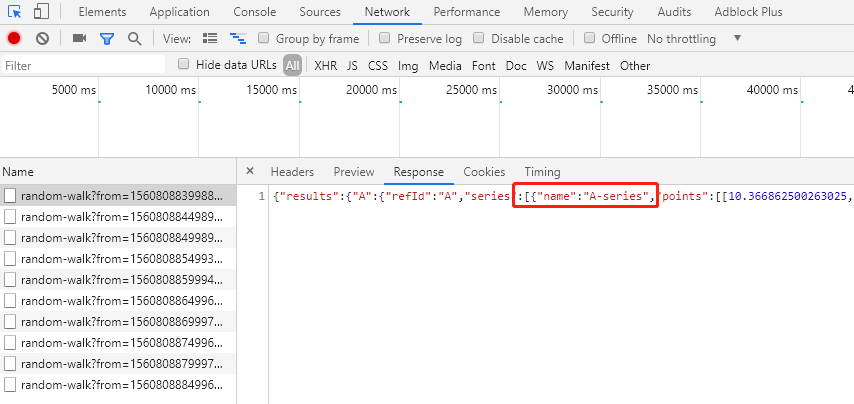

# SaaS-Composer Viewer Panel Plugin 

**Latest Update: v1.1.1 May 29,2019**

**Release in dashboard-1.3.2**

**Version compatible: at least SaaS-Composer-1.1.2**

--

SaaS-Composer Viewer Panel Plugin 可將您事先在 SaaS-Composer 中設計好的圖紙
藉由 Panel 呈現於 Dashboard 上。
數據來源具有相當的自由度，您可選擇在 SaaS-Composer 中完成數據綁定，亦可選擇在此 
Dashboard 中重新綁定來自其他數據來源之數據。


## Quick Start  

### 在 Dashboard 新增一個 SaaS-Composer Viewer 的 Panel  

  

### 點擊 "Edit" 進入 Panel 的編輯介面  

  

### 至 General 分頁設定 Panel 標題  

  

### 至 Options 分頁設定連線資訊  

  

### 於 Domain URL 欄位填入 SaaS-Composer 網址    

範例：

若網址為： `https://saas-composer-2-0-2-adviiot-webacces-composer.wise-paas.com/#/zh/main/orglist`
只需填入「 `https://saas-composer-2-0-2-adviiot-webacces-composer.wise-paas.com` 」這一段即可。

  

### 點擊 "Connect" 按鈕進行連線  

"**Connect Status**" 欄位將顯示是否連線成功。若連線成功，"Current Domain" 欄位將會持續連線至此網址，直到被下一個成功連線的網址替換。 ( 文章稍後將對替換網址有更詳細之說明，請見 "Domain 替換" 區塊)

Connection Failed                           |  Connection Succeeded
--------------------------------------------|---------------------------------------
  |   
  

### 於 "Org. Name" 欄位輸入組織名稱 

  

### 設定 SaaS Composer frame 內容

  

### 至 "Displays" 分頁並點擊 "Add" 按鈕，加入圖紙  

  

### 於 "SaaS Composer File" 下拉選單中選擇圖紙檔案  

在有多個圖紙檔案的狀況下，勾選 "Default" 框可預設優先顯示此圖紙。  
(另一個切換顯示圖紙的方法是使用 "[File Indicator](#File-Indicator)", 文章後段將詳細說明此一功能)   

  

### 於 "Data Source" 下拉選單中選擇數據來源

預設數據來源選項為 "Dashboard"，需先至 "Metric" 分頁設定數據綁定相關資訊，詳細請見下方 "[數據綁定](#數據綁定)" 段落。  

另一數據來源選項為 "SaaS Composer"，亦即可先在 SaaS Composer 頁面將綁定資訊設定好，在 Dashboard 處便不需要再額外進行設定，而是直接導入 SaaS Composer 的原先設定。  

  

## 數據綁定 (metrics)

### Choose "Metrics" tab and set the data.

Select the "**Data Source**" that you've already set up at the "**Configuration / Data Sources**" page. 

  

### Time Series Data as the Data Source

Time Series data contains a timestamp, a metric target name and a numeric value.

### Back to "Displays" tab and set the data binding informations.

Fill in the "**Binding Source** (metric target name)" to bind the data to the target object. 

  

IF you are not sure what the metric target name should be, please press "**F12**" to check.

  

# Tips: Supplementary information for animation.

use common animation                    |  use script for animation
----------------------------------------|------------------------------------
  |   

### Change the "Refreshing rate".
Click  button on the top bar and select the time range to refresh data in specific interval, e.g., refresh every 5s.

  

## File Indicator
### Dashboard 的 "Variables"(變數) 功能可為檔案標記上標籤

  

### 新增變數  

於 "Name" 欄位填入變數組名稱，於 "Type" 下拉選單選擇 "Custom"，於 "Custom Options" 填入自訂的變數組。勾選 "Multi-value" 框，最後點選下方的 "Add" 按鈕來完成變數組的新增。  

  

### 儲存變數

點選 "New" 按鈕來儲存更動。  

  

### 更新變數  

於 "Displays" 分頁，點選 "Update Variables" 更新變數按鈕。  

  

### 指派變數  

  

### 切換變數  

  

## Change Domain
### Choose "Options" Tab and uncheck the "Lock URL" box.
When the "**Lock URL**" box is unchecked, the "**Connect Status**" column will show "**User editing**", and the "**Domain URL**" can now be changed. 

After changing, please click "**Connect**" button to connect to the new domain.


### Case1: Connection failed.
If the new "**Domain URL**" can not be successfully connected, then the "**Current Domain** (words in red)" will not be changed. Everything will stay the same.


### Case2: Connection Succeeded.
If the new "**Domain URL**" successfully connected, it will pop up 2 button, "**reset data**" and "**don't reset**".
If you don't't click any of them, then the "**Current Domain** (words in green)" will not be changed. Everything will stay the same.


If you click "**don't reset**", the "**Current Domain** (words in green)" will be updated, but the "**Org. Name**", and all the setting in "**Displays**" tab page will stay unchanged. Thus, please make sure the new domain contains org and files that has the same group of names.

If you click "**reset data**", the "**Current Domain** (words in green)" will be updated. The "**Org. Name**", and all the setting in "**Displays**" tab page will be cleared. **CAUTION: Please be aware that this movement can not be reversed.**  Make sure before you click the button. 

don't reset                               |  reset data
------------------------------------------|--------------------------------------
  |   


## DEVELOPMENT

```
> npm install
> grunt
```
