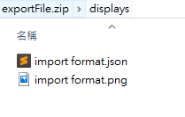
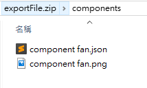
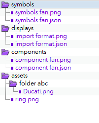

# 2D Import File Format

The file to be imported must follow the file types on SaaS Composer. The following example is a file of 2D **displays** including **symbols**, **components**, and **assets**.

The exportFile.zip contains 4 main types, **displays**, **symbols**, **components**, and **assets**.
The file extension of the file must be **.zip**.

## Display includes:

- A .json file named after the display (describing the locations of all objects and respective attributes in the display)
- A .png file named after the display (a scaled-down screenshot of the display)

## Symbols include:

- A .json file named after the symbols (describing the locations of all objects and respective attributes in the symbols)
- A .png file named after the symbols (a scaled-down screenshot of the symbols)

## Components include:

- A .json file named after the components (describing the locations of all objects and respective attributes in the components)
- A .png file named after the components (a scaled-down screenshot of the components)

## Assets include:

- All resource files used by all displays, which are fully listed here

# 2. File Content

The file used in the sample screenshot contains:

1.	A symbol file named as "symbols fan.json" and having a path as "symbols/symbols fan.json";

2.	A component file named as "component fan.json” and having a path as "components/component fan.json";

Two asset files respectively named as

1. "ring.png" and having a path as "assets/ring.png", and
2. "Ducati.png" and having a path as "assets/folder abc/Ducati.png".

