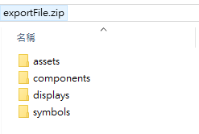

# 2D Import File Format

匯入的檔案要照著SaaS Composer上檔案的分類同步，以下範例在2D圖紙中包含了圖標，組件和資源的檔案。  

exportFile.zip 內包含了 displays, symbols, components, and assets等4種主要類別。
匯入的檔案副檔名一定要是 **.zip**  

## Display包含:  

  

- 以圖紙命名的.json檔 (敘述圖紙內的所有物件位置與各自的屬性)  
- 以圖紙命名的.png檔 (縮小的圖紙畫面截圖檔)  

## Symbols包含:  

  

- 以圖標命名的.json檔 (敘述圖標內的所有物件位置與各自的屬性)  
- 以圖標命名的.png檔 (縮小的圖標畫面截圖檔)  

## Components包含:  

  

- 以組件命名的.json檔 (敘述組件內的所有物件位置與各自的屬性)  
- 以組件命名的.png檔 (縮小的組件畫面截圖檔)  

## Assets包含:  

  

- 所有圖紙中有使用到的資源檔案都會在這裡列出  

## 檔案內容

範例畫面中有使用的檔案包含  

  

一個symbol檔名稱為"symbols fan.json"，路徑為"symbols/symbols fan.json"  

一個component檔名稱為"component fan.json"，路徑為"components/component fan.json"  

兩個assets檔取分別名稱為  

1. “ring.png”，路徑為"assets/ring.png"  
2. “Ducati.png”，路徑為"assets/folder abc/Ducati.png"  

