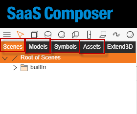

# 3D Import File Format

The file to be imported has to follow the file types on SaaS Composer. The following example is a file of 3D **scenes** including **models**, **symbols**, **components**, and **assets**.

The exportFile.zip contains 5 main types, **scenes**, **models**, **symbols**, **components**, and **assets**.
The file extension of the file has to be **.zip**.

## Scenes include:

- A .json file named after the scenes (describing the locations of all objects and respective attributes in the scenes)
- A .png file named after the scenes (a scaled-down screenshot of the scenes)

## Models include:

- A .json file named after the models (describing the locations of all objects and respective attributes in the models)
- A .png file named after the models (a scaled-down screenshot of the models)

## Symbols include:

- A .json file named after the symbols (describing the locations of all objects and respective attributes in the symbols)
- A .png file named after the symbols (a scaled-down screenshot of the symbols)

## Components include:

- A .json file named after the components (describing the locations of all objects and respective attributes in the components)
- A .png file named after the components (a scaled-down screenshot of the components)

## Assets include:

- All resource files used by all displays, which are fully listed here

# 2. 3D File Content

The file used in the sample screenshot contains:

1.	A scenes file named as “import 3D sample” and having a path as "scenes/import 3D sample.json"; 

2.	A models file named as "solar" and having a path as "models/solar.json";

3.	A symbol file named as "symbols fan.json" and having a path as "symbols/symbols fan.json";

4.	A component file named as "component fan.json” and having a path as "components/component fan.json";

Five assets files respectively named as

1. "ring.png" and having a path as "assets/ring.png",
2. "solar1.jpg" and having a path as "assets/solar folder/solar1.jpg",
3. "solar2.jpg" and having a path as "assets/solar folder/solar2.jpg”,
4. "solar.obj" and having a path as "assets/solar folder/solar.obj", and
5. "solar.mtl” and having a path as "assets/solar folder/solar.mtl".

