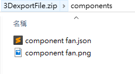

# 3D導入檔案格式

匯入的檔案要照著SaaS Composer上檔案的分類同步，以下範例在3D場景中包含了模型，圖標，組件和資源的檔案。   

exportFile.zip 內包含了 scenes, models, symbols, components, and assets等5種主要類別。
匯入的檔案副檔名一定要是 **.zip**  

## Scenes包含  

- 以場景命名的.json檔 (敘述場景內的所有物件位置與各自的屬性)  
- 以場景命名的.png檔 (縮小的場景畫面截圖檔)  

## Models包含   

- 以模型命名的.json檔 (敘述模型內的所有物件位置與各自的屬性)  
- 以模型命名的.png檔 (縮小的模型畫面截圖檔)  

## Symbols包含  

- 以圖標命名的.json檔 (敘述圖標內的所有物件位置與各自的屬性)
- 以圖標命名的.png檔 (縮小的圖標畫面截圖檔)

## Components包含 

- 以組件命名的.json檔 (敘述組件內的所有物件位置與各自的屬性)
- 以組件命名的.png檔 (縮小的組件畫面截圖檔)

## Assets包含  

  

- 所有圖紙中有使用到的資源檔案都會在這裡列出

## 3D檔案內容  

範例畫面中有使用的檔案包含  

  

一個scenes檔名稱為"import 3D sample"，路徑為"scenes/import 3D sample.json"

一個models檔名稱為"solar"，路徑為"models/solar.json"

一個symbol檔名稱為"symbols fan.json"，路徑為"symbols/symbols fan.json"

一個component檔名稱為"component fan.json"，路徑為"components/component fan.json"

五個assets檔取分別名稱為

1. “ring.png”，路徑為"assets/ring.png"
2. “solar1.jpg”，路徑為"assets/solar folder/solar1.jpg"
3. “solar2.jpg”，路徑為"assets/solar folder/solar2.jpg"
4. “solar.obj”，路徑為"assets/solar folder/solar.obj"
5. “solar.mtl”，路徑為"assets/solar folder/solar.mtl"

