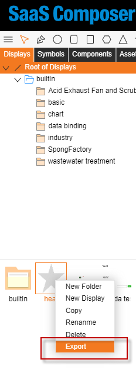
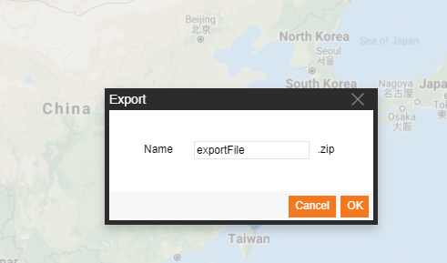

# Export
The SaaS Composer supports exporting the created content as a zip package.

**Export function**

Export function usage method: 
1. Select the content to be exported, right click, and select the export button to open the window for exporting files.
2. Fill in the name of the export zip package and click "**Confirm**".

Export rules: 
1. Exporting displays and 3D scenes
The displays and 3D scenes and their dependent files are exported together. All files are stored using their own path and file name.
2. Exporting icons, models, components, and assets
When the icons, models, components, and assets are exported, the dependent files are exported at the same time. All files are stored using their own path and file name. At the same time, a display.tree file will be created in the compressed package, and the path of the icons, models, components, and assets will be recorded.
3. Exporting multiple files at the same time is supported; the direct export of asset files and export folders is not supported.
4. The path of the exported files is the default download path of the browser.