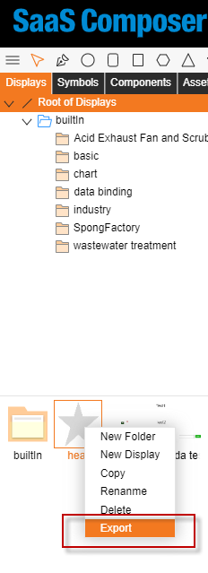

# 導出功能  

SaaS Composer 支援將製作好的內容以 zip 包的形式進行匯出、 也支援將合適的內容打包成 zip 包導入到SaaS Composer中  

右鍵需要匯出檔，點擊匯出按鈕匯出。  
匯出檔均放在一個以匯出時間戳記為名的壓縮包中。  

分以下兩種匯出方式：  

1. 圖紙、3D場景匯出  
    匯出圖紙、3D場景的同時匯出其依賴檔，所有檔使用本身的路徑和檔案名存儲。  

2. 圖示、模型、元件、資源匯出  
    圖示、模型、元件、資源匯出時同時匯出裡面的依賴檔，所有檔使用本身的路徑和檔案名存儲，匯出的同時會在壓縮包中創建一個displays.tree檔，記錄圖示、模型、元件、資源的路徑。  