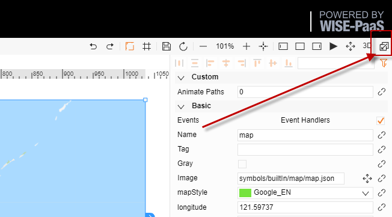
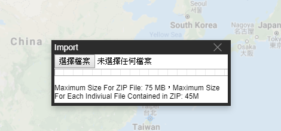

# Import
The SaaS Composer supports the packaging of appropriate content into a zip package for importing into the SaaS Composer.

**zip package format reference to next article: 2D Import File Format & 3D Import File Format**

**Import function**

Import file size limitation:
1.	Importing files smaller than 15 Megabyte 
Drag files directly into the directory structure of the SaaS Composer.
2.	Importing files larger than 15 Megabyte and smaller than 75 Megabyte 
Click the "**Import**" button in the upper right corner to open the import window, select the import zip file, and click "**Confirm**".
3. Importing zip file larger than 75 Megabyte is not supported at this time.
4. Within the zip file, the largest single file size that can be included is limited at 36 Megabyte（36 Megabyte before zipped）.

**Import rules:**
1. Import the zip package containing the displays and 3D scenes into the displays and 3D scenes directory.
The display and 3D scene files are placed in the current import directory, and all the dependent files are placed back in the original paths of the files.
If files already exist, it will automatically change the names of the files and their dependencies.
2. Import the zip package containing the displays and 3D scenes into the directory other than the displays and 3D scenes directory (icons, components).
The display and 3D scene files and their dependent files are placed back in the original paths of the files.
If files already exist, it will automatically change the names of the files and their dependencies.
3. Import the compressed package that does not contain displays and 3D scenes.
Icons, models, components, and assets and their dependent files are placed back in the original paths of the files.       
If the files already exist, the original files will be replaced 
4. Zip package requirements       
Compressed packages exported from the SaaS Composer can be imported directly;       
User-compressed packages must meet two requirements:
i. Files need to be placed in the assets, components, displays, symbols, scenes, and models directory.            
ii. The Chinese name of the files and folders must be encoded in UTF-8.

**Handling the importing of duplicate file names:**

When importing a file, if the import file does not already exist, then the file is created; if the import file exists, a copy of the file is created.       The file copy naming rules are: Add -i after the file name (i>1, i is incremented each time for each creation). 
For example:      
1. Importing the `symblos/abc.json` file
a. The file does not exist, so a file named `symblos/abc.json` will be created;                
b. the file exists, so a file named `symblos/abc-2.json` will be created; importing the `symblos/abc.json` file again will create a `symblos/abc-3.json` file.                
c. If `symblos/abc-2.json` and `symblos/abc-3.json` already exist, a `symblos/abc-4.json` file will be created; if `symblos/abc-2.json` and `symblos/abc-5.json` already exist, a `symblos/abc-3.json` file will be created;       
2. Importing the `symblos/abc-2.json` file               
 a. The file does not exist, so a file named `symblos/abc-2.json` will be created;                
b. the file exists, so a file named `symblos/abc-2-2.json` will be created;                   Importing the symblos/abc.json file again will create a `symblos/abc-2-3.json` file.