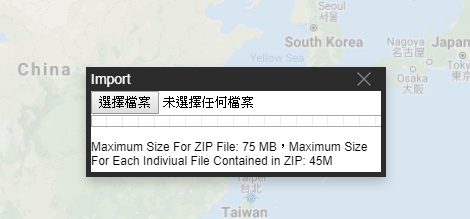

# 導入功能

將匯出的壓縮包拖入將要導入目錄中即可。  
壓縮包 zip 中格式請參考下兩篇文章：2D導入檔案格式 & 3D導入檔案格式  

## 導入檔案大小規範：

- 當導入檔案小於 15 Megabyte 時，可以直接拖拉至SaaS Composer的檔案目錄底下。  
- 當導入檔案大於 15 Megabyte 且小於 75 Megabyte 時，可以點擊右上方的導入按鈕來開啟導入室窗。選擇需要導入的zip檔案和點擊確認。  
- 目前不支援大於75 Megabyte 的zip檔案導入。  
- 在導入的zip檔案內，單一檔案最大限制在36 Megabyte以內的檔案(壓縮前需要小於36Megabyte）  

分以下三種導入方式：  

1. 將包含圖紙、3D場景的壓縮包導入圖紙、3D場景目錄下  
	圖紙、3D場景檔放在當前導入目錄下，其所有依賴檔放回檔原本所在路徑，
	
2. 將包含圖紙、3D場景的壓縮包導入非圖紙、3D場景目錄（圖示、元件等）下  
	圖紙、3D場景文件及其依賴文件都放回檔原本所在路徑，
	
3. 將不包含圖紙、3D場景的壓縮包導入  
	圖示、模型、元件、資源等及其依賴文件都放回檔原本所在路徑

導入文件重名解決辦法：  
	導入文件時，若導入文件不存在，則創建該文件；若導入檔存在，則創建該檔的副本。
	檔副本命名規則為：檔案名後添加 -i（i>1，每次創建時累加）。

例如：  
	1.導入symblos/abc.json文件
		a.該文件不存在，創建檔案名為symblos/abc.json的文件；
		b.該文件存在，創建檔案名為symblos/abc-2.json的文件；
		  再次導入symblos/abc.json文件，則創建symblos/abc-3.json的文件；
		c.若內部有symblos/abc-2.json，symblos/abc-3.json，則創建symblos/abc-4.json文件；
		  若內部有symblos/abc-2.json，symblos/abc-5.json，則創建symblos/abc-3.json文件；
	2.導入symblos/abc-2.json文件
		a.該文件不存在，創建檔案名為symblos/abc-2.json的文件；
		b.該文件存在，創建檔案名為symblos/abc-2-2.json的文件；
		  再次導入symblos/abc.json文件，則創建symblos/abc-2-3.json的文件

## 靜態檔導入匯出

靜態檔導入匯出由 setting.yaml 中 static_file_import_export 參數控制。  
true：支援靜態檔導入匯出，遵循導入匯出規則；  
false：不支援靜態檔導入匯出，導入匯出時均忽略靜態檔，其餘檔正常導入匯出。  